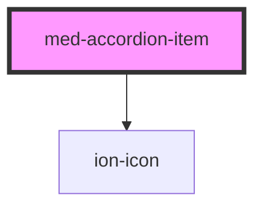

# accordion-item

<!-- Auto Generated Below -->

## Properties

| Property   | Attribute   | Description                                          | Type                             | Default     |
| ---------- | ----------- | ---------------------------------------------------- | -------------------------------- | ----------- |
| `icon`     | `icon`      | Define a posição do ícone de abertura do componente. | `"left" \| "right" \| undefined` | `undefined` |
| `noBorder` | `no-border` | Define a variação da borda do componente.            | `boolean`                        | `false`     |

## Events

| Event    | Description | Type               |
| -------- | ----------- | ------------------ |
| `toggle` |             | `CustomEvent<any>` |

## Slots

| Slot        | Description                                                         |
| ----------- | ------------------------------------------------------------------- |
| `"button"`  | Se houver botões no componente eles devem ser inseridos nesse slot. |
| `"content"` | Define o conteúdo do componente.                                    |
| `"header"`  | Define o conteúdo do header do componente.                          |

## CSS Custom Properties

| Name              | Description                               |
| ----------------- | ----------------------------------------- |
| `--background`    | Define a cor de background do componente. |
| `--border-radius` | Define o border-radius do componente.     |
| `--icon-color`    | Define a cor de do icone do componente.   |

## Dependencies

### Depends on

- ion-icon

### Graph

----------------------------------------------

*Built with [StencilJS](https://stenciljs.com/)*
