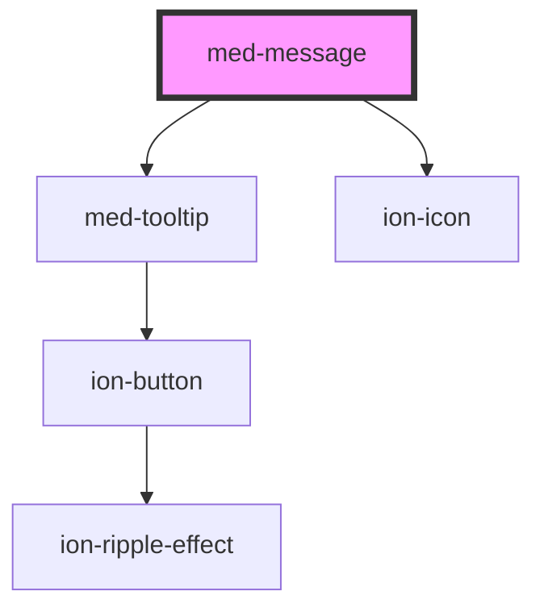

# med-message

<!-- Auto Generated Below -->

## Properties

| Property    | Attribute    | Description                      | Type                                                                   | Default     |
| ----------- | ------------ | -------------------------------- | ---------------------------------------------------------------------- | ----------- |
| `concurso`  | `concurso`   | Define o nome do concurso.       | `string \| undefined`                                                  | `undefined` |
| `dsName`    | `ds-name`    | Define a variação do componente. | `"comment" \| "medgrupo" \| "response" \| "user-message" \| undefined` | `undefined` |
| `messageId` | `message-id` | Define o id da mensagem.         | `string \| undefined`                                                  | `undefined` |
| `nome`      | `nome`       | Define o nome do aluno.          | `string \| undefined`                                                  | `undefined` |
| `texto`     | `texto`      | Define o conteúdo de texto.      | `string \| undefined`                                                  | `undefined` |

## CSS Custom Properties

| Name                  | Description                                         |
| --------------------- | --------------------------------------------------- |
| `--background`        | Define a cor de background do componente.           |
| `--background-footer` | Define a cor do background do footer do componente. |
| `--color`             | Define a cor do texto.                              |

## Dependencies

### Depends on

- [med-tooltip](../med-tooltip)
- ion-icon

### Graph

----------------------------------------------

*Built with [StencilJS](https://stenciljs.com/)*
