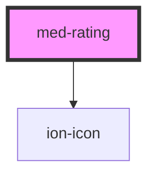

# med-rating

<!-- Auto Generated Below -->

## Properties

| Property   | Attribute  | Description                               | Type                                 | Default     |
| ---------- | ---------- | ----------------------------------------- | ------------------------------------ | ----------- |
| `cabe`     | `cabe`     | Define o estado cabe ou não cabe recurso. | `boolean`                            | `false`     |
| `concurso` | `concurso` | Define o nome do concurso.                | `string \| undefined`                | `undefined` |
| `data`     | `data`     | Define a data da postagem.                | `string \| undefined`                | `undefined` |
| `dsName`   | `ds-name`  | Define a variação do componente.          | `"banca" \| "medgrupo" \| undefined` | `undefined` |
| `nome`     | `nome`     | Define o nome do aluno.                   | `string \| undefined`                | `undefined` |
| `texto`    | `texto`    | Define o conteúdo de texto.               | `string \| undefined`                | `undefined` |

## CSS Custom Properties

| Name                 | Description                                                       |
| -------------------- | ----------------------------------------------------------------- |
| `--background`       | Define a cor de background do componente quando cabe ou não cabe. |
| `--background-right` | Define a cor do background do lado direito do componente.         |
| `--color`            | Define a cor do texto.                                            |
| `--color-date`       | Define a cor do texto da data.                                    |
| `--color-icon`       | Define a cor do icone.                                            |

## Dependencies

### Depends on

- ion-icon

### Graph

----------------------------------------------

*Built with [StencilJS](https://stenciljs.com/)*
