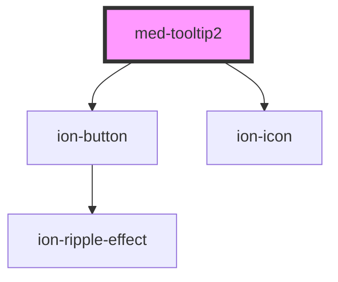

# med-tooltip

<!-- Auto Generated Below -->

## Properties

| Property                   | Attribute | Description | Type                               | Default     |
| -------------------------- | --------- | ----------- | ---------------------------------- | ----------- |
| `buttonLeft` _(required)_  | --        |             | `{ label: string; icon: string; }` | `undefined` |
| `buttonRight` _(required)_ | --        |             | `{ label: string; icon: string; }` | `undefined` |
| `content` _(required)_     | `content` |             | `string`                           | `undefined` |
| `header` _(required)_      | `header`  |             | `string`                           | `undefined` |

## Dependencies

### Depends on

- [ion-button](../../../button)
- ion-icon

### Graph

----------------------------------------------

*Built with [StencilJS](https://stenciljs.com/)*
