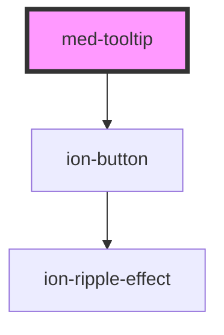

# med-context-menu

<!-- Auto Generated Below -->

## Properties

| Property               | Attribute   | Description                      | Type                                                  | Default     |
| ---------------------- | ----------- | -------------------------------- | ----------------------------------------------------- | ----------- |
| `collapsed`            | `collapsed` | Define o estado do componente.   | `boolean`                                             | `true`      |
| `content` _(required)_ | `content`   |                                  | `string`                                              | `undefined` |
| `dsName`               | `ds-name`   | Define a variação do componente. | `"definition" \| undefined`                           | `undefined` |
| `placement`            | `placement` |                                  | `"bottom" \| "left" \| "right" \| "top" \| undefined` | `undefined` |
| `position`             | `position`  |                                  | `"center" \| "end" \| "start" \| undefined`           | `undefined` |
| `titulo` _(required)_  | `titulo`    |                                  | `string`                                              | `undefined` |

## Methods

### `toggle(event?: Event | undefined) => Promise<void>`

#### Returns

Type: `Promise<void>`

## CSS Custom Properties

| Name           | Description                          |
| -------------- | ------------------------------------ |
| `--background` | Define a cor da borda do componente. |
| `--z-index`    | Define o z-index do componente.      |

## Dependencies

### Depends on

- [ion-button](../../../button)

### Graph

----------------------------------------------

*Built with [StencilJS](https://stenciljs.com/)*
