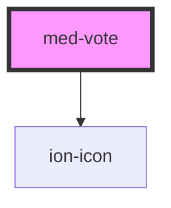

# med-vote

<!-- Auto Generated Below -->

## Properties

| Property  | Attribute  | Description                               | Type                  | Default     |
| --------- | ---------- | ----------------------------------------- | --------------------- | ----------- |
| `cabe`    | `cabe`     | Define o conteúdo de texto do componente. | `number \| undefined` | `undefined` |
| `naoCabe` | `nao-cabe` | Define o conteúdo de texto do componente. | `number \| undefined` | `undefined` |
| `titulo`  | `titulo`   | Define o conteúdo de texto do componente. | `string \| undefined` | `undefined` |

## Dependencies

### Depends on

- ion-icon

### Graph

----------------------------------------------

*Built with [StencilJS](https://stenciljs.com/)*
