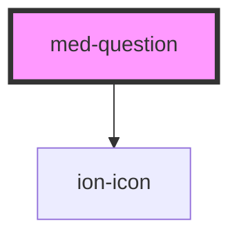

# med-question

<!-- Auto Generated Below -->

## Properties

| Property    | Attribute   | Description                        | Type                  | Default     |
| ----------- | ----------- | ---------------------------------- | --------------------- | ----------- |
| `collapsed` | `collapsed` | Define o estado do componente.     | `boolean`             | `false`     |
| `color`     | `color`     | Define a cor do componente.        | `string \| undefined` | `undefined` |
| `neutral`   | `neutral`   | Define a cor neutra do componente. | `string \| undefined` | `undefined` |

## Methods

### `toggle(event?: Event | undefined) => Promise<void>`

#### Returns

Type: `Promise<void>`

## CSS Custom Properties

| Name      | Description                 |
| --------- | --------------------------- |
| `--color` | Define a cor do componente. |

## Dependencies

### Depends on

- ion-icon

### Graph

----------------------------------------------

*Built with [StencilJS](https://stenciljs.com/)*
