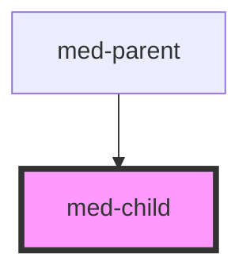

# med-child

<!-- Auto Generated Below -->

## Properties

| Property  | Attribute  | Description                  | Type                     | Default     |
| --------- | ---------- | ---------------------------- | ------------------------ | ----------- |
| `dsColor` | `ds-color` | Define a cor do componente.  | `string \| undefined`    | `undefined` |
| `fill`    | `fill`     | Define o fill do componente. | `"outline" \| undefined` | `undefined` |

## Dependencies

### Used by

 - [med-parent](../parent)

### Graph

----------------------------------------------

*Built with [StencilJS](https://stenciljs.com/)*
