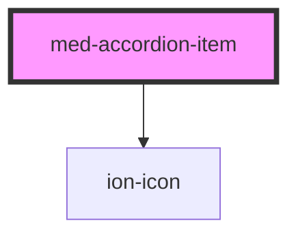

# accordion-item

<!-- Auto Generated Below -->

## Properties

| Property     | Attribute    | Description                                              | Type                             | Default     |
| ------------ | ------------ | -------------------------------------------------------- | -------------------------------- | ----------- |
| `background` | `background` | Define se o componente irá ter background quando aberto. | `boolean`                        | `false`     |
| `color`      | `color`      | Define a cor do componente.                              | `string \| undefined`            | `undefined` |
| `dsName`     | `ds-name`    | Define a variação do componente.                         | `"secondary" \| undefined`       | `undefined` |
| `icon`       | `icon`       | Define a posição do ícone de abertura do componente.     | `"left" \| "right" \| undefined` | `undefined` |
| `noBorder`   | `no-border`  | Define a variação da borda do componente.                | `boolean`                        | `false`     |

## Events

| Event    | Description | Type               |
| -------- | ----------- | ------------------ |
| `toggle` |             | `CustomEvent<any>` |

## Slots

| Slot         | Description                                                         |
| ------------ | ------------------------------------------------------------------- |
| `"auxiliar"` | Define o conteúdo auxiliar do componente.                           |
| `"button"`   | Se houver botões no componente eles devem ser inseridos nesse slot. |
| `"content"`  | Define o conteúdo do componente.                                    |
| `"header"`   | Define o conteúdo do header do componente.                          |

## CSS Custom Properties

| Name                   | Description                                         |
| ---------------------- | --------------------------------------------------- |
| `--background-content` | Define a cor de background do conteudo componente.  |
| `--background-header`  | Define a cor de background do header do componente. |
| `--border-radius`      | Define o border-radius do componente.               |
| `--icon-color`         | Define a cor de do icone do componente.             |

## Dependencies

### Depends on

- ion-icon

### Graph

----------------------------------------------

*Built with [StencilJS](https://stenciljs.com/)*
