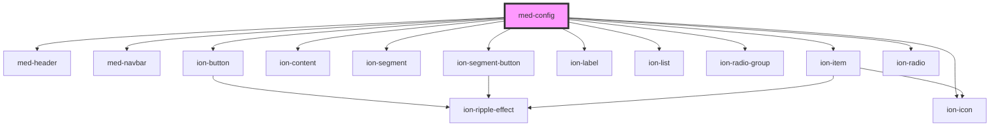

# med-image-zoom

<!-- Auto Generated Below -->

## Properties

| Property               | Attribute | Description | Type                                                                   | Default     |
| ---------------------- | --------- | ----------- | ---------------------------------------------------------------------- | ----------- |
| `emitter` _(required)_ | --        | TODO        | `{ scheme: (value: string) => void; theme: (value: string) => void; }` | `undefined` |
| `opcoes` _(required)_  | --        | TODO        | `MedConfigInterface`                                                   | `undefined` |

## Dependencies

### Depends on

- [med-header](../med-header)
- [med-navbar](../med-navbar)
- [ion-button](../../../button)
- ion-icon
- [ion-content](../../../content)
- [ion-segment](../../../segment)
- [ion-segment-button](../../../segment-button)
- [ion-label](../../../label)
- [ion-list](../../../list)
- [ion-radio-group](../../../radio-group)
- [ion-item](../../../item)
- [ion-radio](../../../radio)

### Graph

----------------------------------------------

*Built with [StencilJS](https://stenciljs.com/)*
