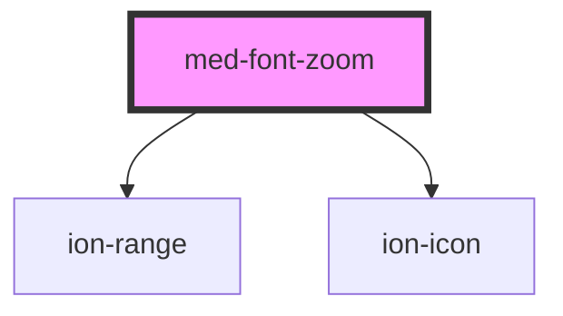

# med-font-zoom

<!-- Auto Generated Below -->

## Properties

| Property               | Attribute | Description | Type                                                                                        | Default          |
| ---------------------- | --------- | ----------- | ------------------------------------------------------------------------------------------- | ---------------- |
| `emitter` _(required)_ | --        | TODO        | `{ emit: (value: MedFontSize) => void; }`                                                   | `undefined`      |
| `value`                | `value`   | TODO        | `MedFontSize.MD \| MedFontSize.SM \| MedFontSize.XS \| MedFontSize.XXS \| MedFontSize.XXXS` | `MedFontSize.XS` |

## Dependencies

### Depends on

- [ion-range](../../../range)
- ion-icon

### Graph

----------------------------------------------

*Built with [StencilJS](https://stenciljs.com/)*
