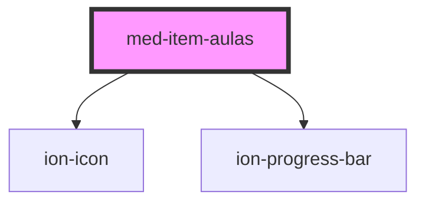

# med-item-aulas

<!-- Auto Generated Below -->

## Properties

| Property                   | Attribute     | Description                                     | Type     | Default     |
| -------------------------- | ------------- | ----------------------------------------------- | -------- | ----------- |
| `porcentagem` _(required)_ | `porcentagem` | Define a porcentagem de visualização de vídeos. | `number` | `undefined` |
| `professor` _(required)_   | `professor`   | Define o nome do professor.                     | `string` | `undefined` |
| `videos` _(required)_      | `videos`      | Define a quantidade de vídeos.                  | `string` | `undefined` |

## Slots

| Slot       | Description                          |
| ---------- | ------------------------------------ |
| `"avatar"` | Slot destinado ao avatar.            |
| `"rate"`   | Slot destinado ao componete de rate. |

## Dependencies

### Depends on

- ion-icon
- [ion-progress-bar](../../../progress-bar)

### Graph

----------------------------------------------

*Built with [StencilJS](https://stenciljs.com/)*
