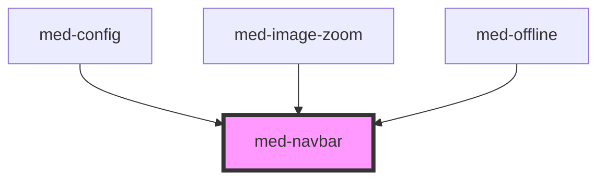

# med-navbar

<!-- Auto Generated Below -->

## Properties

| Property  | Attribute  | Description                      | Type                                        | Default     |
| --------- | ---------- | -------------------------------- | ------------------------------------------- | ----------- |
| `dsColor` | `ds-color` | Define a cor do componente.      | `string \| undefined`                       | `undefined` |
| `dsName`  | `ds-name`  | Define a variação do componente. | `"secondary" \| "transparent" \| undefined` | `undefined` |

## Slots

| Slot         | Description                                      |
| ------------ | ------------------------------------------------ |
| `"left"`     | Posiciona um elemento ao lado esquerdo ao navbar |
| `"right"`    | Posiciona um elemento ao lado direito da navbar. |
| `"subtitle"` | Subtitulo da navbar.                             |
| `"title"`    | Titulo da navbar.                                |

## CSS Custom Properties

| Name           | Description                               |
| -------------- | ----------------------------------------- |
| `--background` | Define a cor de background do componente. |
| `--color`      | Define a cor de texto do componente.      |

## Dependencies

### Used by

 - [med-config](../med-config)
 - [med-image-zoom](../med-image-zoom)
 - [med-offline](../med-offline)

### Graph

----------------------------------------------

*Built with [StencilJS](https://stenciljs.com/)*
