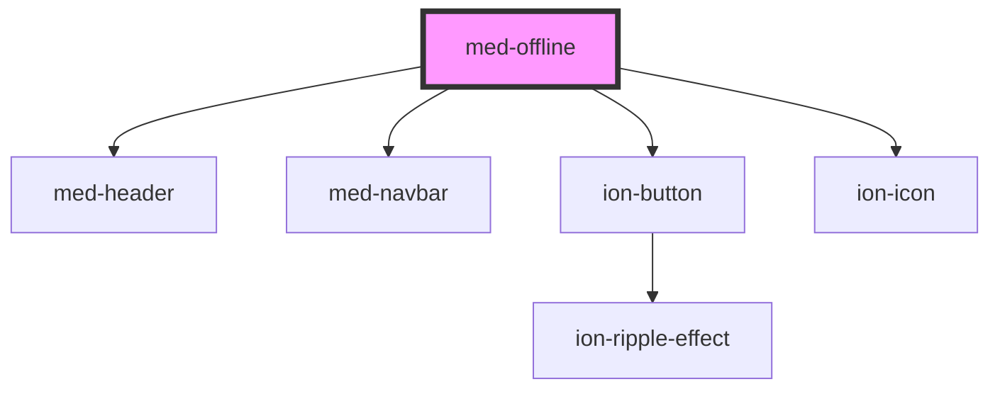

# med-offline

<!-- Auto Generated Below -->

## Events

| Event      | Description | Type                |
| ---------- | ----------- | ------------------- |
| `medClick` | TODO        | `CustomEvent<void>` |

## Dependencies

### Depends on

- [med-header](../med-header)
- [med-navbar](../med-navbar)
- [ion-button](../../../button)
- ion-icon

### Graph

----------------------------------------------

*Built with [StencilJS](https://stenciljs.com/)*
