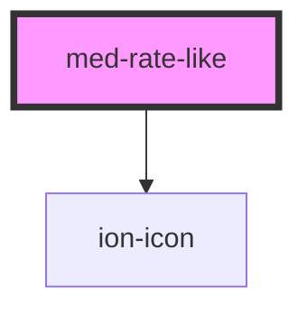

# med-rate-like

<!-- Auto Generated Below -->

## Properties

| Property | Attribute | Description | Type                                                 | Default     |
| -------- | --------- | ----------- | ---------------------------------------------------- | ----------- |
| `status` | `status`  | TODO        | `RateStatus.DISLIKE \| RateStatus.LIKE \| undefined` | `undefined` |

## Events

| Event       | Description | Type                                                 |
| ----------- | ----------- | ---------------------------------------------------- |
| `medChange` | TODO        | `CustomEvent<RateStatus.DISLIKE \| RateStatus.LIKE>` |

## Dependencies

### Depends on

- ion-icon

### Graph

----------------------------------------------

*Built with [StencilJS](https://stenciljs.com/)*
