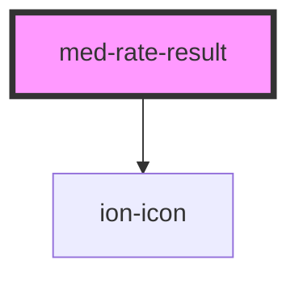

# med-rate-result

<!-- Auto Generated Below -->

## Properties

| Property    | Attribute   | Description                       | Type                  | Default     |
| ----------- | ----------- | --------------------------------- | --------------------- | ----------- |
| `bom`       | `bom`       | Define o valor do item bom.       | `string \| undefined` | `undefined` |
| `excelente` | `excelente` | Define o valor do item excelente. | `string \| undefined` | `undefined` |
| `regular`   | `regular`   | Define o valor do item regular.   | `string \| undefined` | `undefined` |
| `ruim`      | `ruim`      | Define o valor do item ruim.      | `string \| undefined` | `undefined` |

## CSS Custom Properties

| Name               | Description                         |
| ------------------ | ----------------------------------- |
| `--color-bom`      | Define a cor do icone de bom.       |
| `--color-excelent` | Define a cor do icone de excelente. |
| `--color-regular`  | Define a cor do icone de regular.   |
| `--color-ruim`     | Define a cor do icone de ruim.      |

## Dependencies

### Depends on

- ion-icon

### Graph

----------------------------------------------

*Built with [StencilJS](https://stenciljs.com/)*
