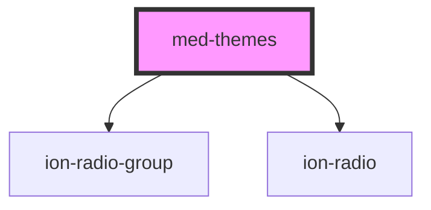

# med-theme

<!-- Auto Generated Below -->

## Properties

| Property | Attribute | Description                      | Type                                            | Default     |
| -------- | --------- | -------------------------------- | ----------------------------------------------- | ----------- |
| `ativo`  | `ativo`   | Define a variação do componente. | `"theme-gold" \| "theme-recursos" \| undefined` | `undefined` |
| `temas`  | --        | Define quais os temas            | `MedTema[] \| undefined`                        | `undefined` |

## Events

| Event       | Description                | Type                  |
| ----------- | -------------------------- | --------------------- |
| `medChange` | Retornar a cor selecionada | `CustomEvent<string>` |

## Dependencies

### Depends on

- [ion-radio-group](../../../radio-group)
- [ion-radio](../../../radio)

### Graph

----------------------------------------------

*Built with [StencilJS](https://stenciljs.com/)*
