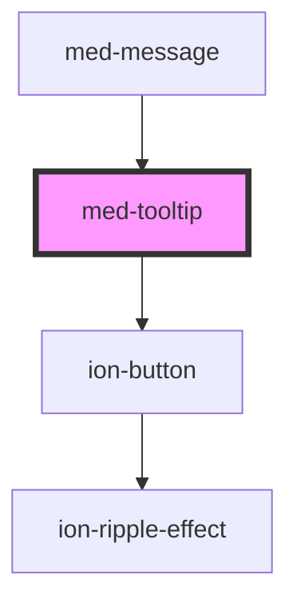

# med-context-menu

<!-- Auto Generated Below -->

## Properties

| Property    | Attribute   | Description                      | Type                                                  | Default     |
| ----------- | ----------- | -------------------------------- | ----------------------------------------------------- | ----------- |
| `collapsed` | `collapsed` | Define o estado do componente.   | `boolean`                                             | `true`      |
| `content`   | `content`   | TODO                             | `string \| undefined`                                 | `undefined` |
| `dsColor`   | `ds-color`  | Define a cor do componente.      | `string \| undefined`                                 | `undefined` |
| `dsName`    | `ds-name`   | Define a variação do componente. | `"definition" \| undefined`                           | `undefined` |
| `placement` | `placement` | TODO                             | `"bottom" \| "left" \| "right" \| "top" \| undefined` | `undefined` |
| `position`  | `position`  | TODO                             | `"center" \| "end" \| "start" \| undefined`           | `undefined` |
| `titulo`    | `titulo`    | TODO                             | `string \| undefined`                                 | `undefined` |

## Methods

### `toggle(event?: Event | undefined) => Promise<void>`

TODO

#### Returns

Type: `Promise<void>`

## Dependencies

### Used by

 - [med-message](../med-message)

### Depends on

- [ion-button](../../../button)

### Graph

----------------------------------------------

*Built with [StencilJS](https://stenciljs.com/)*
