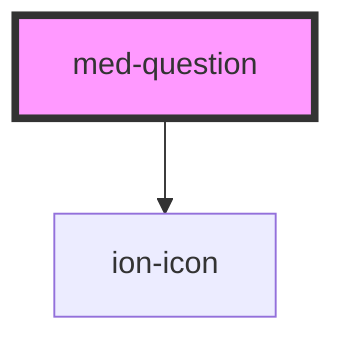

# med-question

<!-- Auto Generated Below -->

## Properties

| Property    | Attribute   | Description                               | Type                  | Default     |
| ----------- | ----------- | ----------------------------------------- | --------------------- | ----------- |
| `collapsed` | `collapsed` | Define o estado do componente.            | `boolean`             | `false`     |
| `dsColor`   | `ds-color`  | Define a cor do componente.               | `string \| undefined` | `undefined` |
| `texto`     | `texto`     | Define o conteúdo de texto do componente. | `string \| undefined` | `undefined` |

## Methods

### `toggle(event?: Event | undefined) => Promise<void>`

TODO

#### Returns

Type: `Promise<void>`

## Dependencies

### Depends on

- ion-icon

### Graph

----------------------------------------------

*Built with [StencilJS](https://stenciljs.com/)*
