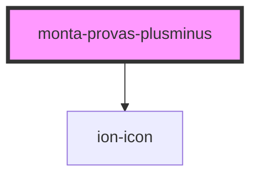

# monta-provas-plusminus

<!-- Auto Generated Below -->

## Properties

| Property | Attribute | Description | Type                | Default     |
| -------- | --------- | ----------- | ------------------- | ----------- |
| `dsSize` | `ds-size` |             | `"xl" \| undefined` | `undefined` |

## Events

| Event       | Description | Type                                                         |
| ----------- | ----------- | ------------------------------------------------------------ |
| `medChange` |             | `CustomEvent<PlusMinusStatus.MINUS \| PlusMinusStatus.PLUS>` |

## Dependencies

### Depends on

- ion-icon

### Graph

----------------------------------------------

*Built with [StencilJS](https://stenciljs.com/)*
