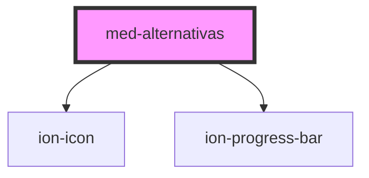

# med-alternativas

<!-- Auto Generated Below -->

## Properties

| Property                              | Attribute                 | Description | Type                  | Default         |
| ------------------------------------- | ------------------------- | ----------- | --------------------- | --------------- |
| `alternativaSelecionada` _(required)_ | `alternativa-selecionada` |             | `string`              | `undefined`     |
| `alternativas`                        | `alternativas`            |             | `any`                 | `[]`            |
| `color`                               | `color`                   |             | `string \| undefined` | `undefined`     |
| `keyAlternativa`                      | `key-alternativa`         |             | `string`              | `'Alternativa'` |
| `keyEnunciado`                        | `key-enunciado`           |             | `string`              | `'Enunciado'`   |
| `keyImagem`                           | `key-imagem`              |             | `string`              | `'Imagem'`      |
| `keyPorcentagem`                      | `key-porcentagem`         |             | `string`              | `'Porcentagem'` |
| `keyRiscada`                          | `key-riscada`             |             | `string`              | `'Riscada'`     |
| `mostraResposta` _(required)_         | `mostra-resposta`         |             | `boolean`             | `undefined`     |
| `neutral`                             | `neutral`                 |             | `string \| undefined` | `undefined`     |
| `permiteRiscar`                       | `permite-riscar`          |             | `boolean`             | `true`          |
| `respostaCorreta` _(required)_        | `resposta-correta`        |             | `string`              | `undefined`     |

## Events

| Event               | Description | Type                                   |
| ------------------- | ----------- | -------------------------------------- |
| `medChange`         |             | `CustomEvent<MedAlternativaInterface>` |
| `medGalleryRequest` |             | `CustomEvent<MedAlternativaInterface>` |
| `medRiscada`        |             | `CustomEvent<MedAlternativaInterface>` |

## Dependencies

### Depends on

- ion-icon
- [ion-progress-bar](../../../../progress-bar)

### Graph

----------------------------------------------

*Built with [StencilJS](https://stenciljs.com/)*
