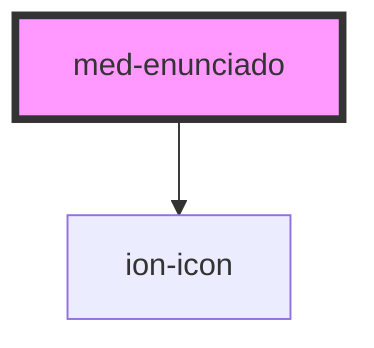

# med-enunciado

<!-- Auto Generated Below -->

## Properties

| Property               | Attribute | Description                      | Type                  | Default     |
| ---------------------- | --------- | -------------------------------- | --------------------- | ----------- |
| `dsName`               | `ds-name` | Define a variação do componente. | `"skin" \| undefined` | `undefined` |
| `imagens` _(required)_ | `imagens` | TODO                             | `string \| string[]`  | `undefined` |

## Events

| Event               | Description | Type                  |
| ------------------- | ----------- | --------------------- |
| `medGalleryRequest` | TODO        | `CustomEvent<string>` |

## Dependencies

### Depends on

- ion-icon

### Graph

----------------------------------------------

*Built with [StencilJS](https://stenciljs.com/)*
