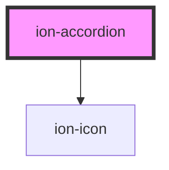

# ion-accordion

<!-- Auto Generated Below -->

## Properties

| Property         | Attribute          | Description                                                                                    | Type                  | Default          |
| ---------------- | ------------------ | ---------------------------------------------------------------------------------------------- | --------------------- | ---------------- |
| `disabled`       | `disabled`         | If `true`, the accordion cannot be interacted with.                                            | `boolean`             | `false`          |
| `mode`           | `mode`             | The mode determines which platform styles to use.                                              | `"ios" \| "md"`       | `undefined`      |
| `readonly`       | `readonly`         | If `true`, the accordion cannot be interacted with, but does not alter the opacity.            | `boolean`             | `false`          |
| `toggleIcon`     | `toggle-icon`      | The toggle icon to use. This icon will be rotated when the accordion is expanded or collapsed. | `string`              | `'chevron-down'` |
| `toggleIconSlot` | `toggle-icon-slot` | The slot inside of `ion-item` to place the toggle icon. Defaults to `'end'`.                   | `"end" \| "start"`    | `'end'`          |
| `value`          | `value`            | The value of the accordion.                                                                    | `string \| undefined` | `undefined`      |

## Events

| Event      | Description                             | Type                |
| ---------- | --------------------------------------- | ------------------- |
| `ionBlur`  | Emitted when the accordion loses focus. | `CustomEvent<void>` |
| `ionFocus` | Emitted when the accordion has focus.   | `CustomEvent<void>` |

## Slots

| Slot        | Description                                                                        |
| ----------- | ---------------------------------------------------------------------------------- |
| `"content"` | Content is placed below the header and is shown or hidden based on expanded state. |
| `"header"`  | Content is placed at the top and is used to expand or collapse the accordion item. |

## Shadow Parts

| Part         | Description                                                                                                              |
| ------------ | ------------------------------------------------------------------------------------------------------------------------ |
| `"content"`  | The wrapper element for the content slot.                                                                                |
| `"expanded"` | The expanded element. Can be used in combination with the `header` and `content` parts (i.e. `::part(header expanded)`). |
| `"header"`   | The wrapper element for the header slot.                                                                                 |

## Dependencies

### Depends on

- ion-icon

### Graph

----------------------------------------------

*Built with [StencilJS](https://stenciljs.com/)*
