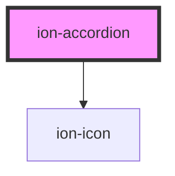

# ion-accordion

Accordions provide collapsible sections in your content to reduce vertical space while providing a way of organizing and grouping information. All `ion-accordion` components should be grouped inside `ion-accordion-group` components.

## Anatomy

### Header

The `header` slot is used as the toggle that will expand or collapse your accordion. We recommend you use an `ion-item` here to take advantage of the accessibility and theming functionalities.

When using `ion-item` in the `header` slot, the `ion-item`'s `button` prop is set to `true` and the `detail` prop is set to `false`. In addition, we will also automatically add a toggle icon to the `ion-item`. This icon will automatically be rotated when you expand or collapse the accordion. See [Customizing Icons](#customizing-icons) for more information.

### Content

The `content` slot is used as the part of the accordion that is revealed or hidden depending on the state of your accordion. You can place anything here except for another `ion-content` instance as only one instance of `ion-content` should be added per page.

## Customizing Icons

When using an `ion-item` in the `header` slot, we automatically add an `ion-icon`. The type of icon used can be controlled by the `toggleIcon` property, and the slot it is added to can be controlled with the `toggleIconSlot` property.

If you would like to manage the icon yourself or use an icon that is not an `ion-icon`, you can add the `ion-accordion-toggle-icon` class to the icon element.

Regardless of which option you choose, the icon will automatically be rotated when you expand or collapse the accordion.

## Expansion Styles

### Built in Styles

There are two built in expansion styles: `compact` and `inset`. This expansion style is set via the `expand` property on `ion-accordion-group`. When `expand="inset"`, the accordion group is given a border radius. On `md` mode, the entire accordion will shift down when it is opened.

### Custom Styles

You can customize the expansion behavior by styling based on the accordion's state:

```css
ion-accordion {
  margin: 0 auto;
}

ion-accordion.accordion-expanding,
ion-accordion.accordion-expanded {
  width: calc(100% - 32px);
  margin: 16px auto;
}
```

This example will cause an accordion to have its width shrink when it is opened. You can also style the accordion differently when it is closing by targeting the `.accordion-collapsing` and `.accordion-collapsed` classes.

If you need to target specific pieces of the accordion, we recommend targeting the element directly. For example, if you want to customize the `ion-item` in your `header` slot when the accordion is expanded, you can use the following selector:

```css
ion-accordion.accordion-expanding ion-item[slot="header"],
ion-accordion.accordion-expanded ion-item[slot="header"] {
  --color: red;
}
```

This example will set the text color of the header `ion-item` to red when the accordion is expanded.


## Accessibility

### Animations

By default, animations are enabled when expanding or collapsing an accordion item. Animations will be automatically disabled when the `prefers-reduced-motion` media query is supported and set to `reduce`. For browsers that do not support this, animations can be disabled by setting the `animated` config in your Ionic Framework app.

### Keyboard Navigation

When used inside an `ion-accordion-group`, `ion-accordion` has full keyboard support for interacting with the component. The following table details what each key does:

| Key                | Function                                                     |
| ------------------ | ------------------------------------------------------------ |
| `Space` or `Enter` | When focus is on the accordion header, the accordion will collapse or expand depending on the state of the component. |
| `Tab`              | Moves focus to the next focusable element.                   |
| `Shift` + `Tab`    | Moves focus to the previous focusable element.               |
| `Down Arrow`       | - When focus is on an accordion header, moves focus to the next accordion header.  <br />- When focus is on the last accordion header, moves focus to the first accordion header. |
| `Up Arrow`         | - When focus is on an accordion header, moves focus to the previous accordion header.  <br />- When focus is on the first accordion header, moves focus to the last accordion header. |
| `Home`             | When focus is on an accordion header, moves focus to the first accordion header. |
| `End`              | When focus is on an accordion header, moves focus to the last accordion header. |

<!-- Auto Generated Below -->


## Usage

### Angular

```html
<!-- Basic -->
<ion-accordion-group>
  <ion-accordion value="colors">
    <ion-item slot="header">
      <ion-label>Colors</ion-label>
    </ion-item>

    <ion-list slot="content">
      <ion-item>
        <ion-label>Red</ion-label>
      </ion-item>
      <ion-item>
        <ion-label>Green</ion-label>
      </ion-item>
      <ion-item>
        <ion-label>Blue</ion-label>
      </ion-item>
    </ion-list>
  </ion-accordion>
  <ion-accordion value="shapes">
    <ion-item slot="header">
      <ion-label>Shapes</ion-label>
    </ion-item>

    <ion-list slot="content">
      <ion-item>
        <ion-label>Circle</ion-label>
      </ion-item>
      <ion-item>
        <ion-label>Triangle</ion-label>
      </ion-item>
      <ion-item>
        <ion-label>Square</ion-label>
      </ion-item>
    </ion-list>
  </ion-accordion>
  <ion-accordion value="numbers">
    <ion-item slot="header">
      <ion-label>Numbers</ion-label>
    </ion-item>

    <ion-list slot="content">
      <ion-item>
        <ion-label>1</ion-label>
      </ion-item>
      <ion-item>
        <ion-label>2</ion-label>
      </ion-item>
      <ion-item>
        <ion-label>3</ion-label>
      </ion-item>
    </ion-list>
  </ion-accordion>
</ion-accordion-group>

<!-- Custom Icon -->
<ion-accordion-group>
  <ion-accordion value="colors" toggle-icon="arrow-down-circle">
    <ion-item slot="header">
      <ion-label>Colors</ion-label>
    </ion-item>

    <ion-list slot="content">
      <ion-item>
        <ion-label>Red</ion-label>
      </ion-item>
      <ion-item>
        <ion-label>Green</ion-label>
      </ion-item>
      <ion-item>
        <ion-label>Blue</ion-label>
      </ion-item>
    </ion-list>
  </ion-accordion>
  <ion-accordion value="shapes" toggle-icon="arrow-down-circle">
    <ion-item slot="header">
      <ion-label>Shapes</ion-label>
    </ion-item>

    <ion-list slot="content">
      <ion-item>
        <ion-label>Circle</ion-label>
      </ion-item>
      <ion-item>
        <ion-label>Triangle</ion-label>
      </ion-item>
      <ion-item>
        <ion-label>Square</ion-label>
      </ion-item>
    </ion-list>
  </ion-accordion>
  <ion-accordion value="numbers" toggle-icon="arrow-down-circle">
    <ion-item slot="header">
      <ion-label>Numbers</ion-label>
    </ion-item>

    <ion-list slot="content">
      <ion-item>
        <ion-label>1</ion-label>
      </ion-item>
      <ion-item>
        <ion-label>2</ion-label>
      </ion-item>
      <ion-item>
        <ion-label>3</ion-label>
      </ion-item>
    </ion-list>
  </ion-accordion>
</ion-accordion-group>

<!-- Open Accordion -->
<ion-accordion-group value="colors">
  <ion-accordion value="colors">
    <ion-item slot="header">
      <ion-label>Colors</ion-label>
    </ion-item>

    <ion-list slot="content">
      <ion-item>
        <ion-label>Red</ion-label>
      </ion-item>
      <ion-item>
        <ion-label>Green</ion-label>
      </ion-item>
      <ion-item>
        <ion-label>Blue</ion-label>
      </ion-item>
    </ion-list>
  </ion-accordion>
  <ion-accordion value="shapes">
    <ion-item slot="header">
      <ion-label>Shapes</ion-label>
    </ion-item>

    <ion-list slot="content">
      <ion-item>
        <ion-label>Circle</ion-label>
      </ion-item>
      <ion-item>
        <ion-label>Triangle</ion-label>
      </ion-item>
      <ion-item>
        <ion-label>Square</ion-label>
      </ion-item>
    </ion-list>
  </ion-accordion>
  <ion-accordion value="numbers">
    <ion-item slot="header">
      <ion-label>Numbers</ion-label>
    </ion-item>

    <ion-list slot="content">
      <ion-item>
        <ion-label>1</ion-label>
      </ion-item>
      <ion-item>
        <ion-label>2</ion-label>
      </ion-item>
      <ion-item>
        <ion-label>3</ion-label>
      </ion-item>
    </ion-list>
  </ion-accordion>
</ion-accordion-group>

<!-- Multiple Accordions -->
<ion-accordion-group [multiple]="true" [value]="['colors', 'numbers']">
  <ion-accordion value="colors">
    <ion-item slot="header">
      <ion-label>Colors</ion-label>
    </ion-item>

    <ion-list slot="content">
      <ion-item>
        <ion-label>Red</ion-label>
      </ion-item>
      <ion-item>
        <ion-label>Green</ion-label>
      </ion-item>
      <ion-item>
        <ion-label>Blue</ion-label>
      </ion-item>
    </ion-list>
  </ion-accordion>
  <ion-accordion value="shapes">
    <ion-item slot="header">
      <ion-label>Shapes</ion-label>
    </ion-item>

    <ion-list slot="content">
      <ion-item>
        <ion-label>Circle</ion-label>
      </ion-item>
      <ion-item>
        <ion-label>Triangle</ion-label>
      </ion-item>
      <ion-item>
        <ion-label>Square</ion-label>
      </ion-item>
    </ion-list>
  </ion-accordion>
  <ion-accordion value="numbers">
    <ion-item slot="header">
      <ion-label>Numbers</ion-label>
    </ion-item>

    <ion-list slot="content">
      <ion-item>
        <ion-label>1</ion-label>
      </ion-item>
      <ion-item>
        <ion-label>2</ion-label>
      </ion-item>
      <ion-item>
        <ion-label>3</ion-label>
      </ion-item>
    </ion-list>
  </ion-accordion>
</ion-accordion-group>
```


### Javascript

```html
<!-- Basic -->
<ion-accordion-group>
  <ion-accordion value="colors">
    <ion-item slot="header">
      <ion-label>Colors</ion-label>
    </ion-item>

    <ion-list slot="content">
      <ion-item>
        <ion-label>Red</ion-label>
      </ion-item>
      <ion-item>
        <ion-label>Green</ion-label>
      </ion-item>
      <ion-item>
        <ion-label>Blue</ion-label>
      </ion-item>
    </ion-list>
  </ion-accordion>
  <ion-accordion value="shapes">
    <ion-item slot="header">
      <ion-label>Shapes</ion-label>
    </ion-item>

    <ion-list slot="content">
      <ion-item>
        <ion-label>Circle</ion-label>
      </ion-item>
      <ion-item>
        <ion-label>Triangle</ion-label>
      </ion-item>
      <ion-item>
        <ion-label>Square</ion-label>
      </ion-item>
    </ion-list>
  </ion-accordion>
  <ion-accordion value="numbers">
    <ion-item slot="header">
      <ion-label>Numbers</ion-label>
    </ion-item>

    <ion-list slot="content">
      <ion-item>
        <ion-label>1</ion-label>
      </ion-item>
      <ion-item>
        <ion-label>2</ion-label>
      </ion-item>
      <ion-item>
        <ion-label>3</ion-label>
      </ion-item>
    </ion-list>
  </ion-accordion>
</ion-accordion-group>

<!-- Custom Icon -->
<ion-accordion-group>
  <ion-accordion value="colors" toggle-icon="arrow-down-circle">
    <ion-item slot="header">
      <ion-label>Colors</ion-label>
    </ion-item>

    <ion-list slot="content">
      <ion-item>
        <ion-label>Red</ion-label>
      </ion-item>
      <ion-item>
        <ion-label>Green</ion-label>
      </ion-item>
      <ion-item>
        <ion-label>Blue</ion-label>
      </ion-item>
    </ion-list>
  </ion-accordion>
  <ion-accordion value="shapes" toggle-icon="arrow-down-circle">
    <ion-item slot="header">
      <ion-label>Shapes</ion-label>
    </ion-item>

    <ion-list slot="content">
      <ion-item>
        <ion-label>Circle</ion-label>
      </ion-item>
      <ion-item>
        <ion-label>Triangle</ion-label>
      </ion-item>
      <ion-item>
        <ion-label>Square</ion-label>
      </ion-item>
    </ion-list>
  </ion-accordion>
  <ion-accordion value="numbers" toggle-icon="arrow-down-circle">
    <ion-item slot="header">
      <ion-label>Numbers</ion-label>
    </ion-item>

    <ion-list slot="content">
      <ion-item>
        <ion-label>1</ion-label>
      </ion-item>
      <ion-item>
        <ion-label>2</ion-label>
      </ion-item>
      <ion-item>
        <ion-label>3</ion-label>
      </ion-item>
    </ion-list>
  </ion-accordion>
</ion-accordion-group>

<!-- Open Accordion -->
<ion-accordion-group value="colors">
  <ion-accordion value="colors">
    <ion-item slot="header">
      <ion-label>Colors</ion-label>
    </ion-item>

    <ion-list slot="content">
      <ion-item>
        <ion-label>Red</ion-label>
      </ion-item>
      <ion-item>
        <ion-label>Green</ion-label>
      </ion-item>
      <ion-item>
        <ion-label>Blue</ion-label>
      </ion-item>
    </ion-list>
  </ion-accordion>
  <ion-accordion value="shapes">
    <ion-item slot="header">
      <ion-label>Shapes</ion-label>
    </ion-item>

    <ion-list slot="content">
      <ion-item>
        <ion-label>Circle</ion-label>
      </ion-item>
      <ion-item>
        <ion-label>Triangle</ion-label>
      </ion-item>
      <ion-item>
        <ion-label>Square</ion-label>
      </ion-item>
    </ion-list>
  </ion-accordion>
  <ion-accordion value="numbers">
    <ion-item slot="header">
      <ion-label>Numbers</ion-label>
    </ion-item>

    <ion-list slot="content">
      <ion-item>
        <ion-label>1</ion-label>
      </ion-item>
      <ion-item>
        <ion-label>2</ion-label>
      </ion-item>
      <ion-item>
        <ion-label>3</ion-label>
      </ion-item>
    </ion-list>
  </ion-accordion>
</ion-accordion-group>

<!-- Multiple Accordions -->
<ion-accordion-group multiple="true">
  <ion-accordion value="colors">
    <ion-item slot="header">
      <ion-label>Colors</ion-label>
    </ion-item>

    <ion-list slot="content">
      <ion-item>
        <ion-label>Red</ion-label>
      </ion-item>
      <ion-item>
        <ion-label>Green</ion-label>
      </ion-item>
      <ion-item>
        <ion-label>Blue</ion-label>
      </ion-item>
    </ion-list>
  </ion-accordion>
  <ion-accordion value="shapes">
    <ion-item slot="header">
      <ion-label>Shapes</ion-label>
    </ion-item>

    <ion-list slot="content">
      <ion-item>
        <ion-label>Circle</ion-label>
      </ion-item>
      <ion-item>
        <ion-label>Triangle</ion-label>
      </ion-item>
      <ion-item>
        <ion-label>Square</ion-label>
      </ion-item>
    </ion-list>
  </ion-accordion>
  <ion-accordion value="numbers">
    <ion-item slot="header">
      <ion-label>Numbers</ion-label>
    </ion-item>

    <ion-list slot="content">
      <ion-item>
        <ion-label>1</ion-label>
      </ion-item>
      <ion-item>
        <ion-label>2</ion-label>
      </ion-item>
      <ion-item>
        <ion-label>3</ion-label>
      </ion-item>
    </ion-list>
  </ion-accordion>
</ion-accordion-group>

<script>
  let accordionGroup = document.querySelector('ion-accordion-group');
  accordionGroup.value = ['colors', 'numbers'];
</script>
```


### React

```tsx
import React from 'react';

import { IonContent, IonAccordionGroup, IonAccordion, IonItem, IonLabel } from '@ionic/react';
import { arrowDownCircle } from 'ionicons/icons';

export const AccordionExample: React.FC = () => (
  {/*-- Basic --*/}
  <IonAccordionGroup>
    <IonAccordion value="colors">
      <IonItem slot="header">
        <IonLabel>Colors</IonLabel>
      </IonItem>

      <ion-list slot="content">
        <IonItem>
          <IonLabel>Red</IonLabel>
        </IonItem>
        <IonItem>
          <IonLabel>Green</IonLabel>
        </IonItem>
        <IonItem>
          <IonLabel>Blue</IonLabel>
        </IonItem>
      </ion-list>
    </IonAccordion>
    <IonAccordion value="shapes">
      <IonItem slot="header">
        <IonLabel>Shapes</IonLabel>
      </IonItem>

      <ion-list slot="content">
        <IonItem>
          <IonLabel>Circle</IonLabel>
        </IonItem>
        <IonItem>
          <IonLabel>Triangle</IonLabel>
        </IonItem>
        <IonItem>
          <IonLabel>Square</IonLabel>
        </IonItem>
      </ion-list>
    </IonAccordion>
    <IonAccordion value="numbers">
      <IonItem slot="header">
        <IonLabel>Numbers</IonLabel>
      </IonItem>

      <ion-list slot="content">
        <IonItem>
          <IonLabel>1</IonLabel>
        </IonItem>
        <IonItem>
          <IonLabel>2</IonLabel>
        </IonItem>
        <IonItem>
          <IonLabel>3</IonLabel>
        </IonItem>
      </ion-list>
    </IonAccordion>
  </IonAccordionGroup>

  {/*-- Custom Icon --*/}
  <IonAccordionGroup>
    <IonAccordion value="colors" toggleIcon={arrowDownCircle}>
      <IonItem slot="header">
        <IonLabel>Colors</IonLabel>
      </IonItem>

      <ion-list slot="content">
        <IonItem>
          <IonLabel>Red</IonLabel>
        </IonItem>
        <IonItem>
          <IonLabel>Green</IonLabel>
        </IonItem>
        <IonItem>
          <IonLabel>Blue</IonLabel>
        </IonItem>
      </ion-list>
    </IonAccordion>
    <IonAccordion value="shapes" toggleIcon={arrowDownCircle}>
      <IonItem slot="header">
        <IonLabel>Shapes</IonLabel>
      </IonItem>

      <ion-list slot="content">
        <IonItem>
          <IonLabel>Circle</IonLabel>
        </IonItem>
        <IonItem>
          <IonLabel>Triangle</IonLabel>
        </IonItem>
        <IonItem>
          <IonLabel>Square</IonLabel>
        </IonItem>
      </ion-list>
    </IonAccordion>
    <IonAccordion value="numbers" toggleIcon={arrowDownCircle}>
      <IonItem slot="header">
        <IonLabel>Numbers</IonLabel>
      </IonItem>

      <ion-list slot="content">
        <IonItem>
          <IonLabel>1</IonLabel>
        </IonItem>
        <IonItem>
          <IonLabel>2</IonLabel>
        </IonItem>
        <IonItem>
          <IonLabel>3</IonLabel>
        </IonItem>
      </ion-list>
    </IonAccordion>
  </IonAccordionGroup>

  {/*-- Open Accordion --*/}
  <IonAccordionGroup value="colors">
    <IonAccordion value="colors">
      <IonItem slot="header">
        <IonLabel>Colors</IonLabel>
      </IonItem>

      <ion-list slot="content">
        <IonItem>
          <IonLabel>Red</IonLabel>
        </IonItem>
        <IonItem>
          <IonLabel>Green</IonLabel>
        </IonItem>
        <IonItem>
          <IonLabel>Blue</IonLabel>
        </IonItem>
      </ion-list>
    </IonAccordion>
    <IonAccordion value="shapes">
      <IonItem slot="header">
        <IonLabel>Shapes</IonLabel>
      </IonItem>

      <ion-list slot="content">
        <IonItem>
          <IonLabel>Circle</IonLabel>
        </IonItem>
        <IonItem>
          <IonLabel>Triangle</IonLabel>
        </IonItem>
        <IonItem>
          <IonLabel>Square</IonLabel>
        </IonItem>
      </ion-list>
    </IonAccordion>
    <IonAccordion value="numbers">
      <IonItem slot="header">
        <IonLabel>Numbers</IonLabel>
      </IonItem>

      <ion-list slot="content">
        <IonItem>
          <IonLabel>1</IonLabel>
        </IonItem>
        <IonItem>
          <IonLabel>2</IonLabel>
        </IonItem>
        <IonItem>
          <IonLabel>3</IonLabel>
        </IonItem>
      </ion-list>
    </IonAccordion>
  </IonAccordionGroup>

  {/*-- Multiple Accordions --*/}
  <IonAccordionGroup multiple={true} value={['colors', 'numbers']}>
    <IonAccordion value="colors">
      <IonItem slot="header">
        <IonLabel>Colors</IonLabel>
      </IonItem>

      <ion-list slot="content">
        <IonItem>
          <IonLabel>Red</IonLabel>
        </IonItem>
        <IonItem>
          <IonLabel>Green</IonLabel>
        </IonItem>
        <IonItem>
          <IonLabel>Blue</IonLabel>
        </IonItem>
      </ion-list>
    </IonAccordion>
    <IonAccordion value="shapes">
      <IonItem slot="header">
        <IonLabel>Shapes</IonLabel>
      </IonItem>

      <ion-list slot="content">
        <IonItem>
          <IonLabel>Circle</IonLabel>
        </IonItem>
        <IonItem>
          <IonLabel>Triangle</IonLabel>
        </IonItem>
        <IonItem>
          <IonLabel>Square</IonLabel>
        </IonItem>
      </ion-list>
    </IonAccordion>
    <IonAccordion value="numbers">
      <IonItem slot="header">
        <IonLabel>Numbers</IonLabel>
      </IonItem>

      <ion-list slot="content">
        <IonItem>
          <IonLabel>1</IonLabel>
        </IonItem>
        <IonItem>
          <IonLabel>2</IonLabel>
        </IonItem>
        <IonItem>
          <IonLabel>3</IonLabel>
        </IonItem>
      </ion-list>
    </IonAccordion>
  </IonAccordionGroup>
);
```


### Stencil

```tsx
import { Component, h } from '@stencil/core';

@Component({
  tag: 'accordion-example',
  styleUrl: 'accordion-example.css'
})
export const AccordionExample {
  render() {
    return [
      // Basic
      <ion-accordion-group>
        <ion-accordion value="colors">
          <ion-item slot="header">
            <ion-label>Colors</ion-label>
          </ion-item>

          <ion-list slot="content">
            <ion-item>
              <ion-label>Red</ion-label>
            </ion-item>
            <ion-item>
              <ion-label>Green</ion-label>
            </ion-item>
            <ion-item>
              <ion-label>Blue</ion-label>
            </ion-item>
          </ion-list>
        </ion-accordion>
        <ion-accordion value="shapes">
          <ion-item slot="header">
            <ion-label>Shapes</ion-label>
          </ion-item>

          <ion-list slot="content">
            <ion-item>
              <ion-label>Circle</ion-label>
            </ion-item>
            <ion-item>
              <ion-label>Triangle</ion-label>
            </ion-item>
            <ion-item>
              <ion-label>Square</ion-label>
            </ion-item>
          </ion-list>
        </ion-accordion>
        <ion-accordion value="numbers">
          <ion-item slot="header">
            <ion-label>Numbers</ion-label>
          </ion-item>

          <ion-list slot="content">
            <ion-item>
              <ion-label>1</ion-label>
            </ion-item>
            <ion-item>
              <ion-label>2</ion-label>
            </ion-item>
            <ion-item>
              <ion-label>3</ion-label>
            </ion-item>
          </ion-list>
        </ion-accordion>
      </ion-accordion-group>

      // Custom Icon
      <ion-accordion-group>
        <ion-accordion value="colors" toggle-icon="arrow-down-circle">
          <ion-item slot="header">
            <ion-label>Colors</ion-label>
          </ion-item>

          <ion-list slot="content">
            <ion-item>
              <ion-label>Red</ion-label>
            </ion-item>
            <ion-item>
              <ion-label>Green</ion-label>
            </ion-item>
            <ion-item>
              <ion-label>Blue</ion-label>
            </ion-item>
          </ion-list>
        </ion-accordion>
        <ion-accordion value="shapes" toggle-icon="arrow-down-circle">
          <ion-item slot="header">
            <ion-label>Shapes</ion-label>
          </ion-item>

          <ion-list slot="content">
            <ion-item>
              <ion-label>Circle</ion-label>
            </ion-item>
            <ion-item>
              <ion-label>Triangle</ion-label>
            </ion-item>
            <ion-item>
              <ion-label>Square</ion-label>
            </ion-item>
          </ion-list>
        </ion-accordion>
        <ion-accordion value="numbers" toggle-icon="arrow-down-circle">
          <ion-item slot="header">
            <ion-label>Numbers</ion-label>
          </ion-item>

          <ion-list slot="content">
            <ion-item>
              <ion-label>1</ion-label>
            </ion-item>
            <ion-item>
              <ion-label>2</ion-label>
            </ion-item>
            <ion-item>
              <ion-label>3</ion-label>
            </ion-item>
          </ion-list>
        </ion-accordion>
      </ion-accordion-group>

      // Open Accordion
      <ion-accordion-group value="colors">
        <ion-accordion value="colors">
          <ion-item slot="header">
            <ion-label>Colors</ion-label>
          </ion-item>

          <ion-list slot="content">
            <ion-item>
              <ion-label>Red</ion-label>
            </ion-item>
            <ion-item>
              <ion-label>Green</ion-label>
            </ion-item>
            <ion-item>
              <ion-label>Blue</ion-label>
            </ion-item>
          </ion-list>
        </ion-accordion>
        <ion-accordion value="shapes">
          <ion-item slot="header">
            <ion-label>Shapes</ion-label>
          </ion-item>

          <ion-list slot="content">
            <ion-item>
              <ion-label>Circle</ion-label>
            </ion-item>
            <ion-item>
              <ion-label>Triangle</ion-label>
            </ion-item>
            <ion-item>
              <ion-label>Square</ion-label>
            </ion-item>
          </ion-list>
        </ion-accordion>
        <ion-accordion value="numbers">
          <ion-item slot="header">
            <ion-label>Numbers</ion-label>
          </ion-item>

          <ion-list slot="content">
            <ion-item>
              <ion-label>1</ion-label>
            </ion-item>
            <ion-item>
              <ion-label>2</ion-label>
            </ion-item>
            <ion-item>
              <ion-label>3</ion-label>
            </ion-item>
          </ion-list>
        </ion-accordion>
      </ion-accordion-group>

      // Multiple Accordions
      <ion-accordion-group multiple={true} value={['colors', 'numbers']}>
        <ion-accordion value="colors">
          <ion-item slot="header">
            <ion-label>Colors</ion-label>
          </ion-item>

          <ion-list slot="content">
            <ion-item>
              <ion-label>Red</ion-label>
            </ion-item>
            <ion-item>
              <ion-label>Green</ion-label>
            </ion-item>
            <ion-item>
              <ion-label>Blue</ion-label>
            </ion-item>
          </ion-list>
        </ion-accordion>
        <ion-accordion value="shapes">
          <ion-item slot="header">
            <ion-label>Shapes</ion-label>
          </ion-item>

          <ion-list slot="content">
            <ion-item>
              <ion-label>Circle</ion-label>
            </ion-item>
            <ion-item>
              <ion-label>Triangle</ion-label>
            </ion-item>
            <ion-item>
              <ion-label>Square</ion-label>
            </ion-item>
          </ion-list>
        </ion-accordion>
        <ion-accordion value="numbers">
          <ion-item slot="header">
            <ion-label>Numbers</ion-label>
          </ion-item>

          <ion-list slot="content">
            <ion-item>
              <ion-label>1</ion-label>
            </ion-item>
            <ion-item>
              <ion-label>2</ion-label>
            </ion-item>
            <ion-item>
              <ion-label>3</ion-label>
            </ion-item>
          </ion-list>
        </ion-accordion>
      </ion-accordion-group>
    ];
  }
);
```


### Vue

```html
<template>
  <!-- Basic -->
  <ion-accordion-group>
    <ion-accordion value="colors">
      <ion-item slot="header">
        <ion-label>Colors</ion-label>
      </ion-item>

      <ion-list slot="content">
        <ion-item>
          <ion-label>Red</ion-label>
        </ion-item>
        <ion-item>
          <ion-label>Green</ion-label>
        </ion-item>
        <ion-item>
          <ion-label>Blue</ion-label>
        </ion-item>
      </ion-list>
    </ion-accordion>
    <ion-accordion value="shapes">
      <ion-item slot="header">
        <ion-label>Shapes</ion-label>
      </ion-item>

      <ion-list slot="content">
        <ion-item>
          <ion-label>Circle</ion-label>
        </ion-item>
        <ion-item>
          <ion-label>Triangle</ion-label>
        </ion-item>
        <ion-item>
          <ion-label>Square</ion-label>
        </ion-item>
      </ion-list>
    </ion-accordion>
    <ion-accordion value="numbers">
      <ion-item slot="header">
        <ion-label>Numbers</ion-label>
      </ion-item>

      <ion-list slot="content">
        <ion-item>
          <ion-label>1</ion-label>
        </ion-item>
        <ion-item>
          <ion-label>2</ion-label>
        </ion-item>
        <ion-item>
          <ion-label>3</ion-label>
        </ion-item>
      </ion-list>
    </ion-accordion>
  </ion-accordion-group>

  <!-- Custom Icon -->
  <ion-accordion-group>
    <ion-accordion value="colors" :toggle-icon="arrowDownCircle">
      <ion-item slot="header">
        <ion-label>Colors</ion-label>
      </ion-item>

      <ion-list slot="content">
        <ion-item>
          <ion-label>Red</ion-label>
        </ion-item>
        <ion-item>
          <ion-label>Green</ion-label>
        </ion-item>
        <ion-item>
          <ion-label>Blue</ion-label>
        </ion-item>
      </ion-list>
    </ion-accordion>
    <ion-accordion value="shapes" :toggle-icon="arrowDownCircle">
      <ion-item slot="header">
        <ion-label>Shapes</ion-label>
      </ion-item>

      <ion-list slot="content">
        <ion-item>
          <ion-label>Circle</ion-label>
        </ion-item>
        <ion-item>
          <ion-label>Triangle</ion-label>
        </ion-item>
        <ion-item>
          <ion-label>Square</ion-label>
        </ion-item>
      </ion-list>
    </ion-accordion>
    <ion-accordion value="numbers" :toggle-icon="arrowDownCircle">
      <ion-item slot="header">
        <ion-label>Numbers</ion-label>
      </ion-item>

      <ion-list slot="content">
        <ion-item>
          <ion-label>1</ion-label>
        </ion-item>
        <ion-item>
          <ion-label>2</ion-label>
        </ion-item>
        <ion-item>
          <ion-label>3</ion-label>
        </ion-item>
      </ion-list>
    </ion-accordion>
  </ion-accordion-group>

  <!-- Open Accordion -->
  <ion-accordion-group value="colors">
    <ion-accordion value="colors">
      <ion-item slot="header">
        <ion-label>Colors</ion-label>
      </ion-item>

      <ion-list slot="content">
        <ion-item>
          <ion-label>Red</ion-label>
        </ion-item>
        <ion-item>
          <ion-label>Green</ion-label>
        </ion-item>
        <ion-item>
          <ion-label>Blue</ion-label>
        </ion-item>
      </ion-list>
    </ion-accordion>
    <ion-accordion value="shapes">
      <ion-item slot="header">
        <ion-label>Shapes</ion-label>
      </ion-item>

      <ion-list slot="content">
        <ion-item>
          <ion-label>Circle</ion-label>
        </ion-item>
        <ion-item>
          <ion-label>Triangle</ion-label>
        </ion-item>
        <ion-item>
          <ion-label>Square</ion-label>
        </ion-item>
      </ion-list>
    </ion-accordion>
    <ion-accordion value="numbers">
      <ion-item slot="header">
        <ion-label>Numbers</ion-label>
      </ion-item>

      <ion-list slot="content">
        <ion-item>
          <ion-label>1</ion-label>
        </ion-item>
        <ion-item>
          <ion-label>2</ion-label>
        </ion-item>
        <ion-item>
          <ion-label>3</ion-label>
        </ion-item>
      </ion-list>
    </ion-accordion>
  </ion-accordion-group>

  <!-- Multiple Accordions -->
  <ion-accordion-group :multiple="true" :value="['colors', 'numbers']">
    <ion-accordion value="colors">
      <ion-item slot="header">
        <ion-label>Colors</ion-label>
      </ion-item>

      <ion-list slot="content">
        <ion-item>
          <ion-label>Red</ion-label>
        </ion-item>
        <ion-item>
          <ion-label>Green</ion-label>
        </ion-item>
        <ion-item>
          <ion-label>Blue</ion-label>
        </ion-item>
      </ion-list>
    </ion-accordion>
    <ion-accordion value="shapes">
      <ion-item slot="header">
        <ion-label>Shapes</ion-label>
      </ion-item>

      <ion-list slot="content">
        <ion-item>
          <ion-label>Circle</ion-label>
        </ion-item>
        <ion-item>
          <ion-label>Triangle</ion-label>
        </ion-item>
        <ion-item>
          <ion-label>Square</ion-label>
        </ion-item>
      </ion-list>
    </ion-accordion>
    <ion-accordion value="numbers">
      <ion-item slot="header">
        <ion-label>Numbers</ion-label>
      </ion-item>

      <ion-list slot="content">
        <ion-item>
          <ion-label>1</ion-label>
        </ion-item>
        <ion-item>
          <ion-label>2</ion-label>
        </ion-item>
        <ion-item>
          <ion-label>3</ion-label>
        </ion-item>
      </ion-list>
    </ion-accordion>
  </ion-accordion-group>
</template>

<script>
  import { IonAccordion, IonAccordionGroup, IonItem, IonLabel } from '@ionic/vue';
  import { defineComponent } from 'vue';
  import { arrowDownCircle } from 'ionicons/icons';

  export default defineComponent({
    components: { IonAccordion, IonAccordionGroup, IonItem, IonLabel },
    setup() {
      return { arrowDownCircle }
    }
  });
</script>
```


## Properties

| Property         | Attribute          | Description                                                                                    | Type               | Default                             |
| ---------------- | ------------------ | ---------------------------------------------------------------------------------------------- | ------------------ | ----------------------------------- |
| `disabled`       | `disabled`         | If `true`, the accordion cannot be interacted with.                                            | `boolean`          | `false`                             |
| `mode`           | `mode`             | The mode determines which platform styles to use.                                              | `"ios" \| "md"`    | `undefined`                         |
| `readonly`       | `readonly`         | If `true`, the accordion cannot be interacted with, but does not alter the opacity.            | `boolean`          | `false`                             |
| `toggleIcon`     | `toggle-icon`      | The toggle icon to use. This icon will be rotated when the accordion is expanded or collapsed. | `string`           | `'chevron-down'`                    |
| `toggleIconSlot` | `toggle-icon-slot` | The slot inside of `ion-item` to place the toggle icon. Defaults to `'end'`.                   | `"end" \| "start"` | `'end'`                             |
| `value`          | `value`            | The value of the accordion. Defaults to an autogenerated value.                                | `string`           | ``ion-accordion-${accordionIds++}`` |


## Slots

| Slot        | Description                                                                        |
| ----------- | ---------------------------------------------------------------------------------- |
| `"content"` | Content is placed below the header and is shown or hidden based on expanded state. |
| `"header"`  | Content is placed at the top and is used to expand or collapse the accordion item. |


## Shadow Parts

| Part         | Description                                                                                                              |
| ------------ | ------------------------------------------------------------------------------------------------------------------------ |
| `"content"`  | The wrapper element for the content slot.                                                                                |
| `"expanded"` | The expanded element. Can be used in combination with the `header` and `content` parts (i.e. `::part(header expanded)`). |
| `"header"`   | The wrapper element for the header slot.                                                                                 |


## Dependencies

### Depends on

- ion-icon

### Graph


----------------------------------------------

*Built with [StencilJS](https://stenciljs.com/)*
