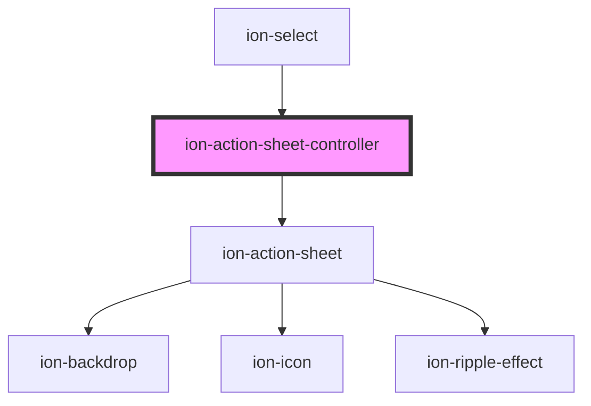

# ion-action-sheet-controller

Action Sheet controllers programmatically control the action sheet component. Action Sheets can be created and dismissed from the action sheet controller. View the [Action Sheet](../action-sheet) documentation for a full list of options to pass upon creation.

<!-- Auto Generated Below -->

## Methods

### `create(opts: ActionSheetOptions) => Promise<HTMLIonActionSheetElement>`

Create an action sheet overlay with action sheet options.

#### Returns

Type: `Promise<HTMLIonActionSheetElement>`

### `dismiss(data?: any, role?: string | undefined, id?: string | undefined) => Promise<boolean>`

Dismiss the open action sheet overlay.

#### Returns

Type: `Promise<boolean>`

### `getTop() => Promise<HTMLIonActionSheetElement | undefined>`

Get the most recently opened action sheet overlay.

#### Returns

Type: `Promise<HTMLIonActionSheetElement | undefined>`

## Dependencies

### Used by

 - [ion-select](../select)

### Depends on

- [ion-action-sheet](../action-sheet)

### Graph

----------------------------------------------

*Built with [StencilJS](https://stenciljs.com/)*
