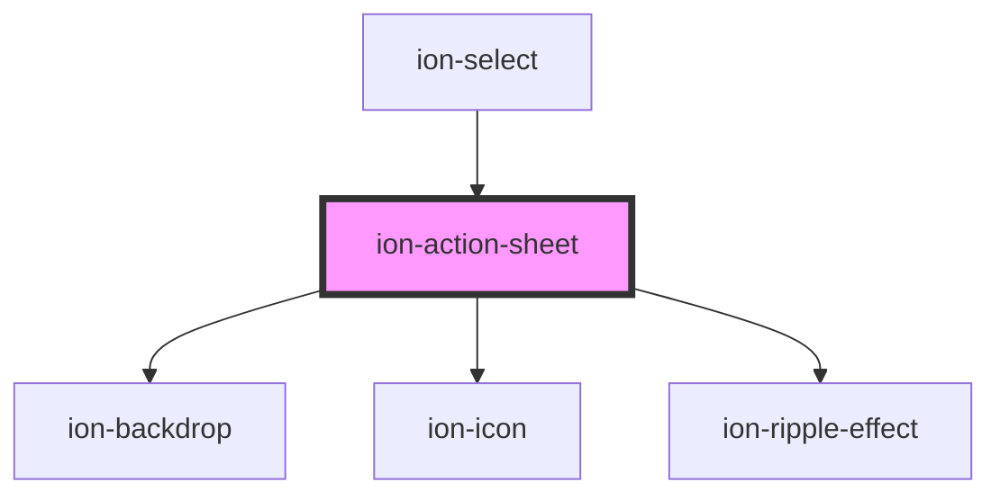

# ion-action-sheet

An Action Sheet is a dialog that displays a set of options. It appears on top of the app's content, and must be manually dismissed by the user before they can resume interaction with the app. Destructive options are made obvious in `ios` mode. There are multiple ways to dismiss the action sheet, including tapping the backdrop or hitting the escape key on desktop.

## Buttons

A button's `role` property can either be `destructive` or `cancel`. Buttons without a role property will have the default look for the platform. Buttons with the `cancel` role will always load as the bottom button, no matter where they are in the array. All other buttons will be displayed in the order they have been added to the `buttons` array. Note: We recommend that `destructive` buttons are always the first button in the array, making them the top button. Additionally, if the action sheet is dismissed by tapping the backdrop, then it will fire the handler from the button with the cancel role.

A button can also be passed data via the `data` property on `ActionSheetButton`. This will populate the `data` field in the return value of the `onDidDismiss` method.

## Customization

Action Sheet uses scoped encapsulation, which means it will automatically scope its CSS by appending each of the styles with an additional class at runtime. Overriding scoped selectors in CSS requires a [higher specificity](https://developer.mozilla.org/en-US/docs/Web/CSS/Specificity) selector.

We recommend passing a custom class to `cssClass` in the `create` method and using that to add custom styles to the host and inner elements. This property can also accept multiple classes separated by spaces. View the [Usage](#usage) section for an example of how to pass a class using `cssClass`.

```css
/* DOES NOT WORK - not specific enough */
.action-sheet-group {
  background: #e5e5e5;
}

/* Works - pass "my-custom-class" in cssClass to increase specificity */
.my-custom-class .action-sheet-group {
  background: #e5e5e5;
}
```

Any of the defined [CSS Custom Properties](#css-custom-properties) can be used to style the Action Sheet without needing to target individual elements:

```css
.my-custom-class {
  --background: #e5e5e5;
}
```

> If you are building an Ionic Angular app, the styles need to be added to a global stylesheet file. Read [Style Placement](#style-placement) in the Angular section below for more information.

## Interfaces

### ActionSheetButton

```typescript
interface ActionSheetButton<T = any> {
  text?: string;
  role?: 'cancel' | 'destructive' | 'selected' | string;
  icon?: string;
  cssClass?: string | string[];
  handler?: () => boolean | void | Promise<boolean | void>;
  data?: T;
}
```

### ActionSheetOptions

```typescript
interface ActionSheetOptions {
  header?: string;
  subHeader?: string;
  cssClass?: string | string[];
  buttons: (ActionSheetButton | string)[];
  backdropDismiss?: boolean;
  translucent?: boolean;
  animated?: boolean;
  mode?: Mode;
  keyboardClose?: boolean;
  id?: string;
  htmlAttributes?: { [key: string]: any };

  enterAnimation?: AnimationBuilder;
  leaveAnimation?: AnimationBuilder;
}
```

<!-- Auto Generated Below -->


## Usage

### Angular

```typescript
import { Component } from '@angular/core';
import { ActionSheetController } from '@ionic/angular';

@Component({
  selector: 'action-sheet-example',
  templateUrl: 'action-sheet-example.html',
  styleUrls: ['./action-sheet-example.css'],
})
export class ActionSheetExample {

  constructor(public actionSheetController: ActionSheetController) {}

  async presentActionSheet() {
    const actionSheet = await this.actionSheetController.create({
      header: 'Albums',
      cssClass: 'my-custom-class',
      buttons: [{
        text: 'Delete',
        role: 'destructive',
        icon: 'trash',
        id: 'delete-button',
        data: {
          type: 'delete'
        },
        handler: () => {
          console.log('Delete clicked');
        }
      }, {
        text: 'Share',
        icon: 'share',
        data: 10,
        handler: () => {
          console.log('Share clicked');
        }
      }, {
        text: 'Play (open modal)',
        icon: 'caret-forward-circle',
        data: 'Data value',
        handler: () => {
          console.log('Play clicked');
        }
      }, {
        text: 'Favorite',
        icon: 'heart',
        handler: () => {
          console.log('Favorite clicked');
        }
      }, {
        text: 'Cancel',
        icon: 'close',
        role: 'cancel',
        handler: () => {
          console.log('Cancel clicked');
        }
      }]
    });
    await actionSheet.present();

    const { role, data } = await actionSheet.onDidDismiss();
    console.log('onDidDismiss resolved with role and data', role, data);
  }

}
```


### Style Placement

In Angular, the CSS of a specific page is scoped only to elements of that page. Even though the Action Sheet can be presented from within a page, the `ion-action-sheet` element is appended outside of the current page. This means that any custom styles need to go in a global stylesheet file. In an Ionic Angular starter this can be the `src/global.scss` file or you can register a new global style file by [adding to the `styles` build option in `angular.json`](https://angular.io/guide/workspace-config#style-script-config).


### Javascript

```javascript
async function presentActionSheet() {
  const actionSheet = document.createElement('ion-action-sheet');

  actionSheet.header = 'Albums';
  actionSheet.cssClass = 'my-custom-class';
  actionSheet.buttons = [{
    text: 'Delete',
    role: 'destructive',
    icon: 'trash',
    id: 'delete-button',
    data: {
      type: 'delete'
    },
    handler: () => {
      console.log('Delete clicked');
    }
  }, {
    text: 'Share',
    icon: 'share',
    data: 10,
    handler: () => {
      console.log('Share clicked');
    }
  }, {
    text: 'Play (open modal)',
    icon: 'caret-forward-circle',
    data: 'Data value',
    handler: () => {
      console.log('Play clicked');
    }
  }, {
    text: 'Favorite',
    icon: 'heart',
    handler: () => {
      console.log('Favorite clicked');
    }
  }, {
    text: 'Cancel',
    icon: 'close',
    role: 'cancel',
    handler: () => {
      console.log('Cancel clicked');
    }
  }];
  document.body.appendChild(actionSheet);
  await actionSheet.present();

  const { role, data } = await actionSheet.onDidDismiss();
  console.log('onDidDismiss resolved with role and data', role, data);
}
```


### React

```tsx
/* Using with useIonActionSheet Hook */

import React from 'react';
import {
  IonButton,
  IonContent,
  IonPage,
  useIonActionSheet,
} from '@ionic/react';

const ActionSheetExample: React.FC = () => {
  const [present, dismiss] = useIonActionSheet();

  return (
    <IonPage>
      <IonContent>
        <IonButton
          expand="block"
          onClick={() =>
            present({
              buttons: [{ text: 'Ok' }, { text: 'Cancel' }],
              header: 'Action Sheet'
            })
          }
        >
          Show ActionSheet
        </IonButton>
        <IonButton
          expand="block"
          onClick={() =>
            present([{ text: 'Ok' }, { text: 'Cancel' }], 'Action Sheet')
          }
        >
          Show ActionSheet using params
        </IonButton>
        <IonButton
          expand="block"
          onClick={() => {
            present([{ text: 'Ok' }, { text: 'Cancel' }], 'Action Sheet');
            setTimeout(dismiss, 3000);
          }}
        >
          Show ActionSheet, hide after 3 seconds
        </IonButton>
      </IonContent>
    </IonPage>
  );
};
```

```tsx
/* Using with IonActionSheet Component */

import React, { useState } from 'react';
import { IonActionSheet, IonContent, IonButton } from '@ionic/react';
import { trash, share, caretForwardCircle, heart, close } from 'ionicons/icons';

export const ActionSheetExample: React.FC = () => {
  const [showActionSheet, setShowActionSheet] = useState(false);

  return (
    <IonContent>
      <IonButton onClick={() => setShowActionSheet(true)} expand="block">
        Show Action Sheet
      </IonButton>
      <IonActionSheet
        isOpen={showActionSheet}
        onDidDismiss={() => setShowActionSheet(false)}
        cssClass='my-custom-class'
        buttons={[{
          text: 'Delete',
          role: 'destructive',
          icon: trash,
          id: 'delete-button',
          data: {
            type: 'delete'
          },
          handler: () => {
            console.log('Delete clicked');
          }
        }, {
          text: 'Share',
          icon: share,
          data: 10,
          handler: () => {
            console.log('Share clicked');
          }
        }, {
          text: 'Play (open modal)',
          icon: caretForwardCircle,
          data: 'Data value',
          handler: () => {
            console.log('Play clicked');
          }
        }, {
          text: 'Favorite',
          icon: heart,
          handler: () => {
            console.log('Favorite clicked');
          }
        }, {
          text: 'Cancel',
          icon: close,
          role: 'cancel',
          handler: () => {
            console.log('Cancel clicked');
          }
        }]}
      >
      </IonActionSheet>
    </IonContent>
  );
}
```


### Stencil

```tsx
import { Component, h } from '@stencil/core';

import { actionSheetController } from '@ionic/core';

@Component({
  tag: 'action-sheet-example',
  styleUrl: 'action-sheet-example.css'
})
export class ActionSheetExample {
  async presentActionSheet() {
    const actionSheet = await actionSheetController.create({
      header: 'Albums',
      cssClass: 'my-custom-class',
      buttons: [{
        text: 'Delete',
        role: 'destructive',
        icon: 'trash',
        id: 'delete-button',
        data: {
          type: 'delete'
        },
        handler: () => {
          console.log('Delete clicked');
        }
      }, {
        text: 'Share',
        icon: 'share',
        data: 10,
        handler: () => {
          console.log('Share clicked');
        }
      }, {
        text: 'Play (open modal)',
        icon: 'caret-forward-circle',
        data: 'Data value',
        handler: () => {
          console.log('Play clicked');
        }
      }, {
        text: 'Favorite',
        icon: 'heart',
        handler: () => {
          console.log('Favorite clicked');
        }
      }, {
        text: 'Cancel',
        icon: 'close',
        role: 'cancel',
        handler: () => {
          console.log('Cancel clicked');
        }
      }]
    });
    await actionSheet.present();

    const { role, data } = await actionSheet.onDidDismiss();
    console.log('onDidDismiss resolved with role and data', role, data);
  }

  render() {
    return [
      <ion-content>
        <ion-button onClick={() => this.presentActionSheet()}>Present Action Sheet</ion-button>
      </ion-content>
    ];
  }
}
```


### Vue

```html
<template>
  <ion-button @click="presentActionSheet">Show Action Sheet</ion-button>
</template>

<script>
import { IonButton, actionSheetController } from '@ionic/vue';
import { defineComponent } from 'vue';
import { caretForwardCircle, close, heart, trash, share } from 'ionicons/icons';

export default defineComponent({
  components: { IonButton },
  methods: {
    async presentActionSheet() {
      const actionSheet = await actionSheetController
        .create({
          header: 'Albums',
          cssClass: 'my-custom-class',
          buttons: [
            {
              text: 'Delete',
              role: 'destructive',
              icon: trash,
              id: 'delete-button', 
              data: {
                type: 'delete'
              },
              handler: () => {
                console.log('Delete clicked')
              },
            },
            {
              text: 'Share',
              icon: share,
              data: 10,  
              handler: () => {
                console.log('Share clicked')
              },
            },
            {
              text: 'Play (open modal)',
              icon: caretForwardCircle,
              data: 'Data value',
              handler: () => {
                console.log('Play clicked')
              },
            },
            {
              text: 'Favorite',
              icon: heart,
              handler: () => {
                console.log('Favorite clicked')
              },
            },
            {
              text: 'Cancel',
              icon: close,
              role: 'cancel',
              handler: () => {
                console.log('Cancel clicked')
              },
            },
          ],
        });
      await actionSheet.present();

      const { role, data } = await actionSheet.onDidDismiss();
      console.log('onDidDismiss resolved with role and data', role, data);
    },
  },
});
</script>
```

Developers can also use this component directly in their template:

```html
<template>
  <ion-button @click="setOpen(true)">Show Action Sheet</ion-button>
  <ion-action-sheet
    :is-open="isOpenRef"
    header="Albums"
    css-class="my-custom-class"
    :buttons="buttons"
    @didDismiss="setOpen(false)"
  >
  </ion-action-sheet>
</template>

<script>
import { IonActionSheet, IonButton } from '@ionic/vue';
import { defineComponent, ref } from 'vue';
import { caretForwardCircle, close, heart, trash, share } from 'ionicons/icons';

export default defineComponent({
  components: { IonActionSheet, IonButton },
  setup() {
    const isOpenRef = ref(false);
    const setOpen = (state: boolean) => isOpenRef.value = state;
    const buttons = [
      {
        text: 'Delete',
        role: 'destructive',
        icon: trash,
        data: {
          type: 'delete'
        }
        handler: () => {
          console.log('Delete clicked')
        },
      },
      {
        text: 'Share',
        icon: share,
        data: 10,  
        handler: () => {
          console.log('Share clicked')
        },
      },
      {
        text: 'Play (open modal)',
        icon: caretForwardCircle,
        data: 'Data value',  
        handler: () => {
          console.log('Play clicked')
        },
      },
      {
        text: 'Favorite',
        icon: heart,
        handler: () => {
          console.log('Favorite clicked')
        },
      },
      {
        text: 'Cancel',
        icon: close,
        role: 'cancel',
        handler: () => {
          console.log('Cancel clicked')
        },
      },
    ];
    
    return { buttons, isOpenRef, setOpen }
  }
});
</script>
```


## Properties

| Property          | Attribute          | Description                                                                                                                                                                                                                 | Type                                                    | Default     |
| ----------------- | ------------------ | --------------------------------------------------------------------------------------------------------------------------------------------------------------------------------------------------------------------------- | ------------------------------------------------------- | ----------- |
| `animated`        | `animated`         | If `true`, the action sheet will animate.                                                                                                                                                                                   | `boolean`                                               | `true`      |
| `backdropDismiss` | `backdrop-dismiss` | If `true`, the action sheet will be dismissed when the backdrop is clicked.                                                                                                                                                 | `boolean`                                               | `true`      |
| `buttons`         | --                 | An array of buttons for the action sheet.                                                                                                                                                                                   | `(string \| ActionSheetButton<any>)[]`                  | `[]`        |
| `cssClass`        | `css-class`        | Additional classes to apply for custom CSS. If multiple classes are provided they should be separated by spaces.                                                                                                            | `string \| string[] \| undefined`                       | `undefined` |
| `enterAnimation`  | --                 | Animation to use when the action sheet is presented.                                                                                                                                                                        | `((baseEl: any, opts?: any) => Animation) \| undefined` | `undefined` |
| `header`          | `header`           | Title for the action sheet.                                                                                                                                                                                                 | `string \| undefined`                                   | `undefined` |
| `htmlAttributes`  | --                 | Additional attributes to pass to the action sheet.                                                                                                                                                                          | `undefined \| { [key: string]: any; }`                  | `undefined` |
| `keyboardClose`   | `keyboard-close`   | If `true`, the keyboard will be automatically dismissed when the overlay is presented.                                                                                                                                      | `boolean`                                               | `true`      |
| `leaveAnimation`  | --                 | Animation to use when the action sheet is dismissed.                                                                                                                                                                        | `((baseEl: any, opts?: any) => Animation) \| undefined` | `undefined` |
| `mode`            | `mode`             | The mode determines which platform styles to use.                                                                                                                                                                           | `"ios" \| "md"`                                         | `undefined` |
| `subHeader`       | `sub-header`       | Subtitle for the action sheet.                                                                                                                                                                                              | `string \| undefined`                                   | `undefined` |
| `translucent`     | `translucent`      | If `true`, the action sheet will be translucent. Only applies when the mode is `"ios"` and the device supports [`backdrop-filter`](https://developer.mozilla.org/en-US/docs/Web/CSS/backdrop-filter#Browser_compatibility). | `boolean`                                               | `false`     |


## Events

| Event                       | Description                             | Type                                   |
| --------------------------- | --------------------------------------- | -------------------------------------- |
| `ionActionSheetDidDismiss`  | Emitted after the alert has dismissed.  | `CustomEvent<OverlayEventDetail<any>>` |
| `ionActionSheetDidPresent`  | Emitted after the alert has presented.  | `CustomEvent<void>`                    |
| `ionActionSheetWillDismiss` | Emitted before the alert has dismissed. | `CustomEvent<OverlayEventDetail<any>>` |
| `ionActionSheetWillPresent` | Emitted before the alert has presented. | `CustomEvent<void>`                    |


## Methods

### `dismiss(data?: any, role?: string | undefined) => Promise<boolean>`

Dismiss the action sheet overlay after it has been presented.

#### Returns

Type: `Promise<boolean>`


### `onDidDismiss<T = any>() => Promise<OverlayEventDetail<T>>`

Returns a promise that resolves when the action sheet did dismiss.

#### Returns

Type: `Promise<OverlayEventDetail<T>>`


### `onWillDismiss<T = any>() => Promise<OverlayEventDetail<T>>`

Returns a promise that resolves when the action sheet will dismiss.

#### Returns

Type: `Promise<OverlayEventDetail<T>>`


### `present() => Promise<void>`

Present the action sheet overlay after it has been created.

#### Returns

Type: `Promise<void>`


## CSS Custom Properties

| Name                                    | Description                                                                                                            |
| --------------------------------------- | ---------------------------------------------------------------------------------------------------------------------- |
| `--backdrop-opacity`                    | Opacity of the backdrop                                                                                                |
| `--background`                          | Background of the action sheet group                                                                                   |
| `--button-background`                   | Background of the action sheet button                                                                                  |
| `--button-background-activated`         | Background of the action sheet button when pressed. Note: setting this will interfere with the Material Design ripple. |
| `--button-background-activated-opacity` | Opacity of the action sheet button background when pressed                                                             |
| `--button-background-focused`           | Background of the action sheet button when tabbed to                                                                   |
| `--button-background-focused-opacity`   | Opacity of the action sheet button background when tabbed to                                                           |
| `--button-background-hover`             | Background of the action sheet button on hover                                                                         |
| `--button-background-hover-opacity`     | Opacity of the action sheet button background on hover                                                                 |
| `--button-background-selected`          | Background of the selected action sheet button                                                                         |
| `--button-background-selected-opacity`  | Opacity of the selected action sheet button background                                                                 |
| `--button-color`                        | Color of the action sheet button                                                                                       |
| `--button-color-activated`              | Color of the action sheet button when pressed                                                                          |
| `--button-color-focused`                | Color of the action sheet button when tabbed to                                                                        |
| `--button-color-hover`                  | Color of the action sheet button on hover                                                                              |
| `--button-color-selected`               | Color of the selected action sheet button                                                                              |
| `--color`                               | Color of the action sheet text                                                                                         |
| `--height`                              | height of the action sheet                                                                                             |
| `--max-height`                          | Maximum height of the action sheet                                                                                     |
| `--max-width`                           | Maximum width of the action sheet                                                                                      |
| `--min-height`                          | Minimum height of the action sheet                                                                                     |
| `--min-width`                           | Minimum width of the action sheet                                                                                      |
| `--width`                               | Width of the action sheet                                                                                              |


## Dependencies

### Used by

 - [ion-select](../select)

### Depends on

- [ion-backdrop](../backdrop)
- ion-icon
- [ion-ripple-effect](../ripple-effect)

### Graph


----------------------------------------------

*Built with [StencilJS](https://stenciljs.com/)*
