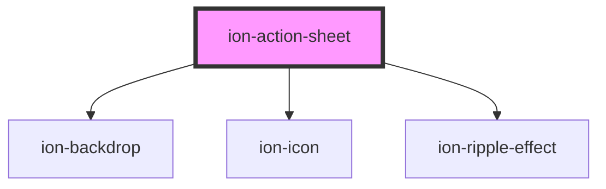

# ion-action-sheet

An Action Sheet is a dialog that displays a set of options. It appears on top of the app's content, and must be manually dismissed by the user before they can resume interaction with the app. Destructive options are made obvious in `ios` mode. There are multiple ways to dismiss the action sheet, including tapping the backdrop or hitting the escape key on desktop.

### Creating

An action sheet can be created by the [Action Sheet Controller](../action-sheet-controller) from an array of `buttons`, with each button including properties for its `text`, and optionally a `handler` and `role`. If a handler returns `false` then the action sheet will not be dismissed. An action sheet can also optionally have a `title`, `subTitle` and an `icon`.

### Buttons

A button's `role` property can either be `destructive` or `cancel`. Buttons without a role property will have the default look for the platform. Buttons with the `cancel` role will always load as the bottom button, no matter where they are in the array. All other buttons will be displayed in the order they have been added to the `buttons` array. Note: We recommend that `destructive` buttons are always the first button in the array, making them the top button. Additionally, if the action sheet is dismissed by tapping the backdrop, then it will fire the handler from the button with the cancel role.


<!-- Auto Generated Below -->


## Usage

### Angular

```typescript
import { Component } from '@angular/core';
import { ActionSheetController } from '@ionic/angular';

@Component({
  selector: 'action-sheet-example',
  templateUrl: 'action-sheet-example.html',
  styleUrls: ['./action-sheet-example.css'],
})
export class ActionSheetExample {

  constructor(public actionSheetController: ActionSheetController) {}

  async presentActionSheet() {
    const actionSheet = await this.actionSheetController.create({
      header: 'Albums',
      buttons: [{
        text: 'Delete',
        role: 'destructive',
        icon: 'trash',
        handler: () => {
          console.log('Delete clicked');
        }
      }, {
        text: 'Share',
        icon: 'share',
        handler: () => {
          console.log('Share clicked');
        }
      }, {
        text: 'Play (open modal)',
        icon: 'arrow-dropright-circle',
        handler: () => {
          console.log('Play clicked');
        }
      }, {
        text: 'Favorite',
        icon: 'heart',
        handler: () => {
          console.log('Favorite clicked');
        }
      }, {
        text: 'Cancel',
        icon: 'close',
        role: 'cancel',
        handler: () => {
          console.log('Cancel clicked');
        }
      }]
    });
    await actionSheet.present();
  }

}
```


### Javascript

```javascript
async function presentActionSheet() {
  const actionSheetController = document.querySelector('ion-action-sheet-controller');
  await actionSheetController.componentOnReady();

  const actionSheet = await actionSheetController.create({
    header: "Albums",
    buttons: [{
      text: 'Delete',
      role: 'destructive',
      icon: 'trash',
      handler: () => {
        console.log('Delete clicked');
      }
    }, {
      text: 'Share',
      icon: 'share',
      handler: () => {
        console.log('Share clicked');
      }
    }, {
      text: 'Play (open modal)',
      icon: 'arrow-dropright-circle',
      handler: () => {
        console.log('Play clicked');
      }
    }, {
      text: 'Favorite',
      icon: 'heart',
      handler: () => {
        console.log('Favorite clicked');
      }
    }, {
      text: 'Cancel',
      icon: 'close',
      role: 'cancel',
      handler: () => {
        console.log('Cancel clicked');
      }
    }]
  });
  await actionSheet.present();
}
```


### React

```typescript
import React, { useState } from 'react'
import { IonActionSheet, IonContent, IonButton } from '@ionic/react';

export const ActionSheetExample: React.FunctionComponent = () => {

  const [showActionSheet, setShowActionSheet] = useState(false);

  return (
    <IonContent>
      <IonButton onClick={() => setShowActionSheet(true)} expand="block">Show Action Sheet</IonButton>
      <IonActionSheet
        isOpen={showActionSheet}
        onDidDismiss={() => setShowActionSheet(false)}
        buttons={[{
          text: 'Delete',
          role: 'destructive',
          icon: 'trash',
          handler: () => {
            console.log('Delete clicked');
          }
        }, {
          text: 'Share',
          icon: 'share',
          handler: () => {
            console.log('Share clicked');
          }
        }, {
          text: 'Play (open modal)',
          icon: 'arrow-dropright-circle',
          handler: () => {
            console.log('Play clicked');
          }
        }, {
          text: 'Favorite',
          icon: 'heart',
          handler: () => {
            console.log('Favorite clicked');
          }
        }, {
          text: 'Cancel',
          icon: 'close',
          role: 'cancel',
          handler: () => {
            console.log('Cancel clicked');
          }
        }]}
      >
      </IonActionSheet>
    </IonContent>

  );

}

```


### Vue

```html
<template>
  <IonVuePage :title="'Action Sheet'">
    <ion-button @click="presentActionSheet">Show Action Sheet</ion-button>
  </IonVuePage>
</template>

<script>
export default {
  methods: {
    presentActionSheet() {
      return this.$ionic.actionSheetController
        .create({
          header: 'Albums',
          buttons: [
            {
              text: 'Delete',
              role: 'destructive',
              icon: 'trash',
              handler: () => {
                console.log('Delete clicked')
              },
            },
            {
              text: 'Share',
              icon: 'share',
              handler: () => {
                console.log('Share clicked')
              },
            },
            {
              text: 'Play (open modal)',
              icon: 'arrow-dropright-circle',
              handler: () => {
                console.log('Play clicked')
              },
            },
            {
              text: 'Favorite',
              icon: 'heart',
              handler: () => {
                console.log('Favorite clicked')
              },
            },
            {
              text: 'Cancel',
              icon: 'close',
              role: 'cancel',
              handler: () => {
                console.log('Cancel clicked')
              },
            },
          ],
        })
        .then(a => a.present())
    },
  },
}
</script>
```


## Properties

| Property          | Attribute          | Description                                                                                                                     | Type                                                                                   | Default     |
| ----------------- | ------------------ | ------------------------------------------------------------------------------------------------------------------------------- | -------------------------------------------------------------------------------------- | ----------- |
| `animated`        | `animated`         | If `true`, the action sheet will animate.                                                                                       | `boolean`                                                                              | `true`      |
| `backdropDismiss` | `backdrop-dismiss` | If `true`, the action sheet will be dismissed when the backdrop is clicked.                                                     | `boolean`                                                                              | `true`      |
| `buttons`         | --                 | An array of buttons for the action sheet.                                                                                       | `(string \| ActionSheetButton)[]`                                                      | `[]`        |
| `cssClass`        | `css-class`        | Additional classes to apply for custom CSS. If multiple classes are provided they should be separated by spaces.                | `string \| string[] \| undefined`                                                      | `undefined` |
| `enterAnimation`  | --                 | Animation to use when the action sheet is presented.                                                                            | `((Animation: Animation, baseEl: any, opts?: any) => Promise<Animation>) \| undefined` | `undefined` |
| `header`          | `header`           | Title for the action sheet.                                                                                                     | `string \| undefined`                                                                  | `undefined` |
| `keyboardClose`   | `keyboard-close`   | If `true`, the keyboard will be automatically dismissed when the overlay is presented.                                          | `boolean`                                                                              | `true`      |
| `leaveAnimation`  | --                 | Animation to use when the action sheet is dismissed.                                                                            | `((Animation: Animation, baseEl: any, opts?: any) => Promise<Animation>) \| undefined` | `undefined` |
| `mode`            | `mode`             | The mode determines which platform styles to use.                                                                               | `"ios" \| "md"`                                                                        | `undefined` |
| `subHeader`       | `sub-header`       | Subtitle for the action sheet.                                                                                                  | `string \| undefined`                                                                  | `undefined` |
| `translucent`     | `translucent`      | If `true`, the action sheet will be translucent. Only applies when the mode is `"ios"` and the device supports backdrop-filter. | `boolean`                                                                              | `false`     |


## Events

| Event                       | Description                             | Type                                   |
| --------------------------- | --------------------------------------- | -------------------------------------- |
| `ionActionSheetDidDismiss`  | Emitted after the alert has dismissed.  | `CustomEvent<OverlayEventDetail<any>>` |
| `ionActionSheetDidPresent`  | Emitted after the alert has presented.  | `CustomEvent<void>`                    |
| `ionActionSheetWillDismiss` | Emitted before the alert has dismissed. | `CustomEvent<OverlayEventDetail<any>>` |
| `ionActionSheetWillPresent` | Emitted before the alert has presented. | `CustomEvent<void>`                    |


## Methods

### `dismiss(data?: any, role?: string | undefined) => Promise<boolean>`

Dismiss the action sheet overlay after it has been presented.

#### Returns

Type: `Promise<boolean>`


### `onDidDismiss() => Promise<OverlayEventDetail<any>>`

Returns a promise that resolves when the action sheet did dismiss.

#### Returns

Type: `Promise<OverlayEventDetail<any>>`


### `onWillDismiss() => Promise<OverlayEventDetail<any>>`

Returns a promise that resolves when the action sheet will dismiss.

#### Returns

Type: `Promise<OverlayEventDetail<any>>`


### `present() => Promise<void>`

Present the action sheet overlay after it has been created.

#### Returns

Type: `Promise<void>`


## CSS Custom Properties

| Name                     | Description                                        |
| ------------------------ | -------------------------------------------------- |
| `--background`           | Background of the action sheet group               |
| `--background-activated` | Background of the action sheet button when pressed |
| `--background-selected`  | Background of the selected action sheet button     |
| `--color`                | Color of the action sheet text                     |
| `--height`               | height of the action sheet                         |
| `--max-height`           | Maximum height of the action sheet                 |
| `--max-width`            | Maximum width of the action sheet                  |
| `--min-height`           | Minimum height of the action sheet                 |
| `--min-width`            | Minimum width of the action sheet                  |
| `--width`                | Width of the action sheet                          |


## Dependencies

### Depends on

- [ion-backdrop](../backdrop)
- ion-icon
- [ion-ripple-effect](../ripple-effect)

### Graph


----------------------------------------------

*Built with [StencilJS](https://stenciljs.com/)*
