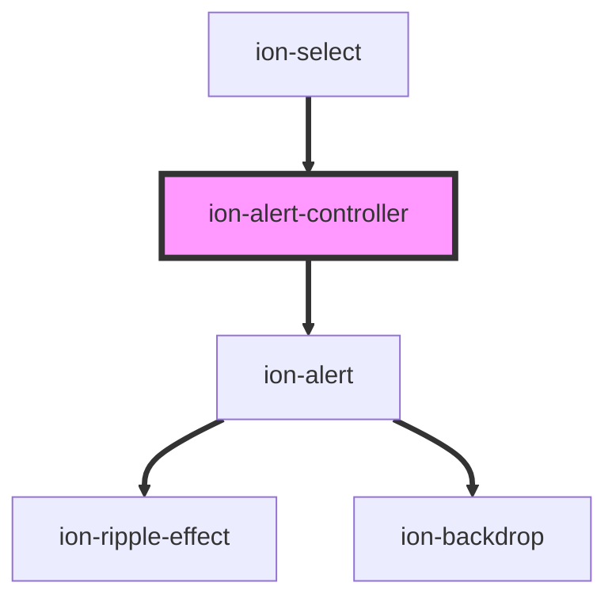

# ion-alert-controller

Alert controllers programmatically control the alert component. Alerts can be created and dismissed from the alert controller. View the [Alert](../alert) documentation for a full list of options to pass upon creation.


```javascript
async function presentAlert() {
  const alertController = document.querySelector('ion-alert-controller');
  await alertController.componentOnReady();

  const alert = await alertController.create({
    header: 'Alert',
    subHeader: 'Subtitle',
    message: 'This is an alert message.',
    buttons: ['OK']
  });
  return await alert.present();
}
```


<!-- Auto Generated Below -->


## Methods

### `create(opts: AlertOptions) => Promise<HTMLIonAlertElement>`

Create an alert overlay with alert options

#### Returns

Type: `Promise<HTMLIonAlertElement>`


### `dismiss(data?: any, role?: string | undefined, id?: string | undefined) => Promise<boolean>`

Dismiss the open alert overlay.

#### Returns

Type: `Promise<boolean>`


### `getTop() => Promise<HTMLIonAlertElement | undefined>`

Get the most recently opened alert overlay.

#### Returns

Type: `Promise<HTMLIonAlertElement | undefined>`


## Dependency Analysys

**Used by:** [ion-select](./select)



----------------------------------------------

*Built with [StencilJS](https://stenciljs.com/)*
