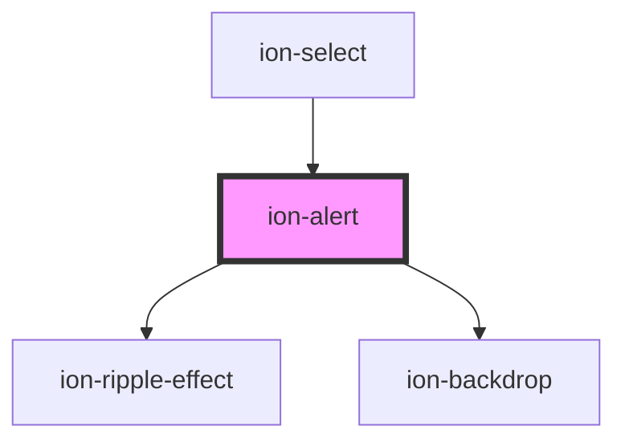

# ion-alert

An Alert is a dialog that presents users with information or collects information from the user using inputs. An alert appears on top of the app's content, and must be manually dismissed by the user before they can resume interaction with the app. It can also optionally have a `header`, `subHeader` and `message`.

## Buttons

In the array of `buttons`, each button includes properties for its `text`, and optionally a `handler`. If a handler returns `false` then the alert will not automatically be dismissed when the button is clicked. All buttons will show up in the order they have been added to the `buttons` array from left to right. Note: The right most button (the last one in the array) is the main button.

Optionally, a `role` property can be added to a button, such as `cancel`. If a `cancel` role is on one of the buttons, then if the alert is dismissed by tapping the backdrop, then it will fire the handler from the button with a cancel role.


## Inputs

Alerts can also include several different inputs whose data can be passed back to the app. Inputs can be used as a simple way to prompt users for information. Radios, checkboxes and text inputs are all accepted, but they cannot be mixed. For example, an alert could have all radio button inputs, or all checkbox inputs, but the same alert cannot mix radio and checkbox inputs. Do note however, different types of "text" inputs can be mixed, such as `url`, `email`, `text`, `textarea` etc. If you require a complex form UI which doesn't fit within the guidelines of an alert then we recommend building the form within a modal instead.

## Customization

Alert uses scoped encapsulation, which means it will automatically scope its CSS by appending each of the styles with an additional class at runtime. Overriding scoped selectors in CSS requires a [higher specificity](https://developer.mozilla.org/en-US/docs/Web/CSS/Specificity) selector.

We recommend passing a custom class to `cssClass` in the `create` method and using that to add custom styles to the host and inner elements. This property can also accept multiple classes separated by spaces. View the [Usage](#usage) section for an example of how to pass a class using `cssClass`.

```css
/* DOES NOT WORK - not specific enough */
.alert-wrapper {
  background: #e5e5e5;
}

/* Works - pass "my-custom-class" in cssClass to increase specificity */
.my-custom-class .alert-wrapper {
  background: #e5e5e5;
}
```

Any of the defined [CSS Custom Properties](#css-custom-properties) can be used to style the Alert without needing to target individual elements:

```css
.my-custom-class {
  --background: #e5e5e5;
}
```

> If you are building an Ionic Angular app, the styles need to be added to a global stylesheet file. Read [Style Placement](#style-placement) in the Angular section below for more information.

## Interfaces

### AlertButton

```typescript
interface AlertButton {
  text: string;
  role?: 'cancel' | 'destructive' | string;
  cssClass?: string | string[];
  handler?: (value: any) => boolean | void | {[key: string]: any};
}
```


### AlertInput

```typescript
interface AlertInput {
  type?: TextFieldTypes | 'checkbox' | 'radio' | 'textarea';
  name?: string;
  placeholder?: string;
  value?: any;
  label?: string;
  checked?: boolean;
  disabled?: boolean;
  id?: string;
  handler?: (input: AlertInput) => void;
  min?: string | number;
  max?: string | number;
  cssClass?: string | string[];
  attributes?: { [key: string]: any };
  tabindex?: number;
}
```


### AlertOptions

```typescript
interface AlertOptions {
  header?: string;
  subHeader?: string;
  message?: string | IonicSafeString;
  cssClass?: string | string[];
  inputs?: AlertInput[];
  buttons?: (AlertButton | string)[];
  backdropDismiss?: boolean;
  translucent?: boolean;
  animated?: boolean;
  htmlAttributes?: { [key: string]: any };

  mode?: Mode;
  keyboardClose?: boolean;
  id?: string;

  enterAnimation?: AnimationBuilder;
  leaveAnimation?: AnimationBuilder;
}
```


<!-- Auto Generated Below -->


## Usage

### Angular

```typescript
import { Component } from '@angular/core';
import { AlertController } from '@ionic/angular';

@Component({
  selector: 'alert-example',
  templateUrl: 'alert-example.html',
  styleUrls: ['./alert-example.css'],
})
export class AlertExample {

  constructor(public alertController: AlertController) {}

  async presentAlert() {
    const alert = await this.alertController.create({
      cssClass: 'my-custom-class',
      header: 'Alert',
      subHeader: 'Subtitle',
      message: 'This is an alert message.',
      buttons: ['OK']
    });

    await alert.present();

    const { role } = await alert.onDidDismiss();
    console.log('onDidDismiss resolved with role', role);
  }

  async presentAlertMultipleButtons() {
    const alert = await this.alertController.create({
      cssClass: 'my-custom-class',
      header: 'Alert',
      subHeader: 'Subtitle',
      message: 'This is an alert message.',
      buttons: ['Cancel', 'Open Modal', 'Delete']
    });

    await alert.present();
  }

  async presentAlertConfirm() {
    const alert = await this.alertController.create({
      cssClass: 'my-custom-class',
      header: 'Confirm!',
      message: 'Message <strong>text</strong>!!!',
      buttons: [
        {
          text: 'Cancel',
          role: 'cancel',
          cssClass: 'secondary',
          id: 'cancel-button',
          handler: (blah) => {
            console.log('Confirm Cancel: blah');
          }
        }, {
          text: 'Okay',
          id: 'confirm-button',
          handler: () => {
            console.log('Confirm Okay');
          }
        }
      ]
    });

    await alert.present();
  }

  async presentAlertPrompt() {
    const alert = await this.alertController.create({
      cssClass: 'my-custom-class',
      header: 'Prompt!',
      inputs: [
        {
          name: 'name1',
          type: 'text',
          placeholder: 'Placeholder 1'
        },
        {
          name: 'name2',
          type: 'text',
          id: 'name2-id',
          value: 'hello',
          placeholder: 'Placeholder 2'
        },
        // multiline input.
        {
          name: 'paragraph',
          id: 'paragraph',
          type: 'textarea',
          placeholder: 'Placeholder 3'
        },
        {
          name: 'name3',
          value: 'http://ionicframework.com',
          type: 'url',
          placeholder: 'Favorite site ever'
        },
        // input date with min & max
        {
          name: 'name4',
          type: 'date',
          min: '2017-03-01',
          max: '2018-01-12'
        },
        // input date without min nor max
        {
          name: 'name5',
          type: 'date'
        },
        {
          name: 'name6',
          type: 'number',
          min: -5,
          max: 10
        },
        {
          name: 'name7',
          type: 'number'
        },
        {
          name: 'name8',
          type: 'password',
          placeholder: 'Advanced Attributes',
          cssClass: 'specialClass',
          attributes: {
            maxlength: 4,
            inputmode: 'decimal'
          }
        }
      ],
      buttons: [
        {
          text: 'Cancel',
          role: 'cancel',
          cssClass: 'secondary',
          handler: () => {
            console.log('Confirm Cancel');
          }
        }, {
          text: 'Ok',
          handler: () => {
            console.log('Confirm Ok');
          }
        }
      ]
    });

    await alert.present();
  }

  async presentAlertRadio() {
    const alert = await this.alertController.create({
      cssClass: 'my-custom-class',
      header: 'Radio',
      inputs: [
        {
          name: 'radio1',
          type: 'radio',
          label: 'Radio 1',
          value: 'value1',
          handler: () => {
            console.log('Radio 1 selected');
          },
          checked: true
        },
        {
          name: 'radio2',
          type: 'radio',
          label: 'Radio 2',
          value: 'value2',
          handler: () => {
            console.log('Radio 2 selected');
          }
        },
        {
          name: 'radio3',
          type: 'radio',
          label: 'Radio 3',
          value: 'value3',
          handler: () => {
            console.log('Radio 3 selected');
          }
        },
        {
          name: 'radio4',
          type: 'radio',
          label: 'Radio 4',
          value: 'value4',
          handler: () => {
            console.log('Radio 4 selected');
          }
        },
        {
          name: 'radio5',
          type: 'radio',
          label: 'Radio 5',
          value: 'value5',
          handler: () => {
            console.log('Radio 5 selected');
          }
        },
        {
          name: 'radio6',
          type: 'radio',
          label: 'Radio 6 Radio 6 Radio 6 Radio 6 Radio 6 Radio 6 Radio 6 Radio 6 Radio 6 Radio 6 ',
          value: 'value6',
          handler: () => {
            console.log('Radio 6 selected');
          }
        }
      ],
      buttons: [
        {
          text: 'Cancel',
          role: 'cancel',
          cssClass: 'secondary',
          handler: () => {
            console.log('Confirm Cancel');
          }
        }, {
          text: 'Ok',
          handler: () => {
            console.log('Confirm Ok');
          }
        }
      ]
    });

    await alert.present();
  }

  async presentAlertCheckbox() {
    const alert = await this.alertController.create({
      cssClass: 'my-custom-class',
      header: 'Checkbox',
      inputs: [
        {
          name: 'checkbox1',
          type: 'checkbox',
          label: 'Checkbox 1',
          value: 'value1',
          handler: () => {
            console.log('Checkbox 1 selected');
          },
          checked: true
        },

        {
          name: 'checkbox2',
          type: 'checkbox',
          label: 'Checkbox 2',
          value: 'value2',
          handler: () => {
            console.log('Checkbox 2 selected');
          }
        },

        {
          name: 'checkbox3',
          type: 'checkbox',
          label: 'Checkbox 3',
          value: 'value3',
          handler: () => {
            console.log('Checkbox 3 selected');
          }
        },

        {
          name: 'checkbox4',
          type: 'checkbox',
          label: 'Checkbox 4',
          value: 'value4',
          handler: () => {
            console.log('Checkbox 4 selected');
          }
        },

        {
          name: 'checkbox5',
          type: 'checkbox',
          label: 'Checkbox 5',
          value: 'value5',
          handler: () => {
            console.log('Checkbox 5 selected');
          }
        },

        {
          name: 'checkbox6',
          type: 'checkbox',
          label: 'Checkbox 6 Checkbox 6 Checkbox 6 Checkbox 6 Checkbox 6 Checkbox 6 Checkbox 6 Checkbox 6 Checkbox 6 Checkbox 6',
          value: 'value6',
          handler: () => {
            console.log('Checkbox 6 selected');
          }
        }
      ],
      buttons: [
        {
          text: 'Cancel',
          role: 'cancel',
          cssClass: 'secondary',
          handler: () => {
            console.log('Confirm Cancel');
          }
        }, {
          text: 'Ok',
          handler: () => {
            console.log('Confirm Ok');
          }
        }
      ]
    });

    await alert.present();
  }
}
```


### Style Placement

In Angular, the CSS of a specific page is scoped only to elements of that page. Even though the Alert can be presented from within a page, the `ion-alert` element is appended outside of the current page. This means that any custom styles need to go in a global stylesheet file. In an Ionic Angular starter this can be the `src/global.scss` file or you can register a new global style file by [adding to the `styles` build option in `angular.json`](https://angular.io/guide/workspace-config#style-script-config).


### Javascript

```javascript
function presentAlert() {
  const alert = document.createElement('ion-alert');
  alert.cssClass = 'my-custom-class';
  alert.header = 'Alert';
  alert.subHeader = 'Subtitle';
  alert.message = 'This is an alert message.';
  alert.buttons = ['OK'];

  document.body.appendChild(alert);
  await alert.present();

  const { role } = await alert.onDidDismiss();
  console.log('onDidDismiss resolved with role', role);
}

function presentAlertMultipleButtons() {
  const alert = document.createElement('ion-alert');
  alert.cssClass = 'my-custom-class';
  alert.header = 'Alert';
  alert.subHeader = 'Subtitle';
  alert.message = 'This is an alert message.';
  alert.buttons = ['Cancel', 'Open Modal', 'Delete'];

  document.body.appendChild(alert);
  return alert.present();
}

function presentAlertConfirm() {
  const alert = document.createElement('ion-alert');
  alert.cssClass = 'my-custom-class';
  alert.header = 'Confirm!';
  alert.message = 'Message <strong>text</strong>!!!';
  alert.buttons = [
    {
      text: 'Cancel',
      role: 'cancel',
      cssClass: 'secondary',
      id: 'cancel-button',
      handler: (blah) => {
        console.log('Confirm Cancel: blah');
      }
    }, {
      text: 'Okay',
      id: 'confirm-button',
      handler: () => {
        console.log('Confirm Okay')
      }
    }
  ];

  document.body.appendChild(alert);
  return alert.present();
}

function presentAlertPrompt() {
  const alert = document.createElement('ion-alert');
  alert.cssClass = 'my-custom-class';
  alert.header = 'Prompt!';
  alert.inputs = [
    {
      placeholder: 'Placeholder 1'
    },
    {
      name: 'name2',
      id: 'name2-id',
      value: 'hello',
      placeholder: 'Placeholder 2'
    },
    // multiline input.
    {
      name: 'paragraph',
      id: 'paragraph',
      type: 'textarea',
      placeholder: 'Placeholder 3'
    },
    {
      name: 'name3',
      value: 'http://ionicframework.com',
      type: 'url',
      placeholder: 'Favorite site ever'
    },
    // input date with min & max
    {
      name: 'name4',
      type: 'date',
      min: '2017-03-01',
      max: '2018-01-12'
    },
    // input date without min nor max
    {
      name: 'name5',
      type: 'date'
    },
    {
      name: 'name6',
      type: 'number',
      min: -5,
      max: 10
    },
    {
      name: 'name7',
      type: 'number'
    },
    {
      name: 'name8',
      type: 'password',
      placeholder: 'Advanced Attributes',
      cssClass: 'specialClass',
      attributes: {
        maxlength: 4,
        inputmode: 'decimal'
      }
    }
  ];
  alert.buttons = [
    {
      text: 'Cancel',
      role: 'cancel',
      cssClass: 'secondary',
      handler: () => {
        console.log('Confirm Cancel')
      }
    }, {
      text: 'Ok',
      handler: () => {
        console.log('Confirm Ok')
      }
    }
  ];

  document.body.appendChild(alert);
  return alert.present();
}

function presentAlertRadio() {
  const alert = document.createElement('ion-alert');
  alert.cssClass = 'my-custom-class';
  alert.header = 'Radio';
  alert.inputs = [
    {
      type: 'radio',
      label: 'Radio 1',
      value: 'value1',
      handler: () => {
        console.log('Radio 1 selected');
      },
      checked: true
    },
    {
      type: 'radio',
      label: 'Radio 2',
      value: 'value2',
      handler: () => {
        console.log('Radio 2 selected');
      }
    },
    {
      type: 'radio',
      label: 'Radio 3',
      value: 'value3',
      handler: () => {
        console.log('Radio 3 selected');
      }
    },
    {
      type: 'radio',
      label: 'Radio 4',
      value: 'value4',
      handler: () => {
        console.log('Radio 4 selected');
      }
    },
    {
      type: 'radio',
      label: 'Radio 5',
      value: 'value5',
      handler: () => {
        console.log('Radio 5 selected');
      }
    },
    {
      type: 'radio',
      label: 'Radio 6 Radio 6 Radio 6 Radio 6 Radio 6 Radio 6 Radio 6 Radio 6 Radio 6 Radio 6 ',
      value: 'value6',
      handler: () => {
        console.log('Radio 6 selected');
      }
    }
  ];
  alert.buttons = [
    {
      text: 'Cancel',
      role: 'cancel',
      cssClass: 'secondary',
      handler: () => {
        console.log('Confirm Cancel')
      }
    }, {
      text: 'Ok',
      handler: () => {
        console.log('Confirm Ok')
      }
    }
  ];
  document.body.appendChild(alert);
  return alert.present();
}

function presentAlertCheckbox() {
  const alert = document.createElement('ion-alert');
  alert.cssClass = 'my-custom-class';
  alert.header = 'Checkbox';
  alert.inputs = [
    {
      type: 'checkbox',
      label: 'Checkbox 1',
      value: 'value1',
      handler: () => {
        console.log('Checkbox 1 selected');
      },
      checked: true
    },

    {
      type: 'checkbox',
      label: 'Checkbox 2',
      value: 'value2',
      handler: () => {
        console.log('Checkbox 2 selected');
      }
    },

    {
      type: 'checkbox',
      label: 'Checkbox 3',
      value: 'value3',
      handler: () => {
        console.log('Checkbox 3 selected');
      }
    },

    {
      type: 'checkbox',
      label: 'Checkbox 4',
      value: 'value4',
      handler: () => {
        console.log('Checkbox 4 selected');
      }
    },

    {
      type: 'checkbox',
      label: 'Checkbox 5',
      value: 'value5',
      handler: () => {
        console.log('Checkbox 5 selected');
      }
    },

    {
      type: 'checkbox',
      label: 'Checkbox 6 Checkbox 6 Checkbox 6 Checkbox 6 Checkbox 6 Checkbox 6 Checkbox 6 Checkbox 6 Checkbox 6 Checkbox 6',
      value: 'value6',
      handler: () => {
        console.log('Checkbox 6 selected');
      }
    }
  ];
  alert.buttons = [
    {
      text: 'Cancel',
      role: 'cancel',
      cssClass: 'secondary',
      handler: () => {
        console.log('Confirm Cancel')
      }
    }, {
      text: 'Ok',
      handler: () => {
        console.log('Confirm Ok')
      }
    }
  ];

  document.body.appendChild(alert);
  return alert.present();
}
```


### React

```tsx
/* Using with useIonAlert Hook */

import React from 'react';
import { IonButton, IonContent, IonPage, useIonAlert } from '@ionic/react';

const AlertExample: React.FC = () => {
  const [present] = useIonAlert();
  return (
    <IonPage>
      <IonContent fullscreen>
        <IonButton
          expand="block"
          onClick={() =>
            present({
              cssClass: 'my-css',
              header: 'Alert',
              message: 'alert from hook',
              buttons: [
                'Cancel',
                { text: 'Ok', handler: (d) => console.log('ok pressed') },
              ],
              onDidDismiss: (e) => console.log('did dismiss'),
            })
          }
        >
          Show Alert
        </IonButton>
        <IonButton
          expand="block"
          onClick={() => present('hello with params', [{ text: 'Ok' }])}
        >
          Show Alert using params
        </IonButton>
      </IonContent>
    </IonPage>
  );
};
```

```tsx
/* Using with IonAlert Component */

import React, { useState } from 'react';
import { IonAlert, IonButton, IonContent } from '@ionic/react';

export const AlertExample: React.FC = () => {

  const [showAlert1, setShowAlert1] = useState(false);
  const [showAlert2, setShowAlert2] = useState(false);
  const [showAlert3, setShowAlert3] = useState(false);
  const [showAlert4, setShowAlert4] = useState(false);
  const [showAlert5, setShowAlert5] = useState(false);
  const [showAlert6, setShowAlert6] = useState(false);

    return (
      <IonContent>
        <IonButton onClick={() => setShowAlert1(true)} expand="block">Show Alert 1</IonButton>
        <IonButton onClick={() => setShowAlert2(true)} expand="block">Show Alert 2</IonButton>
        <IonButton onClick={() => setShowAlert3(true)} expand="block">Show Alert 3</IonButton>
        <IonButton onClick={() => setShowAlert4(true)} expand="block">Show Alert 4</IonButton>
        <IonButton onClick={() => setShowAlert5(true)} expand="block">Show Alert 5</IonButton>
        <IonButton onClick={() => setShowAlert6(true)} expand="block">Show Alert 6</IonButton>
        <IonAlert
          isOpen={showAlert1}
          onDidDismiss={() => setShowAlert1(false)}
          cssClass='my-custom-class'
          header={'Alert'}
          subHeader={'Subtitle'}
          message={'This is an alert message.'}
          buttons={['OK']}
        />

        <IonAlert
          isOpen={showAlert2}
          onDidDismiss={() => setShowAlert2(false)}
          cssClass='my-custom-class'
          header={'Alert'}
          subHeader={'Subtitle'}
          message={'This is an alert message.'}
          buttons={['Cancel', 'Open Modal', 'Delete']}
        />

        <IonAlert
          isOpen={showAlert3}
          onDidDismiss={() => setShowAlert3(false)}
          cssClass='my-custom-class'
          header={'Confirm!'}
          message={'Message <strong>text</strong>!!!'}
          buttons={[
            {
              text: 'Cancel',
              role: 'cancel',
              cssClass: 'secondary',
              id: 'cancel-button',
              handler: blah => {
                console.log('Confirm Cancel: blah');
              }
            },
            {
              text: 'Okay',
              id: 'confirm-button',
              handler: () => {
                console.log('Confirm Okay');
              }
            }
          ]}
        />

        <IonAlert
          isOpen={showAlert4}
          onDidDismiss={() => setShowAlert4(false)}
          cssClass='my-custom-class'
          header={'Prompt!'}
          inputs={[
            {
              name: 'name1',
              type: 'text',
              placeholder: 'Placeholder 1'
            },
            {
              name: 'name2',
              type: 'text',
              id: 'name2-id',
              value: 'hello',
              placeholder: 'Placeholder 2'
            },
            {
              name: 'name3',
              value: 'http://ionicframework.com',
              type: 'url',
              placeholder: 'Favorite site ever'
            },
            // input date with min & max
            {
              name: 'name4',
              type: 'date',
              min: '2017-03-01',
              max: '2018-01-12'
            },
            // input date without min nor max
            {
              name: 'name5',
              type: 'date'
            },
            {
              name: 'name6',
              type: 'number',
              min: -5,
              max: 10
            },
            {
              name: 'name7',
              type: 'number'
            },
            {
              name: 'name8',
              type: 'password',
              placeholder: 'Advanced Attributes',
              cssClass: 'specialClass',
              attributes: {
                maxlength: 4,
                inputmode: 'decimal'
              }
            }
          ]}
          buttons={[
            {
              text: 'Cancel',
              role: 'cancel',
              cssClass: 'secondary',
              handler: () => {
                console.log('Confirm Cancel');
              }
            },
            {
              text: 'Ok',
              handler: () => {
                console.log('Confirm Ok');
              }
            }
          ]}
        />

        <IonAlert
          isOpen={showAlert5}
          onDidDismiss={() => setShowAlert5(false)}
          cssClass='my-custom-class'
          header={'Radio'}
          inputs={[
            {
              name: 'radio1',
              type: 'radio',
              label: 'Radio 1',
              value: 'value1',
              handler: () => {
                console.log('Radio 1 selected');
              },
              checked: true
            },
            {
              name: 'radio2',
              type: 'radio',
              label: 'Radio 2',
              value: 'value2',
              handler: () => {
                console.log('Radio 2 selected');
              }
            },
            {
              name: 'radio3',
              type: 'radio',
              label: 'Radio 3',
              value: 'value3',
              handler: () => {
                console.log('Radio 3 selected');
              }
            },
            {
              name: 'radio4',
              type: 'radio',
              label: 'Radio 4',
              value: 'value4',
              handler: () => {
                console.log('Radio 4 selected');
              }
            },
            {
              name: 'radio5',
              type: 'radio',
              label: 'Radio 5',
              value: 'value5',
              handler: () => {
                console.log('Radio 5 selected');
              }
            },
            {
              name: 'radio6',
              type: 'radio',
              label: 'Radio 6',
              value: 'value6',
              handler: () => {
                console.log('Radio 6 selected');
              }
            }
          ]}
          buttons={[
            {
              text: 'Cancel',
              role: 'cancel',
              cssClass: 'secondary',
              handler: () => {
                console.log('Confirm Cancel');
              }
            },
            {
              text: 'Ok',
              handler: () => {
                console.log('Confirm Ok');
              }
            }
          ]}
        />

        <IonAlert
          isOpen={showAlert6}
          onDidDismiss={() => setShowAlert6(false)}
          cssClass='my-custom-class'
          header={'Checkbox'}
          inputs={[
            {
              name: 'checkbox1',
              type: 'checkbox',
              label: 'Checkbox 1',
              value: 'value1',
              handler: () => {
                console.log('Checkbox 1 selected');
              },
              checked: true
            },
            {
              name: 'checkbox2',
              type: 'checkbox',
              label: 'Checkbox 2',
              value: 'value2',
              handler: () => {
                console.log('Checkbox 2 selected');
              }
            },
            {
              name: 'checkbox3',
              type: 'checkbox',
              label: 'Checkbox 3',
              value: 'value3',
              handler: () => {
                console.log('Checkbox 3 selected');
              }
            },
            {
              name: 'checkbox4',
              type: 'checkbox',
              label: 'Checkbox 4',
              value: 'value4',
              handler: () => {
                console.log('Checkbox 4 selected');
              }
            },
            {
              name: 'checkbox5',
              type: 'checkbox',
              label: 'Checkbox 5',
              value: 'value5',
              handler: () => {
                console.log('Checkbox 5 selected');
              }
            },
            {
              name: 'checkbox6',
              type: 'checkbox',
              label: 'Checkbox 6',
              value: 'value6',
              handler: () => {
                console.log('Checkbox 6 selected');
              }
            }
          ]}
          buttons={[
            {
              text: 'Cancel',
              role: 'cancel',
              cssClass: 'secondary',
              handler: () => {
                console.log('Confirm Cancel');
              }
            },
            {
              text: 'Ok',
              handler: () => {
                console.log('Confirm Ok');
              }
            }
          ]}
        />
      </IonContent>
    );
}

export default AlertExample;

```


### Stencil

```tsx
import { Component, h } from '@stencil/core';

import { alertController } from '@ionic/core';

@Component({
  tag: 'alert-example',
  styleUrl: 'alert-example.css'
})
export class AlertExample {
  async presentAlert() {
    const alert = await alertController.create({
      cssClass: 'my-custom-class',
      header: 'Alert',
      subHeader: 'Subtitle',
      message: 'This is an alert message.',
      buttons: ['OK']
    });

    await alert.present();

    const { role } = await alert.onDidDismiss();
    console.log('onDidDismiss resolved with role', role);
  }

  async presentAlertMultipleButtons() {
    const alert = await alertController.create({
      cssClass: 'my-custom-class',
      header: 'Alert',
      subHeader: 'Subtitle',
      message: 'This is an alert message.',
      buttons: ['Cancel', 'Open Modal', 'Delete']
    });

    await alert.present();
  }

  async presentAlertConfirm() {
    const alert = await alertController.create({
      cssClass: 'my-custom-class',
      header: 'Confirm!',
      message: 'Message <strong>text</strong>!!!',
      buttons: [
        {
          text: 'Cancel',
          role: 'cancel',
          cssClass: 'secondary',
          id: 'cancel-button',
          handler: (blah) => {
            console.log('Confirm Cancel: blah');
          }
        }, {
          text: 'Okay',
          id: 'confirm-button',
          handler: () => {
            console.log('Confirm Okay');
          }
        }
      ]
    });

    await alert.present();
  }

  async presentAlertPrompt() {
    const alert = await alertController.create({
      cssClass: 'my-custom-class',
      header: 'Prompt!',
      inputs: [
        {
          name: 'name1',
          type: 'text',
          placeholder: 'Placeholder 1'
        },
        {
          name: 'name2',
          type: 'text',
          id: 'name2-id',
          value: 'hello',
          placeholder: 'Placeholder 2'
        },
        // multiline input.
        {
          name: 'paragraph',
          id: 'paragraph',
          type: 'textarea',
          placeholder: 'Placeholder 3'
        },
        {
          name: 'name3',
          value: 'http://ionicframework.com',
          type: 'url',
          placeholder: 'Favorite site ever'
        },
        // input date with min & max
        {
          name: 'name4',
          type: 'date',
          min: '2017-03-01',
          max: '2018-01-12'
        },
        // input date without min nor max
        {
          name: 'name5',
          type: 'date'
        },
        {
          name: 'name6',
          type: 'number',
          min: -5,
          max: 10
        },
        {
          name: 'name7',
          type: 'number'
        },
        {
          name: 'name8',
          type: 'password',
          placeholder: 'Advanced Attributes',
          cssClass: 'specialClass',
          attributes: {
            maxlength: 4,
            inputmode: 'decimal'
          }
        }
      ],
      buttons: [
        {
          text: 'Cancel',
          role: 'cancel',
          cssClass: 'secondary',
          handler: () => {
            console.log('Confirm Cancel');
          }
        }, {
          text: 'Ok',
          handler: () => {
            console.log('Confirm Ok');
          }
        }
      ]
    });

    await alert.present();
  }

  async presentAlertRadio() {
    const alert = await alertController.create({
      cssClass: 'my-custom-class',
      header: 'Radio',
      inputs: [
        {
          name: 'radio1',
          type: 'radio',
          label: 'Radio 1',
          value: 'value1',
          handler: () => {
            console.log('Radio 1 selected');
          },
          checked: true
        },
        {
          name: 'radio2',
          type: 'radio',
          label: 'Radio 2',
          value: 'value2',
          handler: () => {
            console.log('Radio 2 selected');
          }
        },
        {
          name: 'radio3',
          type: 'radio',
          label: 'Radio 3',
          value: 'value3',
          handler: () => {
            console.log('Radio 3 selected');
          }
        },
        {
          name: 'radio4',
          type: 'radio',
          label: 'Radio 4',
          value: 'value4',
          handler: () => {
            console.log('Radio 4 selected');
          }
        },
        {
          name: 'radio5',
          type: 'radio',
          label: 'Radio 5',
          value: 'value5',
          handler: () => {
            console.log('Radio 5 selected');
          }
        },
        {
          name: 'radio6',
          type: 'radio',
          label: 'Radio 6 Radio 6 Radio 6 Radio 6 Radio 6 Radio 6 Radio 6 Radio 6 Radio 6 Radio 6 ',
          value: 'value6',
          handler: () => {
            console.log('Radio 6 selected');
          }
        }
      ],
      buttons: [
        {
          text: 'Cancel',
          role: 'cancel',
          cssClass: 'secondary',
          handler: () => {
            console.log('Confirm Cancel');
          }
        }, {
          text: 'Ok',
          handler: () => {
            console.log('Confirm Ok');
          }
        }
      ]
    });

    await alert.present();
  }

  async presentAlertCheckbox() {
    const alert = await alertController.create({
      cssClass: 'my-custom-class',
      header: 'Checkbox',
      inputs: [
        {
          name: 'checkbox1',
          type: 'checkbox',
          label: 'Checkbox 1',
          value: 'value1',
          handler: () => {
            console.log('Checkbox 1 selected');
          },
          checked: true
        },
        {
          name: 'checkbox2',
          type: 'checkbox',
          label: 'Checkbox 2',
          value: 'value2',
          handler: () => {
            console.log('Checkbox 2 selected');
          }
        },

        {
          name: 'checkbox3',
          type: 'checkbox',
          label: 'Checkbox 3',
          value: 'value3',
          handler: () => {
            console.log('Checkbox 3 selected');
          }
        },

        {
          name: 'checkbox4',
          type: 'checkbox',
          label: 'Checkbox 4',
          value: 'value4',
          handler: () => {
            console.log('Checkbox 4 selected');
          }
        },

        {
          name: 'checkbox5',
          type: 'checkbox',
          label: 'Checkbox 5',
          value: 'value5',
          handler: () => {
            console.log('Checkbox 5 selected');
          }
        },

        {
          name: 'checkbox6',
          type: 'checkbox',
          label: 'Checkbox 6 Checkbox 6 Checkbox 6 Checkbox 6 Checkbox 6 Checkbox 6 Checkbox 6 Checkbox 6 Checkbox 6 Checkbox 6',
          value: 'value6',
          handler: () => {
            console.log('Checkbox 6 selected');
          }
        }
      ],
      buttons: [
        {
          text: 'Cancel',
          role: 'cancel',
          cssClass: 'secondary',
          handler: () => {
            console.log('Confirm Cancel');
          }
        }, {
          text: 'Ok',
          handler: () => {
            console.log('Confirm Ok');
          }
        }
      ]
    });

    await alert.present();
  }


  render() {
    return [
      <ion-content>
        <ion-button onClick={() => this.presentAlert()}>Present Alert</ion-button>
        <ion-button onClick={() => this.presentAlertMultipleButtons()}>Present Alert: Multiple Buttons</ion-button>
        <ion-button onClick={() => this.presentAlertConfirm()}>Present Alert: Confirm</ion-button>
        <ion-button onClick={() => this.presentAlertPrompt()}>Present Alert: Prompt</ion-button>
        <ion-button onClick={() => this.presentAlertRadio()}>Present Alert: Radio</ion-button>
        <ion-button onClick={() => this.presentAlertCheckbox()}>Present Alert: Checkbox</ion-button>
      </ion-content>
    ];
  }
}
```


### Vue

```html
<template>
  <ion-button @click="presentAlert">Show Alert</ion-button>
  <ion-button @click="presentAlertMultipleButtons">Show Alert (multiple buttons)</ion-button>
  <ion-button @click="presentAlertConfirm">Show Alert (confirm)</ion-button>
  <ion-button @click="presentAlertPrompt">Show Alert (prompt)</ion-button>
  <ion-button @click="presentAlertRadio">Show Alert (radio)</ion-button>
  <ion-button @click="presentAlertCheckbox">Show Alert (checkbox)</ion-button>
</template>

<script>
import { IonButton, alertController } from '@ionic/vue';
import { defineComponent } from 'vue';

export default defineComponent({
  components: { IonButton },
  methods: {
    async presentAlert() {
      const alert = await alertController
        .create({
          cssClass: 'my-custom-class',
          header: 'Alert',
          subHeader: 'Subtitle',
          message: 'This is an alert message.',
          buttons: ['OK'],
        });
      await alert.present();

      const { role } = await alert.onDidDismiss();
      console.log('onDidDismiss resolved with role', role);
    },

    async presentAlertMultipleButtons() {
      const alert = await alertController
        .create({
          cssClass: 'my-custom-class',
          header: 'Alert',
          subHeader: 'Subtitle',
          message: 'This is an alert message.',
          buttons: ['Cancel', 'Open Modal', 'Delete'],
        });
      return alert.present();
    },

    async presentAlertConfirm() {
      const alert = await alertController
        .create({
          cssClass: 'my-custom-class',
          header: 'Confirm!',
          message: 'Message <strong>text</strong>!!!',
          buttons: [
            {
              text: 'Cancel',
              role: 'cancel',
              cssClass: 'secondary',
              id: 'cancel-button',
              handler: blah => {
                console.log('Confirm Cancel:', blah)
              },
            },
            {
              text: 'Okay',
              id: 'confirm-button',
              handler: () => {
                console.log('Confirm Okay')
              },
            },
          ],
        });
      return alert.present();
    },

    async presentAlertPrompt() {
      const alert = await alertController
        .create({
          cssClass: 'my-custom-class',
          header: 'Prompt!',
          inputs: [
            {
              placeholder: 'Placeholder 1',
            },
            {
              name: 'name2',
              id: 'name2-id',
              value: 'hello',
              placeholder: 'Placeholder 2',
            },
            {
              name: 'name3',
              value: 'http://ionicframework.com',
              type: 'url',
              placeholder: 'Favorite site ever',
            },
            // input date with min & max
            {
              name: 'name4',
              type: 'date',
              min: '2017-03-01',
              max: '2018-01-12',
            },
            // input date without min nor max
            {
              name: 'name5',
              type: 'date',
            },
            {
              name: 'name6',
              type: 'number',
              min: -5,
              max: 10,
            },
            {
              name: 'name7',
              type: 'number',
            },
            {
              name: 'name8',
              type: 'password',
              placeholder: 'Advanced Attributes',
              cssClass: 'specialClass',
              attributes: {
                maxlength: 4,
                inputmode: 'decimal'
              }
            }
          ],
          buttons: [
            {
              text: 'Cancel',
              role: 'cancel',
              cssClass: 'secondary',
              handler: () => {
                console.log('Confirm Cancel')
              },
            },
            {
              text: 'Ok',
              handler: () => {
                console.log('Confirm Ok')
              },
            },
          ],
        });
      return alert.present();
    },

    async presentAlertRadio() {
      const alert = await alertController
        .create({
          cssClass: 'my-custom-class',
          header: 'Radio',
          inputs: [
            {
              type: 'radio',
              label: 'Radio 1',
              value: 'value1',
              handler: () => {
                console.log('Radio 1 selected');
              },
              checked: true,
            },
            {
              type: 'radio',
              label: 'Radio 2',
              value: 'value2',
              handler: () => {
                console.log('Radio 2 selected');
              }
            },
            {
              type: 'radio',
              label: 'Radio 3',
              value: 'value3',
              handler: () => {
                console.log('Radio 3 selected');
              }
            },
            {
              type: 'radio',
              label: 'Radio 4',
              value: 'value4',
              handler: () => {
                console.log('Radio 4 selected');
              }
            },
            {
              type: 'radio',
              label: 'Radio 5',
              value: 'value5',
              handler: () => {
                console.log('Radio 5 selected');
              }
            },
            {
              type: 'radio',
              label: 'Radio 6',
              value: 'value6',
              handler: () => {
                console.log('Radio 6 selected');
              }
            },
          ],
          buttons: [
            {
              text: 'Cancel',
              role: 'cancel',
              cssClass: 'secondary',
              handler: () => {
                console.log('Confirm Cancel')
              },
            },
            {
              text: 'Ok',
              handler: () => {
                console.log('Confirm Ok')
              },
            },
          ],
        });
      return alert.present();
    },

    async presentAlertCheckbox() {
      const alert = await alertController
        .create({
          cssClass: 'my-custom-class',
          header: 'Checkbox',
          inputs: [
            {
              type: 'checkbox',
              label: 'Checkbox 1',
              value: 'value1',
              handler: () => {
                console.log('Checkbox 1 selected');
              },
              checked: true,
            },

            {
              type: 'checkbox',
              label: 'Checkbox 2',
              value: 'value2',
              handler: () => {
                console.log('Checkbox 2 selected');
              }
            },

            {
              type: 'checkbox',
              label: 'Checkbox 3',
              value: 'value3',
              handler: () => {
                console.log('Checkbox 3 selected');
              }
            },

            {
              type: 'checkbox',
              label: 'Checkbox 4',
              value: 'value4',
              handler: () => {
                console.log('Checkbox 4 selected');
              }
            },

            {
              type: 'checkbox',
              label: 'Checkbox 5',
              value: 'value5',
              handler: () => {
                console.log('Checkbox 5 selected');
              }
            },

            {
              type: 'checkbox',
              label: 'Checkbox 6',
              value: 'value6',
              handler: () => {
                console.log('Checkbox 6 selected');
              }
            },
          ],
          buttons: [
            {
              text: 'Cancel',
              role: 'cancel',
              cssClass: 'secondary',
              handler: () => {
                console.log('Confirm Cancel')
              },
            },
            {
              text: 'Ok',
              handler: () => {
                console.log('Confirm Ok')
              },
            },
          ],
        });
      return alert.present();
    },
  },
});
</script>
```

Developers can also use this component directly in their template:

```html
<template>
  <ion-button @click="setOpen(true)">Show Alert</ion-button>
  <ion-alert
    :is-open="isOpenRef"
    header="Alert"
    sub-header="Subtitle"
    message="This is an alert message."
    css-class="my-custom-class"
    :buttons="buttons"
    @didDismiss="setOpen(false)"
  >
  </ion-alert>
</template>

<script>
import { IonAlert, IonButton } from '@ionic/vue';
import { defineComponent, ref } from 'vue';

export default defineComponent({
  components: { IonAlert, IonButton },
  setup() {
    const isOpenRef = ref(false);
    const setOpen = (state: boolean) => isOpenRef.value = state;
    const buttons = ['Ok'];
    
    return { buttons, isOpenRef, setOpen }
  }
});
</script>
```


## Properties

| Property          | Attribute          | Description                                                                                                                                                                                                                                                                                                                        | Type                                                    | Default     |
| ----------------- | ------------------ | ---------------------------------------------------------------------------------------------------------------------------------------------------------------------------------------------------------------------------------------------------------------------------------------------------------------------------------- | ------------------------------------------------------- | ----------- |
| `animated`        | `animated`         | If `true`, the alert will animate.                                                                                                                                                                                                                                                                                                 | `boolean`                                               | `true`      |
| `backdropDismiss` | `backdrop-dismiss` | If `true`, the alert will be dismissed when the backdrop is clicked.                                                                                                                                                                                                                                                               | `boolean`                                               | `true`      |
| `buttons`         | --                 | Array of buttons to be added to the alert.                                                                                                                                                                                                                                                                                         | `(string \| AlertButton)[]`                             | `[]`        |
| `cssClass`        | `css-class`        | Additional classes to apply for custom CSS. If multiple classes are provided they should be separated by spaces.                                                                                                                                                                                                                   | `string \| string[] \| undefined`                       | `undefined` |
| `enterAnimation`  | --                 | Animation to use when the alert is presented.                                                                                                                                                                                                                                                                                      | `((baseEl: any, opts?: any) => Animation) \| undefined` | `undefined` |
| `header`          | `header`           | The main title in the heading of the alert.                                                                                                                                                                                                                                                                                        | `string \| undefined`                                   | `undefined` |
| `htmlAttributes`  | --                 | Additional attributes to pass to the alert.                                                                                                                                                                                                                                                                                        | `undefined \| { [key: string]: any; }`                  | `undefined` |
| `inputs`          | --                 | Array of input to show in the alert.                                                                                                                                                                                                                                                                                               | `AlertInput[]`                                          | `[]`        |
| `keyboardClose`   | `keyboard-close`   | If `true`, the keyboard will be automatically dismissed when the overlay is presented.                                                                                                                                                                                                                                             | `boolean`                                               | `true`      |
| `leaveAnimation`  | --                 | Animation to use when the alert is dismissed.                                                                                                                                                                                                                                                                                      | `((baseEl: any, opts?: any) => Animation) \| undefined` | `undefined` |
| `message`         | `message`          | The main message to be displayed in the alert. `message` can accept either plaintext or HTML as a string. To display characters normally reserved for HTML, they must be escaped. For example `<Ionic>` would become `&lt;Ionic&gt;`  For more information: [Security Documentation](https://ionicframework.com/docs/faq/security) | `IonicSafeString \| string \| undefined`                | `undefined` |
| `mode`            | `mode`             | The mode determines which platform styles to use.                                                                                                                                                                                                                                                                                  | `"ios" \| "md"`                                         | `undefined` |
| `subHeader`       | `sub-header`       | The subtitle in the heading of the alert. Displayed under the title.                                                                                                                                                                                                                                                               | `string \| undefined`                                   | `undefined` |
| `translucent`     | `translucent`      | If `true`, the alert will be translucent. Only applies when the mode is `"ios"` and the device supports [`backdrop-filter`](https://developer.mozilla.org/en-US/docs/Web/CSS/backdrop-filter#Browser_compatibility).                                                                                                               | `boolean`                                               | `false`     |


## Events

| Event                 | Description                             | Type                                   |
| --------------------- | --------------------------------------- | -------------------------------------- |
| `ionAlertDidDismiss`  | Emitted after the alert has dismissed.  | `CustomEvent<OverlayEventDetail<any>>` |
| `ionAlertDidPresent`  | Emitted after the alert has presented.  | `CustomEvent<void>`                    |
| `ionAlertWillDismiss` | Emitted before the alert has dismissed. | `CustomEvent<OverlayEventDetail<any>>` |
| `ionAlertWillPresent` | Emitted before the alert has presented. | `CustomEvent<void>`                    |


## Methods

### `dismiss(data?: any, role?: string | undefined) => Promise<boolean>`

Dismiss the alert overlay after it has been presented.

#### Returns

Type: `Promise<boolean>`


### `onDidDismiss<T = any>() => Promise<OverlayEventDetail<T>>`

Returns a promise that resolves when the alert did dismiss.

#### Returns

Type: `Promise<OverlayEventDetail<T>>`


### `onWillDismiss<T = any>() => Promise<OverlayEventDetail<T>>`

Returns a promise that resolves when the alert will dismiss.

#### Returns

Type: `Promise<OverlayEventDetail<T>>`


### `present() => Promise<void>`

Present the alert overlay after it has been created.

#### Returns

Type: `Promise<void>`


## CSS Custom Properties

| Name                 | Description                 |
| -------------------- | --------------------------- |
| `--backdrop-opacity` | Opacity of the backdrop     |
| `--background`       | Background of the alert     |
| `--height`           | Height of the alert         |
| `--max-height`       | Maximum height of the alert |
| `--max-width`        | Maximum width of the alert  |
| `--min-height`       | Minimum height of the alert |
| `--min-width`        | Minimum width of the alert  |
| `--width`            | Width of the alert          |


## Dependencies

### Used by

 - [ion-select](../select)

### Depends on

- [ion-ripple-effect](../ripple-effect)
- [ion-backdrop](../backdrop)

### Graph


----------------------------------------------

*Built with [StencilJS](https://stenciljs.com/)*
