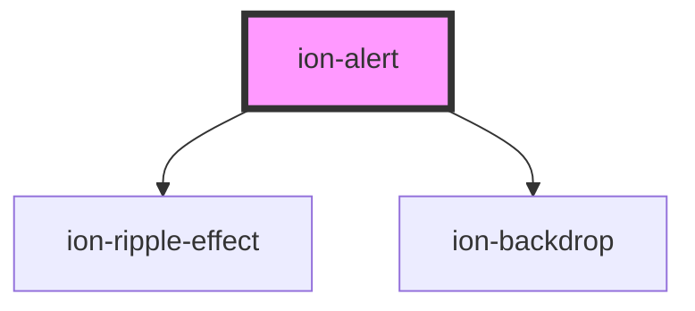

# ion-alert

An Alert is a dialog that presents users with information or collects information from the user using inputs. An alert appears on top of the app's content, and must be manually dismissed by the user before they can resume interaction with the app. It can also optionally have a `header`, `subHeader` and `message`.


### Creating

Alerts can be created using an [Alert Controller](../alert-controller). They can be customized by passing alert options in the alert controller's create method.


### Buttons

In the array of `buttons`, each button includes properties for its `text`, and optionally a `handler`. If a handler returns `false` then the alert will not automatically be dismissed when the button is clicked. All buttons will show up in the order they have been added to the `buttons` array from left to right. Note: The right most button (the last one in the array) is the main button.

Optionally, a `role` property can be added to a button, such as `cancel`. If a `cancel` role is on one of the buttons, then if the alert is dismissed by tapping the backdrop, then it will fire the handler from the button with a cancel role.


### Inputs

Alerts can also include several different inputs whose data can be passed back to the app. Inputs can be used as a simple way to prompt users for information. Radios, checkboxes and text inputs are all accepted, but they cannot be mixed. For example, an alert could have all radio button inputs, or all checkbox inputs, but the same alert cannot mix radio and checkbox inputs. Do note however, different types of "text" inputs can be mixed, such as `url`, `email`, `text`, etc. If you require a complex form UI which doesn't fit within the guidelines of an alert then we recommend building the form within a modal instead.


<!-- Auto Generated Below -->


## Usage

### Angular

```typescript
import { Component } from '@angular/core';
import { AlertController } from '@ionic/angular';

@Component({
  selector: 'alert-example',
  templateUrl: 'alert-example.html',
  styleUrls: ['./alert-example.css'],
})
export class AlertExample {

  constructor(public alertController: AlertController) {}

  async presentAlert() {
    const alert = await this.alertController.create({
      header: 'Alert',
      subHeader: 'Subtitle',
      message: 'This is an alert message.',
      buttons: ['OK']
    });

    await alert.present();
  }

  async presentAlertMultipleButtons() {
    const alert = await this.alertController.create({
      header: 'Alert',
      subHeader: 'Subtitle',
      message: 'This is an alert message.',
      buttons: ['Cancel', 'Open Modal', 'Delete']
    });

    await alert.present();
  }

  async presentAlertConfirm() {
    const alert = await this.alertController.create({
      header: 'Confirm!',
      message: 'Message <strong>text</strong>!!!',
      buttons: [
        {
          text: 'Cancel',
          role: 'cancel',
          cssClass: 'secondary',
          handler: (blah) => {
            console.log('Confirm Cancel: blah');
          }
        }, {
          text: 'Okay',
          handler: () => {
            console.log('Confirm Okay');
          }
        }
      ]
    });

    await alert.present();
  }

  async presentAlertPrompt() {
    const alert = await this.alertController.create({
      header: 'Prompt!',
      inputs: [
        {
          name: 'name1',
          type: 'text',
          placeholder: 'Placeholder 1'
        },
        {
          name: 'name2',
          type: 'text',
          id: 'name2-id',
          value: 'hello',
          placeholder: 'Placeholder 2'
        },
        {
          name: 'name3',
          value: 'http://ionicframework.com',
          type: 'url',
          placeholder: 'Favorite site ever'
        },
        // input date with min & max
        {
          name: 'name4',
          type: 'date',
          min: '2017-03-01',
          max: '2018-01-12'
        },
        // input date without min nor max
        {
          name: 'name5',
          type: 'date'
        },
        {
          name: 'name6',
          type: 'number',
          min: -5,
          max: 10
        },
        {
          name: 'name7',
          type: 'number'
        }
      ],
      buttons: [
        {
          text: 'Cancel',
          role: 'cancel',
          cssClass: 'secondary',
          handler: () => {
            console.log('Confirm Cancel');
          }
        }, {
          text: 'Ok',
          handler: () => {
            console.log('Confirm Ok');
          }
        }
      ]
    });

    await alert.present();
  }

  async presentAlertRadio() {
    const alert = await this.alertController.create({
      header: 'Radio',
      inputs: [
        {
          name: 'radio1',
          type: 'radio',
          label: 'Radio 1',
          value: 'value1',
          checked: true
        },
        {
          name: 'radio2',
          type: 'radio',
          label: 'Radio 2',
          value: 'value2'
        },
        {
          name: 'radio3',
          type: 'radio',
          label: 'Radio 3',
          value: 'value3'
        },
        {
          name: 'radio4',
          type: 'radio',
          label: 'Radio 4',
          value: 'value4'
        },
        {
          name: 'radio5',
          type: 'radio',
          label: 'Radio 5',
          value: 'value5'
        },
        {
          name: 'radio6',
          type: 'radio',
          label: 'Radio 6 Radio 6 Radio 6 Radio 6 Radio 6 Radio 6 Radio 6 Radio 6 Radio 6 Radio 6 ',
          value: 'value6'
        }
      ],
      buttons: [
        {
          text: 'Cancel',
          role: 'cancel',
          cssClass: 'secondary',
          handler: () => {
            console.log('Confirm Cancel');
          }
        }, {
          text: 'Ok',
          handler: () => {
            console.log('Confirm Ok');
          }
        }
      ]
    });

    await alert.present();
  }

  async presentAlertCheckbox() {
    const alert = await this.alertController.create({
      header: 'Checkbox',
      inputs: [
        {
          name: 'checkbox1',
          type: 'checkbox',
          label: 'Checkbox 1',
          value: 'value1',
          checked: true
        },

        {
          name: 'checkbox2',
          type: 'checkbox',
          label: 'Checkbox 2',
          value: 'value2'
        },

        {
          name: 'checkbox3',
          type: 'checkbox',
          label: 'Checkbox 3',
          value: 'value3'
        },

        {
          name: 'checkbox4',
          type: 'checkbox',
          label: 'Checkbox 4',
          value: 'value4'
        },

        {
          name: 'checkbox5',
          type: 'checkbox',
          label: 'Checkbox 5',
          value: 'value5'
        },

        {
          name: 'checkbox6',
          type: 'checkbox',
          label: 'Checkbox 6 Checkbox 6 Checkbox 6 Checkbox 6 Checkbox 6 Checkbox 6 Checkbox 6 Checkbox 6 Checkbox 6 Checkbox 6',
          value: 'value6'
        }
      ],
      buttons: [
        {
          text: 'Cancel',
          role: 'cancel',
          cssClass: 'secondary',
          handler: () => {
            console.log('Confirm Cancel');
          }
        }, {
          text: 'Ok',
          handler: () => {
            console.log('Confirm Ok');
          }
        }
      ]
    });

    await alert.present();
  }

}
```


### Javascript

```javascript
async function presentAlert() {
  const alertController = document.querySelector('ion-alert-controller');
  await alertController.componentOnReady();

  const alert = await alertController.create({
    header: 'Alert',
    subHeader: 'Subtitle',
    message: 'This is an alert message.',
    buttons: ['OK']
  });
  return await alert.present();
}

async function presentAlertMultipleButtons() {
  const alertController = document.querySelector('ion-alert-controller');
  await alertController.componentOnReady();

  const alert = await alertController.create({
    header: 'Alert',
    subHeader: 'Subtitle',
    message: 'This is an alert message.',
    buttons: ['Cancel', 'Open Modal', 'Delete']
  });
  return await alert.present();
}

async function presentAlertConfirm() {
  const alertController = document.querySelector('ion-alert-controller');
  await alertController.componentOnReady();

  const alert = await alertController.create({
    header: 'Confirm!',
    message: 'Message <strong>text</strong>!!!',
    buttons: [
      {
        text: 'Cancel',
        role: 'cancel',
        cssClass: 'secondary',
        handler: (blah) => {
          console.log('Confirm Cancel: blah');
        }
      }, {
        text: 'Okay',
        handler: () => {
          console.log('Confirm Okay')
        }
      }
    ]
  });
  return await alert.present();
}

async function presentAlertPrompt() {
  const alertController = document.querySelector('ion-alert-controller');
  await alertController.componentOnReady();

  const alert = await alertController.create({
    header: 'Prompt!',
    inputs: [
      {
        placeholder: 'Placeholder 1'
      },
      {
        name: 'name2',
        id: 'name2-id',
        value: 'hello',
        placeholder: 'Placeholder 2'
      },
      {
        name: 'name3',
        value: 'http://ionicframework.com',
        type: 'url',
        placeholder: 'Favorite site ever'
      },
      // input date with min & max
      {
        name: 'name4',
        type: 'date',
        min: '2017-03-01',
        max: '2018-01-12'
      },
      // input date without min nor max
      {
        name: 'name5',
        type: 'date'
      },
      {
        name: 'name6',
        type: 'number',
        min: -5,
        max: 10
      },
      {
        name: 'name7',
        type: 'number'
      }
    ],
    buttons: [
      {
        text: 'Cancel',
        role: 'cancel',
        cssClass: 'secondary',
        handler: () => {
          console.log('Confirm Cancel')
        }
      }, {
        text: 'Ok',
        handler: () => {
          console.log('Confirm Ok')
        }
      }
    ]
  });
  return await alert.present();
}

async function presentAlertRadio() {
  const alertController = document.querySelector('ion-alert-controller');
  await alertController.componentOnReady();

  const alert = await alertController.create({
    header: 'Radio',
    inputs: [
      {
        type: 'radio',
        label: 'Radio 1',
        value: 'value1',
        checked: true
      },
      {
        type: 'radio',
        label: 'Radio 2',
        value: 'value2'
      },
      {
        type: 'radio',
        label: 'Radio 3',
        value: 'value3'
      },
      {
        type: 'radio',
        label: 'Radio 4',
        value: 'value4'
      },
      {
        type: 'radio',
        label: 'Radio 5',
        value: 'value5'
      },
      {
        type: 'radio',
        label: 'Radio 6 Radio 6 Radio 6 Radio 6 Radio 6 Radio 6 Radio 6 Radio 6 Radio 6 Radio 6 ',
        value: 'value6'
      }
    ],
    buttons: [
      {
        text: 'Cancel',
        role: 'cancel',
        cssClass: 'secondary',
        handler: () => {
          console.log('Confirm Cancel')
        }
      }, {
        text: 'Ok',
        handler: () => {
          console.log('Confirm Ok')
        }
      }
    ]
  });
  return await alert.present();
}

async function presentAlertCheckbox() {
  const alertController = document.querySelector('ion-alert-controller');
  await alertController.componentOnReady();

  const alert = await alertController.create({
    header: 'Checkbox',
    inputs: [
      {
        type: 'checkbox',
        label: 'Checkbox 1',
        value: 'value1',
        checked: true
      },

      {
        type: 'checkbox',
        label: 'Checkbox 2',
        value: 'value2'
      },

      {
        type: 'checkbox',
        label: 'Checkbox 3',
        value: 'value3'
      },

      {
        type: 'checkbox',
        label: 'Checkbox 4',
        value: 'value4'
      },

      {
        type: 'checkbox',
        label: 'Checkbox 5',
        value: 'value5'
      },

      {
        type: 'checkbox',
        label: 'Checkbox 6 Checkbox 6 Checkbox 6 Checkbox 6 Checkbox 6 Checkbox 6 Checkbox 6 Checkbox 6 Checkbox 6 Checkbox 6',
        value: 'value6'
      }
    ],
    buttons: [
      {
        text: 'Cancel',
        role: 'cancel',
        cssClass: 'secondary',
        handler: () => {
          console.log('Confirm Cancel')
        }
      }, {
        text: 'Ok',
        handler: () => {
          console.log('Confirm Ok')
        }
      }
    ]
  });
  return await alert.present();
}
```


### React

```tsx
import React, { useState } from 'react';
import { IonAlert, IonButton, IonContent } from '@ionic/react';

export const AlertExample: React.FunctionComponent = () => {

  const [showAlert1, setShowAlert1] = useState(false);
  const [showAlert2, setShowAlert2] = useState(false);
  const [showAlert3, setShowAlert3] = useState(false);
  const [showAlert4, setShowAlert4] = useState(false);
  const [showAlert5, setShowAlert5] = useState(false);
  const [showAlert6, setShowAlert6] = useState(false);

    return (
      <IonContent>
        <IonButton onClick={() => setShowAlert1(true)} expand="block">Show Alert 1</IonButton>
        <IonButton onClick={() => setShowAlert2(true)} expand="block">Show Alert 2</IonButton>
        <IonButton onClick={() => setShowAlert3(true)} expand="block">Show Alert 3</IonButton>
        <IonButton onClick={() => setShowAlert4(true)} expand="block">Show Alert 4</IonButton>
        <IonButton onClick={() => setShowAlert5(true)} expand="block">Show Alert 5</IonButton>
        <IonButton onClick={() => setShowAlert6(true)} expand="block">Show Alert 6</IonButton>
        <IonAlert
          isOpen={showAlert1}
          onDidDismiss={() => setShowAlert1(false)}
          header={'Alert'}
          subHeader={'Subtitle'}
          message={'This is an alert message.'}
          buttons={['OK']}
        />

        <IonAlert
          isOpen={showAlert2}
          onDidDismiss={() => setShowAlert2(false)}
          header={'Alert'}
          subHeader={'Subtitle'}
          message={'This is an alert message.'}
          buttons={['Cancel', 'Open Modal', 'Delete']}
        />

        <IonAlert
          isOpen={showAlert3}
          onDidDismiss={() => setShowAlert3(false)}
          header={'Confirm!'}
          message={'Message <strong>text</strong>!!!'}
          buttons={[
            {
              text: 'Cancel',
              role: 'cancel',
              cssClass: 'secondary',
              handler: blah => {
                console.log('Confirm Cancel: blah');
              }
            },
            {
              text: 'Okay',
              handler: () => {
                console.log('Confirm Okay');
              }
            }
          ]}
        />

        <IonAlert
          isOpen={showAlert4}
          onDidDismiss={() => setShowAlert4(false)}
          header={'Prompt!'}
          inputs={[
            {
              name: 'name1',
              type: 'text',
              placeholder: 'Placeholder 1'
            },
            {
              name: 'name2',
              type: 'text',
              id: 'name2-id',
              value: 'hello',
              placeholder: 'Placeholder 2'
            },
            {
              name: 'name3',
              value: 'http://ionicframework.com',
              type: 'url',
              placeholder: 'Favorite site ever'
            },
            // input date with min & max
            {
              name: 'name4',
              type: 'date',
              min: '2017-03-01',
              max: '2018-01-12'
            },
            // input date without min nor max
            {
              name: 'name5',
              type: 'date'
            },
            {
              name: 'name6',
              type: 'number',
              min: -5,
              max: 10
            },
            {
              name: 'name7',
              type: 'number'
            }
          ]}
          buttons={[
            {
              text: 'Cancel',
              role: 'cancel',
              cssClass: 'secondary',
              handler: () => {
                console.log('Confirm Cancel');
              }
            },
            {
              text: 'Ok',
              handler: () => {
                console.log('Confirm Ok');
              }
            }
          ]}
        />

        <IonAlert
          isOpen={showAlert5}
          onDidDismiss={() => setShowAlert5(false)}
          header={'Radio'}
          inputs={[
            {
              name: 'radio1',
              type: 'radio',
              label: 'Radio 1',
              value: 'value1',
              checked: true
            },
            {
              name: 'radio2',
              type: 'radio',
              label: 'Radio 2',
              value: 'value2'
            },
            {
              name: 'radio3',
              type: 'radio',
              label: 'Radio 3',
              value: 'value3'
            },
            {
              name: 'radio4',
              type: 'radio',
              label: 'Radio 4',
              value: 'value4'
            },
            {
              name: 'radio5',
              type: 'radio',
              label: 'Radio 5',
              value: 'value5'
            },
            {
              name: 'radio6',
              type: 'radio',
              label: 'Radio 6',
              value: 'value6'
            }
          ]}
          buttons={[
            {
              text: 'Cancel',
              role: 'cancel',
              cssClass: 'secondary',
              handler: () => {
                console.log('Confirm Cancel');
              }
            },
            {
              text: 'Ok',
              handler: () => {
                console.log('Confirm Ok');
              }
            }
          ]}
        />

        <IonAlert
          isOpen={showAlert6}
          onDidDismiss={() => setShowAlert6(false)}
          header={'Checkbox'}
          inputs={[
            {
              name: 'checkbox1',
              type: 'checkbox',
              label: 'Checkbox 1',
              value: 'value1',
              checked: true
            },
            {
              name: 'checkbox2',
              type: 'checkbox',
              label: 'Checkbox 2',
              value: 'value2'
            },
            {
              name: 'checkbox3',
              type: 'checkbox',
              label: 'Checkbox 3',
              value: 'value3'
            },
            {
              name: 'checkbox4',
              type: 'checkbox',
              label: 'Checkbox 4',
              value: 'value4'
            },
            {
              name: 'checkbox5',
              type: 'checkbox',
              label: 'Checkbox 5',
              value: 'value5'
            },
            {
              name: 'checkbox6',
              type: 'checkbox',
              label: 'Checkbox 6',
              value: 'value6'
            }
          ]}
          buttons={[
            {
              text: 'Cancel',
              role: 'cancel',
              cssClass: 'secondary',
              handler: () => {
                console.log('Confirm Cancel');
              }
            },
            {
              text: 'Ok',
              handler: () => {
                console.log('Confirm Ok');
              }
            }
          ]}
        />
      </IonContent>
    );
}

export default AlertExample;

```


### Vue

```html
<template>
  <IonVuePage :title="'Alert'">
    <ion-button @click="presentAlert">Show Alert</ion-button>
    <ion-button @click="presentAlertMultipleButtons">Show Alert (multiple buttons)</ion-button>
    <ion-button @click="presentAlertConfirm">Show Alert (confirm)</ion-button>
    <ion-button @click="presentAlertPrompt">Show Alert (prompt)</ion-button>
    <ion-button @click="presentAlertRadio">Show Alert (radio)</ion-button>
    <ion-button @click="presentAlertCheckbox">Show Alert (checkbox)</ion-button>
  </IonVuePage>
</template>

<script>
export default {
  methods: {
    presentAlert() {
      return this.$ionic.alertController
        .create({
          header: 'Alert',
          subHeader: 'Subtitle',
          message: 'This is an alert message.',
          buttons: ['OK'],
        })
        .then(a => a.present())
    },

    presentAlertMultipleButtons() {
      return this.$ionic.alertController
        .create({
          header: 'Alert',
          subHeader: 'Subtitle',
          message: 'This is an alert message.',
          buttons: ['Cancel', 'Open Modal', 'Delete'],
        })
        .then(a => a.present())
    },

    presentAlertConfirm() {
      return this.$ionic.alertController
        .create({
          header: 'Confirm!',
          message: 'Message <strong>text</strong>!!!',
          buttons: [
            {
              text: 'Cancel',
              role: 'cancel',
              cssClass: 'secondary',
              handler: blah => {
                console.log('Confirm Cancel:', blah)
              },
            },
            {
              text: 'Okay',
              handler: () => {
                console.log('Confirm Okay')
              },
            },
          ],
        })
        .then(a => a.present())
    },

    presentAlertPrompt() {
      return this.$ionic.alertController
        .create({
          header: 'Prompt!',
          inputs: [
            {
              placeholder: 'Placeholder 1',
            },
            {
              name: 'name2',
              id: 'name2-id',
              value: 'hello',
              placeholder: 'Placeholder 2',
            },
            {
              name: 'name3',
              value: 'http://ionicframework.com',
              type: 'url',
              placeholder: 'Favorite site ever',
            },
            // input date with min & max
            {
              name: 'name4',
              type: 'date',
              min: '2017-03-01',
              max: '2018-01-12',
            },
            // input date without min nor max
            {
              name: 'name5',
              type: 'date',
            },
            {
              name: 'name6',
              type: 'number',
              min: -5,
              max: 10,
            },
            {
              name: 'name7',
              type: 'number',
            },
          ],
          buttons: [
            {
              text: 'Cancel',
              role: 'cancel',
              cssClass: 'secondary',
              handler: () => {
                console.log('Confirm Cancel')
              },
            },
            {
              text: 'Ok',
              handler: () => {
                console.log('Confirm Ok')
              },
            },
          ],
        })
        .then(a => a.present())
    },

    presentAlertRadio() {
      return this.$ionic.alertController
        .create({
          header: 'Radio',
          inputs: [
            {
              type: 'radio',
              label: 'Radio 1',
              value: 'value1',
              checked: true,
            },
            {
              type: 'radio',
              label: 'Radio 2',
              value: 'value2',
            },
            {
              type: 'radio',
              label: 'Radio 3',
              value: 'value3',
            },
            {
              type: 'radio',
              label: 'Radio 4',
              value: 'value4',
            },
            {
              type: 'radio',
              label: 'Radio 5',
              value: 'value5',
            },
            {
              type: 'radio',
              label: 'Radio 6',
              value: 'value6',
            },
          ],
          buttons: [
            {
              text: 'Cancel',
              role: 'cancel',
              cssClass: 'secondary',
              handler: () => {
                console.log('Confirm Cancel')
              },
            },
            {
              text: 'Ok',
              handler: () => {
                console.log('Confirm Ok')
              },
            },
          ],
        })
        .then(a => a.present())
    },

    presentAlertCheckbox() {
      return this.$ionic.alertController
        .create({
          header: 'Checkbox',
          inputs: [
            {
              type: 'checkbox',
              label: 'Checkbox 1',
              value: 'value1',
              checked: true,
            },

            {
              type: 'checkbox',
              label: 'Checkbox 2',
              value: 'value2',
            },

            {
              type: 'checkbox',
              label: 'Checkbox 3',
              value: 'value3',
            },

            {
              type: 'checkbox',
              label: 'Checkbox 4',
              value: 'value4',
            },

            {
              type: 'checkbox',
              label: 'Checkbox 5',
              value: 'value5',
            },

            {
              type: 'checkbox',
              label: 'Checkbox 6',
              value: 'value6',
            },
          ],
          buttons: [
            {
              text: 'Cancel',
              role: 'cancel',
              cssClass: 'secondary',
              handler: () => {
                console.log('Confirm Cancel')
              },
            },
            {
              text: 'Ok',
              handler: () => {
                console.log('Confirm Ok')
              },
            },
          ],
        })
        .then(a => a.present())
    },
  },
}
</script>
```


## Properties

| Property          | Attribute          | Description                                                                                                                                                                                                                                                                                                                        | Type                                                                                   | Default     |
| ----------------- | ------------------ | ---------------------------------------------------------------------------------------------------------------------------------------------------------------------------------------------------------------------------------------------------------------------------------------------------------------------------------- | -------------------------------------------------------------------------------------- | ----------- |
| `animated`        | `animated`         | If `true`, the alert will animate.                                                                                                                                                                                                                                                                                                 | `boolean`                                                                              | `true`      |
| `backdropDismiss` | `backdrop-dismiss` | If `true`, the alert will be dismissed when the backdrop is clicked.                                                                                                                                                                                                                                                               | `boolean`                                                                              | `true`      |
| `buttons`         | --                 | Array of buttons to be added to the alert.                                                                                                                                                                                                                                                                                         | `(string \| AlertButton)[]`                                                            | `[]`        |
| `cssClass`        | `css-class`        | Additional classes to apply for custom CSS. If multiple classes are provided they should be separated by spaces.                                                                                                                                                                                                                   | `string \| string[] \| undefined`                                                      | `undefined` |
| `enterAnimation`  | --                 | Animation to use when the alert is presented.                                                                                                                                                                                                                                                                                      | `((Animation: Animation, baseEl: any, opts?: any) => Promise<Animation>) \| undefined` | `undefined` |
| `header`          | `header`           | The main title in the heading of the alert.                                                                                                                                                                                                                                                                                        | `string \| undefined`                                                                  | `undefined` |
| `inputs`          | --                 | Array of input to show in the alert.                                                                                                                                                                                                                                                                                               | `AlertInput[]`                                                                         | `[]`        |
| `keyboardClose`   | `keyboard-close`   | If `true`, the keyboard will be automatically dismissed when the overlay is presented.                                                                                                                                                                                                                                             | `boolean`                                                                              | `true`      |
| `leaveAnimation`  | --                 | Animation to use when the alert is dismissed.                                                                                                                                                                                                                                                                                      | `((Animation: Animation, baseEl: any, opts?: any) => Promise<Animation>) \| undefined` | `undefined` |
| `message`         | `message`          | The main message to be displayed in the alert. `message` can accept either plaintext or HTML as a string. To display characters normally reserved for HTML, they must be escaped. For example `<Ionic>` would become `&lt;Ionic&gt;`  For more information: [Security Documentation](https://ionicframework.com/docs/faq/security) | `string \| undefined`                                                                  | `undefined` |
| `mode`            | `mode`             | The mode determines which platform styles to use.                                                                                                                                                                                                                                                                                  | `"ios" \| "md"`                                                                        | `undefined` |
| `subHeader`       | `sub-header`       | The subtitle in the heading of the alert. Displayed under the title.                                                                                                                                                                                                                                                               | `string \| undefined`                                                                  | `undefined` |
| `translucent`     | `translucent`      | If `true`, the alert will be translucent.                                                                                                                                                                                                                                                                                          | `boolean`                                                                              | `false`     |


## Events

| Event                 | Description                             | Type                                   |
| --------------------- | --------------------------------------- | -------------------------------------- |
| `ionAlertDidDismiss`  | Emitted after the alert has dismissed.  | `CustomEvent<OverlayEventDetail<any>>` |
| `ionAlertDidPresent`  | Emitted after the alert has presented.  | `CustomEvent<void>`                    |
| `ionAlertWillDismiss` | Emitted before the alert has dismissed. | `CustomEvent<OverlayEventDetail<any>>` |
| `ionAlertWillPresent` | Emitted before the alert has presented. | `CustomEvent<void>`                    |


## Methods

### `dismiss(data?: any, role?: string | undefined) => Promise<boolean>`

Dismiss the alert overlay after it has been presented.

#### Returns

Type: `Promise<boolean>`


### `onDidDismiss() => Promise<OverlayEventDetail<any>>`

Returns a promise that resolves when the alert did dismiss.

#### Returns

Type: `Promise<OverlayEventDetail<any>>`


### `onWillDismiss() => Promise<OverlayEventDetail<any>>`

Returns a promise that resolves when the alert will dismiss.

#### Returns

Type: `Promise<OverlayEventDetail<any>>`


### `present() => Promise<void>`

Present the alert overlay after it has been created.

#### Returns

Type: `Promise<void>`


## CSS Custom Properties

| Name           | Description                 |
| -------------- | --------------------------- |
| `--background` | Background of the alert     |
| `--height`     | Height of the alert         |
| `--max-height` | Maximum height of the alert |
| `--max-width`  | Maximum width of the alert  |
| `--min-height` | Minimum height of the alert |
| `--min-width`  | Minimum width of the alert  |
| `--width`      | Width of the alert          |


## Dependencies

### Depends on

- [ion-ripple-effect](../ripple-effect)
- [ion-backdrop](../backdrop)

### Graph


----------------------------------------------

*Built with [StencilJS](https://stenciljs.com/)*
