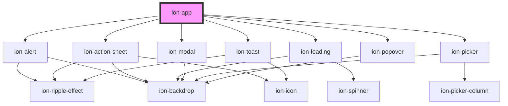

# ion-app

App is a container element for an Ionic application. There should only be one `<ion-app>` element per project. An app can have many Ionic components including menus, headers, content, and footers. The overlay components get appended to the `<ion-app>` when they are presented.

<!-- Auto Generated Below -->

## Dependencies

### Depends on

- [ion-alert](../alert)
- [ion-action-sheet](../action-sheet)
- [ion-loading](../loading)
- [ion-modal](../modal)
- [ion-picker](../picker)
- [ion-popover](../popover)
- [ion-toast](../toast)

### Graph

----------------------------------------------

*Built with [StencilJS](https://stenciljs.com/)*
