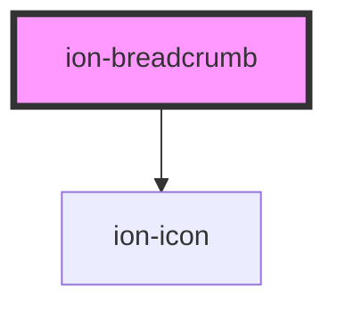

# ion-breadcrumb

A Breadcrumb is a single navigation item that is a child of the Breadcrumbs component. A breadcrumb can link elsewhere in an app or it can be plain text. Each breadcrumb has a separator between it and the next breadcrumb and can optionally contain an icon.

<!-- Auto Generated Below -->

## Properties

| Property          | Attribute          | Description                                                                                                                                                                                                                                                                               | Type                                                    | Default     |
| ----------------- | ------------------ | ----------------------------------------------------------------------------------------------------------------------------------------------------------------------------------------------------------------------------------------------------------------------------------------- | ------------------------------------------------------- | ----------- |
| `active`          | `active`           | If `true`, the breadcrumb will take on a different look to show that it is the currently active breadcrumb. Defaults to `true` for the last breadcrumb if it is not set on any.                                                                                                           | `boolean`                                               | `false`     |
| `color`           | `color`            | The color to use from your application's color palette. Default options are: `"primary"`, `"secondary"`, `"tertiary"`, `"success"`, `"warning"`, `"danger"`, `"light"`, `"medium"`, and `"dark"`. For more information on colors, see [theming](/docs/theming/basics).                    | `string \| undefined`                                   | `undefined` |
| `disabled`        | `disabled`         | If `true`, the user cannot interact with the breadcrumb.                                                                                                                                                                                                                                  | `boolean`                                               | `false`     |
| `download`        | `download`         | This attribute instructs browsers to download a URL instead of navigating to it, so the user will be prompted to save it as a local file. If the attribute has a value, it is used as the pre-filled file name in the Save prompt (the user can still change the file name if they want). | `string \| undefined`                                   | `undefined` |
| `href`            | `href`             | Contains a URL or a URL fragment that the hyperlink points to. If this property is set, an anchor tag will be rendered.                                                                                                                                                                   | `string \| undefined`                                   | `undefined` |
| `mode`            | `mode`             | The mode determines which platform styles to use.                                                                                                                                                                                                                                         | `"ios" \| "md"`                                         | `undefined` |
| `rel`             | `rel`              | Specifies the relationship of the target object to the link object. The value is a space-separated list of [link types](https://developer.mozilla.org/en-US/docs/Web/HTML/Link_types).                                                                                                    | `string \| undefined`                                   | `undefined` |
| `routerAnimation` | --                 | When using a router, it specifies the transition animation when navigating to another page using `href`.                                                                                                                                                                                  | `((baseEl: any, opts?: any) => Animation) \| undefined` | `undefined` |
| `routerDirection` | `router-direction` | When using a router, it specifies the transition direction when navigating to another page using `href`.                                                                                                                                                                                  | `"back" \| "forward" \| "root"`                         | `'forward'` |
| `separator`       | `separator`        | If true, show a separator between this breadcrumb and the next. Defaults to `true` for all breadcrumbs except the last.                                                                                                                                                                   | `boolean \| undefined`                                  | `undefined` |
| `target`          | `target`           | Specifies where to display the linked URL. Only applies when an `href` is provided. Special keywords: `"_blank"`, `"_self"`, `"_parent"`, `"_top"`.                                                                                                                                       | `string \| undefined`                                   | `undefined` |

## Events

| Event      | Description                              | Type                |
| ---------- | ---------------------------------------- | ------------------- |
| `ionBlur`  | Emitted when the breadcrumb loses focus. | `CustomEvent<void>` |
| `ionFocus` | Emitted when the breadcrumb has focus.   | `CustomEvent<void>` |

## Shadow Parts

| Part                    | Description                                                          |
| ----------------------- | -------------------------------------------------------------------- |
| `"collapsed-indicator"` | The indicator element that shows the breadcrumbs are collapsed.      |
| `"native"`              | The native HTML anchor or div element that wraps all child elements. |
| `"separator"`           | The separator element between each breadcrumb.                       |

## CSS Custom Properties

| Name                   | Description                                     |
| ---------------------- | ----------------------------------------------- |
| `--background-focused` | Background color of the breadcrumb when focused |
| `--color`              | Text color of the breadcrumb                    |
| `--color-active`       | Text color of the active breadcrumb             |
| `--color-focused`      | Text color of the breadcrumb when focused       |
| `--color-hover`        | Text color of the breadcrumb on hover           |

## Dependencies

### Depends on

- ion-icon

### Graph

----------------------------------------------

*Built with [StencilJS](https://stenciljs.com/)*
