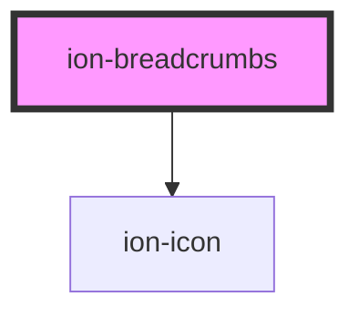

# ion-breadcrumbs

Breadcrumbs


<!-- Auto Generated Below -->


## Usage

### Angular / javascript / vue

```html

```


### React / stencil

```tsx

```


## Properties

| Property | Attribute | Description                                                                                                                                                                                                                                                            | Type                  | Default     |
| -------- | --------- | ---------------------------------------------------------------------------------------------------------------------------------------------------------------------------------------------------------------------------------------------------------------------- | --------------------- | ----------- |
| `color`  | `color`   | The color to use from your application's color palette. Default options are: `"primary"`, `"secondary"`, `"tertiary"`, `"success"`, `"warning"`, `"danger"`, `"light"`, `"medium"`, and `"dark"`. For more information on colors, see [theming](/docs/theming/basics). | `string \| undefined` | `undefined` |
| `mode`   | `mode`    | The mode determines which platform styles to use.                                                                                                                                                                                                                      | `"ios" \| "md"`       | `undefined` |


## Events

| Event               | Description                                      | Type                |
| ------------------- | ------------------------------------------------ | ------------------- |
| `ionCollapsedClick` | Emitted when the collapsed button is clicked on. | `CustomEvent<void>` |


## Shadow Parts

| Part                    | Description                                                                       |
| ----------------------- | --------------------------------------------------------------------------------- |
| `"collapsed-indicator"` | The indicator element that shows when at least one child breadcrumb is collapsed. |


## CSS Custom Properties

| Name           | Description                   |
| -------------- | ----------------------------- |
| `--background` | Background of the breadcrumbs |
| `--color`      | Text color of the breadcrumbs |


## Dependencies

### Depends on

- ion-icon

### Graph


----------------------------------------------

*Built with [StencilJS](https://stenciljs.com/)*
