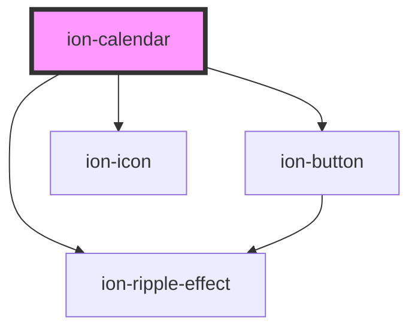

# ion-calendar

`ion-calendar` is displays a calendar view of this month, allows you to move between months and years to select a different date. You can also use use `ion-calendar-popover` to select a date from within an input.

<!-- Auto Generated Below -->

## Properties

| Property             | Attribute  | Description                                                                                                                                                                                                     | Type                                               | Default                    |
| -------------------- | ---------- | --------------------------------------------------------------------------------------------------------------------------------------------------------------------------------------------------------------- | -------------------------------------------------- | -------------------------- |
| `availableDates`     | --         | An array of javascript dates that are available for selection. e.g. [new Date()] this would only allow today to be selected. for large dater date sets, consider using disabledBeforeDate and disabledAfterDate | `Date[] \| undefined`                              | `[]`                       |
| `disabled`           | `disabled` | If `true`, the user cannot interact with the calendar.                                                                                                                                                          | `boolean`                                          | `false`                    |
| `disabledAfterDate`  | --         | Disables any date before the date entered e.g. passing new Date() would mean users could not select anything after today                                                                                        | `Date \| undefined`                                | `undefined`                |
| `disabledBeforeDate` | --         | Disables any date after the date entered e.g. passing new Date() would mean users could not select anything before today                                                                                        | `Date \| undefined`                                | `undefined`                |
| `disabledDates`      | --         | Dates that users will not be able to select e.g. [new Date()] would mean users could not select today                                                                                                           | `Date[] \| undefined`                              | `undefined`                |
| `disabledDays`       | --         | Weekdays that users will not be able to select (optional) e.g. [0,6] would mean users could not select Sunday or Saturday                                                                                       | `(0 \| 1 \| 2 \| 3 \| 4 \| 5 \| 6)[] \| undefined` | `undefined`                |
| `mode`               | `mode`     | The mode determines which platform styles to use.                                                                                                                                                               | `'ios' \| 'md'`                                    | `undefined`                |
| `month`              | `month`    | Month index to display on the calendar, defaults to current month. e.g. January is 0, February is 1                                                                                                             | `number`                                           | `this.today.getMonth()`    |
| `selectedDates`      | --         | An array of javascript dates that are shown as selected on the page. e.g. [new Date()]                                                                                                                          | `Date[]`                                           | `[]`                       |
| `year`               | `year`     | Year to display on the calendar, defaults to current year.                                                                                                                                                      | `number`                                           | `this.today.getFullYear()` |

## Events

| Event           | Description                                                                      | Type                              |
| --------------- | -------------------------------------------------------------------------------- | --------------------------------- |
| `ionSelectDate` | Emitted when a date is tapped/clicked on. Value is emitted as an ISO String date | `CustomEvent<{ value: string; }>` |

## Dependencies

### Depends on

- [ion-ripple-effect](../ripple-effect)
- [ion-button](../button)
- ion-icon

### Graph

----------------------------------------------

*Built with [StencilJS](https://stenciljs.com/)*
