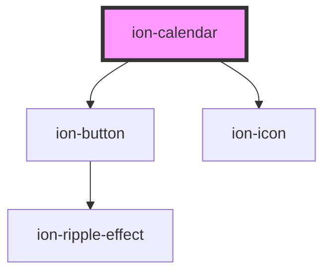

# ion-calendar

`ion-calendar` is displays a calendar view of this month, allows you to move between months and years to select a different date. You can also use use `ion-calendar-popover` to select a date from within an input.

<!-- Auto Generated Below -->

## Properties

| Property        | Attribute  | Description                                                                                         | Type            | Default                    |
| --------------- | ---------- | --------------------------------------------------------------------------------------------------- | --------------- | -------------------------- |
| `disabled`      | `disabled` | If `true`, the user cannot interact with the calendar.                                              | `boolean`       | `false`                    |
| `mode`          | `mode`     | The mode determines which platform styles to use.                                                   | `'ios' \| 'md'` | `undefined`                |
| `month`         | `month`    | Month index to display on the calendar, defaults to current month. e.g. January is 0, February is 1 | `number`        | `this.today.getMonth()`    |
| `selectedDates` | --         | An array of javascript dates that are shown as selected on the page. e.g. [new Date()]              | `Date[]`        | `[]`                       |
| `year`          | `year`     | Year to display on the calendar, defaults to current year.                                          | `number`        | `this.today.getFullYear()` |

## Events

| Event           | Description                                                                      | Type                              |
| --------------- | -------------------------------------------------------------------------------- | --------------------------------- |
| `ionSelectDate` | Emitted when a date is tapped/clicked on. Value is emitted as an ISO String date | `CustomEvent<{ value: string; }>` |

## Dependencies

### Depends on

- [ion-button](../button)
- ion-icon

### Graph

----------------------------------------------

*Built with [StencilJS](https://stenciljs.com/)*
