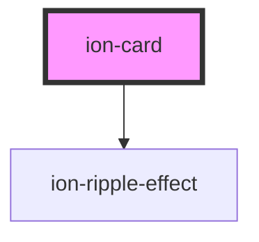

# ion-card

Cards are a standard piece of UI that serves as an entry point to more detailed
information. A card can be a single component, but is often made up of some
header, title, subtitle, and content. `ion-card` is broken up into several
sub-components to reflect this. Please see `ion-card-content`,
`ion-card-header`, `ion-card-title`, `ion-card-subtitle`.

<!-- Auto Generated Below -->


## Usage

### Angular / javascript

```html
<ion-card>
  <ion-card-header>
    <ion-card-subtitle>Card Subtitle</ion-card-subtitle>
    <ion-card-title>Card Title</ion-card-title>
  </ion-card-header>

  <ion-card-content>
    Keep close to Nature's heart... and break clear away, once in awhile,
    and climb a mountain or spend a week in the woods. Wash your spirit clean.
  </ion-card-content>
</ion-card>

<ion-card>
  <ion-item>
    <ion-icon name="pin" slot="start"></ion-icon>
    <ion-label>ion-item in a card, icon left, button right</ion-label>
    <ion-button fill="outline" slot="end">View</ion-button>
  </ion-item>

  <ion-card-content>
    This is content, without any paragraph or header tags,
    within an ion-card-content element.
  </ion-card-content>
</ion-card>

<ion-card>
  <ion-item href="#" class="activated">
    <ion-icon name="wifi" slot="start"></ion-icon>
    <ion-label>Card Link Item 1 .activated</ion-label>
  </ion-item>

  <ion-item href="#">
    <ion-icon name="wine" slot="start"></ion-icon>
    <ion-label>Card Link Item 2</ion-label>
  </ion-item>

  <ion-item class="activated">
    <ion-icon name="warning" slot="start"></ion-icon>
    <ion-label>Card Button Item 1 .activated</ion-label>
  </ion-item>

  <ion-item>
    <ion-icon name="walk" slot="start"></ion-icon>
    <ion-label>Card Button Item 2</ion-label>
  </ion-item>
</ion-card>
```


### React

```tsx
import React from 'react';
import { IonButton, IonCard, IonCardContent, IonCardHeader, IonCardSubtitle, IonCardTitle, IonContent, IonIcon, IonItem, IonLabel } from '@ionic/react';

export const CardExample: React.FunctionComponent = () => (
  <IonContent>
    <IonCard>
      <IonCardHeader>
        <IonCardSubtitle>Card Subtitle</IonCardSubtitle>
        <IonCardTitle>Card Title</IonCardTitle>
      </IonCardHeader>

      <IonCardContent>
        Keep close to Nature's heart... and break clear away, once in awhile,
        and climb a mountain or spend a week in the woods. Wash your spirit clean.
      </IonCardContent>
    </IonCard>

    <IonCard>
      <IonItem>
        <IonIcon name="pin" slot="start" />
        <IonLabel>ion-item in a card, icon left, button right</IonLabel>
        <IonButton fill="outline" slot="end">View</IonButton>
      </IonItem>

      <IonCardContent>
        This is content, without any paragraph or header tags,
        within an ion-cardContent element.
      </IonCardContent>
    </IonCard>

    <IonCard>
      <IonItem href="#" class="activated">
        <IonIcon name="wifi" slot="start" />
        <IonLabel>Card Link Item 1 .activated</IonLabel>
      </IonItem>

      <IonItem href="#">
        <IonIcon name="wine" slot="start" />
        <IonLabel>Card Link Item 2</IonLabel>
      </IonItem>

      <IonItem class="activated">
        <IonIcon name="warning" slot="start" />
        <IonLabel>Card Button Item 1 .activated</IonLabel>
      </IonItem>

      <IonItem>
        <IonIcon name="walk" slot="start" />
        <IonLabel>Card Button Item 2</IonLabel>
      </IonItem>
    </IonCard>
  </IonContent>
);
```


### Vue

```html
<template>
  <ion-card>
    <ion-card-header>
      <ion-card-subtitle>Card Subtitle</ion-card-subtitle>
      <ion-card-title>Card Title</ion-card-title>
    </ion-card-header>

    <ion-card-content>
      Keep close to Nature's heart... and break clear away, once in awhile,
      and climb a mountain or spend a week in the woods. Wash your spirit clean.
    </ion-card-content>
  </ion-card>

  <ion-card>
    <ion-item>
      <ion-icon name="pin" slot="start"></ion-icon>
      <ion-label>ion-item in a card, icon left, button right</ion-label>
      <ion-button fill="outline" slot="end">View</ion-button>
    </ion-item>

    <ion-card-content>
      This is content, without any paragraph or header tags,
      within an ion-card-content element.
    </ion-card-content>
  </ion-card>

  <ion-card>
    <ion-item href="#" class="activated">
      <ion-icon name="wifi" slot="start"></ion-icon>
      <ion-label>Card Link Item 1 .activated</ion-label>
    </ion-item>

    <ion-item href="#">
      <ion-icon name="wine" slot="start"></ion-icon>
      <ion-label>Card Link Item 2</ion-label>
    </ion-item>

    <ion-item class="activated">
      <ion-icon name="warning" slot="start"></ion-icon>
      <ion-label>Card Button Item 1 .activated</ion-label>
    </ion-item>

    <ion-item>
      <ion-icon name="walk" slot="start"></ion-icon>
      <ion-label>Card Button Item 2</ion-label>
    </ion-item>
  </ion-card>
</template>
```


## Properties

| Property          | Attribute          | Description                                                                                                                                                                                                                                                                               | Type                              | Default     |
| ----------------- | ------------------ | ----------------------------------------------------------------------------------------------------------------------------------------------------------------------------------------------------------------------------------------------------------------------------------------- | --------------------------------- | ----------- |
| `button`          | `button`           | If `true`, a button tag will be rendered and the card will be tappable.                                                                                                                                                                                                                   | `boolean`                         | `false`     |
| `color`           | `color`            | The color to use from your application's color palette. Default options are: `"primary"`, `"secondary"`, `"tertiary"`, `"success"`, `"warning"`, `"danger"`, `"light"`, `"medium"`, and `"dark"`. For more information on colors, see [theming](/docs/theming/basics).                    | `string \| undefined`             | `undefined` |
| `disabled`        | `disabled`         | If `true`, the user cannot interact with the card.                                                                                                                                                                                                                                        | `boolean`                         | `false`     |
| `download`        | `download`         | This attribute instructs browsers to download a URL instead of navigating to it, so the user will be prompted to save it as a local file. If the attribute has a value, it is used as the pre-filled file name in the Save prompt (the user can still change the file name if they want). | `string \| undefined`             | `undefined` |
| `href`            | `href`             | Contains a URL or a URL fragment that the hyperlink points to. If this property is set, an anchor tag will be rendered.                                                                                                                                                                   | `string \| undefined`             | `undefined` |
| `mode`            | `mode`             | The mode determines which platform styles to use.                                                                                                                                                                                                                                         | `"ios" \| "md"`                   | `undefined` |
| `rel`             | `rel`              | Specifies the relationship of the target object to the link object. The value is a space-separated list of [link types](https://developer.mozilla.org/en-US/docs/Web/HTML/Link_types).                                                                                                    | `string \| undefined`             | `undefined` |
| `routerDirection` | `router-direction` | When using a router, it specifies the transition direction when navigating to another page using `href`.                                                                                                                                                                                  | `"back" \| "forward" \| "root"`   | `'forward'` |
| `target`          | `target`           | Specifies where to display the linked URL. Only applies when an `href` is provided. Special keywords: `"_blank"`, `"_self"`, `"_parent"`, `"_top"`.                                                                                                                                       | `string \| undefined`             | `undefined` |
| `type`            | `type`             | The type of the button. Only used when an `onclick` or `button` property is present.                                                                                                                                                                                                      | `"button" \| "reset" \| "submit"` | `'button'`  |


## CSS Custom Properties

| Name           | Description            |
| -------------- | ---------------------- |
| `--background` | Background of the card |
| `--color`      | Color of the card      |


## Dependencies

### Depends on

- [ion-ripple-effect](../ripple-effect)

### Graph


----------------------------------------------

*Built with [StencilJS](https://stenciljs.com/)*
