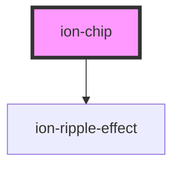

# ion-chip

Chips represent complex entities in small blocks, such as a contact. A chip can contain several different elements such as avatars, text, and icons.

<!-- Auto Generated Below -->


## Usage

### Angular / javascript

```html
<ion-chip>
  <ion-label>Default</ion-label>
</ion-chip>

<ion-chip>
  <ion-label color="secondary">Secondary Label</ion-label>
</ion-chip>

<ion-chip color="secondary">
  <ion-label color="dark">Secondary w/ Dark label</ion-label>
</ion-chip>

<ion-chip>
  <ion-icon name="pin"></ion-icon>
  <ion-label>Default</ion-label>
</ion-chip>

<ion-chip>
  <ion-icon name="heart" color="dark"></ion-icon>
  <ion-label>Default</ion-label>
</ion-chip>

<ion-chip>
  <ion-label>Button Chip</ion-label>
  <ion-icon name="close-circle"></ion-icon>
</ion-chip>

<ion-chip>
  <ion-icon name="pin" color="primary"></ion-icon>
  <ion-label>Icon Chip</ion-label>
  <ion-icon name="close"></ion-icon>
</ion-chip>

<ion-chip>
  <ion-avatar>
    
  </ion-avatar>
  <ion-label>Avatar Chip</ion-label>
  <ion-icon name="close-circle"></ion-icon>
</ion-chip>
```


### React

```tsx
import React from 'react';
import { IonChip, IonLabel, IonIcon, IonAvatar, IonContent } from '@ionic/react';

export const ChipExample: React.FunctionComponent = () => (
  <IonContent>
    <IonChip>
      <IonLabel>Default</IonLabel>
    </IonChip>

    <IonChip>
      <IonLabel color="secondary">Secondary Label</IonLabel>
    </IonChip>

    <IonChip color="secondary">
      <IonLabel color="dark">Secondary w/ Dark label</IonLabel>
    </IonChip>

    <IonChip>
      <IonIcon name="pin" />
      <IonLabel>Default</IonLabel>
    </IonChip>

    <IonChip>
      <IonIcon name="heart" color="dark" />
      <IonLabel>Default</IonLabel>
    </IonChip>

    <IonChip>
      <IonLabel>Button Chip</IonLabel>
      <IonIcon name="close-circle" />
    </IonChip>

    <IonChip>
      <IonIcon name="pin" color="primary" />
      <IonLabel>Icon Chip</IonLabel>
      <IonIcon name="close" />
    </IonChip>

    <IonChip>
      <IonAvatar>
        
      </IonAvatar>
      <IonLabel>Avatar Chip</IonLabel>
      <IonIcon name="close-circle" />
    </IonChip>
  </IonContent>
);
```


### Vue

```html
<template>
  <ion-chip>
    <ion-label>Default</ion-label>
  </ion-chip>

  <ion-chip>
    <ion-label color="secondary">Secondary Label</ion-label>
  </ion-chip>

  <ion-chip color="secondary">
    <ion-label color="dark">Secondary w/ Dark label</ion-label>
  </ion-chip>

  <ion-chip>
    <ion-icon name="pin"></ion-icon>
    <ion-label>Default</ion-label>
  </ion-chip>

  <ion-chip>
    <ion-icon name="heart" color="dark"></ion-icon>
    <ion-label>Default</ion-label>
  </ion-chip>

  <ion-chip>
    <ion-label>Button Chip</ion-label>
    <ion-icon name="close-circle"></ion-icon>
  </ion-chip>

  <ion-chip>
    <ion-icon name="pin" color="primary"></ion-icon>
    <ion-label>Icon Chip</ion-label>
    <ion-icon name="close"></ion-icon>
  </ion-chip>

  <ion-chip>
    <ion-avatar>
      
    </ion-avatar>
    <ion-label>Avatar Chip</ion-label>
    <ion-icon name="close-circle"></ion-icon>
  </ion-chip>
</template>
```


## Properties

| Property  | Attribute | Description                                                                                                                                                                                                                                                            | Type                  | Default     |
| --------- | --------- | ---------------------------------------------------------------------------------------------------------------------------------------------------------------------------------------------------------------------------------------------------------------------- | --------------------- | ----------- |
| `color`   | `color`   | The color to use from your application's color palette. Default options are: `"primary"`, `"secondary"`, `"tertiary"`, `"success"`, `"warning"`, `"danger"`, `"light"`, `"medium"`, and `"dark"`. For more information on colors, see [theming](/docs/theming/basics). | `string \| undefined` | `undefined` |
| `mode`    | `mode`    | The mode determines which platform styles to use.                                                                                                                                                                                                                      | `"ios" \| "md"`       | `undefined` |
| `outline` | `outline` | Display an outline style button.                                                                                                                                                                                                                                       | `boolean`             | `false`     |


## CSS Custom Properties

| Name           | Description            |
| -------------- | ---------------------- |
| `--background` | Background of the chip |
| `--color`      | Color of the chip      |


## Dependencies

### Depends on

- [ion-ripple-effect](../ripple-effect)

### Graph


----------------------------------------------

*Built with [StencilJS](https://stenciljs.com/)*
