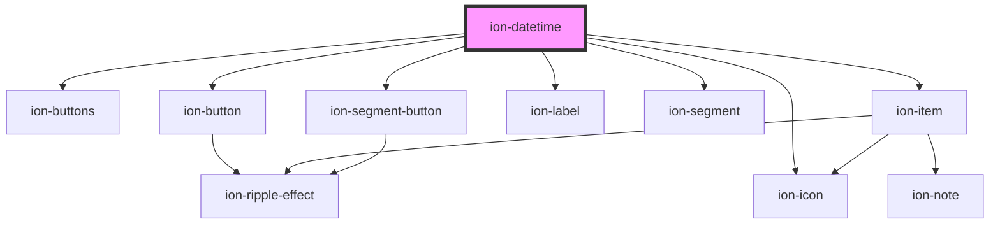

# ion-datetime

Datetimes present a calendar interface and time wheel, making it easy for users to select dates and times. Datetimes are similar to the native `input` elements of `datetime-local`, however, Ionic Framework's Datetime component makes it easy to display the date and time in the a preferred format, and manage the datetime values.

### Datetime Data

Historically, handling datetime values within JavaScript, or even within HTML
inputs, has always been a challenge. Specifically, JavaScript's `Date` object is
notoriously difficult to correctly parse apart datetime strings or to format
datetime values. Even worse is how different browsers and JavaScript versions
parse various datetime strings differently, especially per locale.

Fortunately, Ionic Framework's datetime input has been designed so developers can avoid
the common pitfalls, allowing developers to easily manipulate datetime values and give the user a simple datetime picker for a great user experience.

##### ISO 8601 Datetime Format: YYYY-MM-DDTHH:mmZ

Ionic Framework uses the [ISO 8601 datetime format](https://www.w3.org/TR/NOTE-datetime)
for its value. The value is simply a string, rather than using JavaScript's
`Date` object. Using the ISO datetime format makes it easy to serialize
and parse within JSON objects and databases.

An ISO format can be used as a simple year, or just the hour and minute, or get
more detailed down to the millisecond and timezone. Any of the ISO formats below
can be used, and after a user selects a new value, Ionic Framework will continue to use
the same ISO format which datetime value was originally given as.

| Description          | Format                 | Datetime Value Example        |
| -------------------- | ---------------------- | ----------------------------  |
| Year                 | YYYY                   | 1994                          |
| Year and Month       | YYYY-MM                | 1994-12                       |
| Complete Date        | YYYY-MM-DD             | 1994-12-15                    |
| Date and Time        | YYYY-MM-DDTHH:mm       | 1994-12-15T13:47              |
| UTC Timezone         | YYYY-MM-DDTHH:mm:ssTZD | 1994-12-15T13:47:20.789Z      |
| Timezone Offset      | YYYY-MM-DDTHH:mm:ssTZD | 1994-12-15T13:47:20.789+05:00 |
| Hour and Minute      | HH:mm                  | 13:47                         |
| Hour, Minute, Second | HH:mm:ss               | 13:47:20                      |

Note that the year is always four-digits, milliseconds (if it's added) is always
three-digits, and all others are always two-digits. So the number representing
January always has a leading zero, such as `01`. Additionally, the hour is
always in the 24-hour format, so `00` is `12am` on a 12-hour clock, `13` means
`1pm`, and `23` means `11pm`.

## Min and Max Datetimes

By default, there is no maximum or minimum date a user can select. To customize the minimum and maximum datetime values, the `min` and `max` component properties can be provided which may make more sense for the app's use-case. Following the same IS0 8601 format listed in the table above, each component can restrict which dates can be selected by the user. By passing `2016` to the `min` property and `2020-10-31` to the `max` property, the datetime will restrict the date selection between the beginning of `2016`, and `October 31st of 2020`.

## Selecting Specific Values

While the `min` and `max` properties allow you to restrict date selection to a certain range, the `monthValues`, `dayValues`, `yearValues`, `hourValues`, and `minuteValues` properties allow you choose specific days and times that you to have enabled.

For example, if we wanted users to only select minutes in increments of 15, we could pass `"0,15,30,45"` to the `minuteValues` property.

As another example, if we wanted users to only select from the month of October, we could pass `"10"` to the `monthValues` property.

## Customizing Date and Time Presentation

Some use cases may call for only date selection or only time selection. The `presentation` property allows you to specify which pickers to show and the order to show them in. For example, `presentation="time"` would only show the time picker. `presentation="time-date"` would show the time picker first and the date picker second, but `presentation="date-time"` would show the date picker first and the time picker second.

## Reset and Cancel Buttons

`ion-datetime` provides `cancel` and `reset` methods that you can call when clicking on custom buttons that you have provided in the `buttons` slot. The `reset` method also allows you to provide a date to reset the datetime to.

## Confirming Selected Values

By default, `ionChange` is emitted with the new datetime value whenever a new date is selected. To require user confirmation before emitting `ionChange`, you can either set the `showDefaultButtons` property to `true` or use the `buttons` slot to pass in a custom confirmation button. When passing in custom buttons, the confirm button must call the `confirm` method on `ion-datetime` for `ionChange` to be emitted.

## Localization

Ionic Framework makes use of the [Intl.DatetimeFormat](https://developer.mozilla.org/en-US/docs/Web/JavaScript/Reference/Global_Objects/DatetimeFormat) Web API which allows us to automatically localize the month and day names according to the language and region set on the user's device.

For instances where you need a specific locale, you can use the `locale` property to set it. The following example sets the language to "French" and the region to "France":

```html
<ion-datetime locale="fr-FR"></ion-datetime>
```

## Parsing Dates

When `ionChange` is emitted, we provide an ISO-8601 string in the event payload. From there, it is the developer's responsibility to format it as they see fit. We recommend using a library like [date-fns](https://date-fns.org) to format their dates properly.

Below is an example of formatting an ISO-8601 string to display the month, date, and year:

```typescript
import { format, parseISO } from 'date-fns';

/**
 * This is provided in the event
 * payload from the `ionChange` event.
 */
const dateFromIonDatetime = '2021-06-04T14:23:00-04:00';
const formattedString = format(parseISO(dateFromIonDatetime), 'MMM d, yyyy');

console.log(formattedString); // Jun 4, 2021
```

See https://date-fns.org/docs/format for a list of all the valid format tokens.

## Advanced Datetime Validation and Manipulation

The datetime picker provides the simplicity of selecting an exact format, and
persists the datetime values as a string using the standardized [ISO 8601
datetime format](https://www.w3.org/TR/NOTE-datetime). However, it's important
to note that `ion-datetime` does not attempt to solve all situations when
validating and manipulating datetime values. If datetime values need to be
parsed from a certain format, or manipulated (such as adding 5 days to a date,
subtracting 30 minutes, etc.), or even formatting data to a specific locale,
then we highly recommend using [date-fns](https://date-fns.org) to work with
dates in JavaScript.

<!-- Auto Generated Below -->


## Usage

### Angular

```html
<!-- Initial value -->
<ion-datetime value="2012-12-15T13:47:20.789"></ion-datetime>

<!-- Readonly -->
<ion-datetime readonly></ion-datetime>

<!-- Disabled -->
<ion-datetime disabled></ion-datetime>

<!-- Custom locale -->
<ion-datetime locale="en-GB"></ion-datetime>

<!-- Max and min -->
<ion-datetime min="1994-03-14" max="2012-12-09" value="2008-09-02"></ion-datetime>

<!-- 15 minute increments -->
<ion-datetime minuteValues="0,15,30,45"></ion-datetime>

<!-- Specific days/months/years --> 
<ion-datetime monthValues="6,7,8" yearValues="2014,2015" dayValues="01,02,03,04,05,06,08,09,10,11,12,13,14"></ion-datetime>

<!-- Selecting time, no date -->
<ion-datetime presentation="time"></ion-datetime>

<!-- Selecting time first, date second -->
<ion-datetime presentation="time-date"></ion-datetime>

<!-- Custom title -->
<ion-datetime>
  <div slot="title">My Custom Title</div>
</ion-datetime>

<!-- Custom buttons -->
<ion-datetime #customDatetime>
  <ion-buttons slot="buttons">
    <ion-button (click)="confirm()">Good to go!</ion-button>
    <ion-button (click)="reset()">Reset</ion-button>
  </ion-buttons>
</ion-datetime>

<!-- Datetime in overlay -->
<ion-button id="open-modal">Open Datetime Modal</ion-button>
<ion-modal trigger="open-modal">
  <ng-template>
    <ion-content>
      <ion-datetime></ion-datetime>
    </ion-content>
  </ng-template>
</ion-modal>

```javascript
@Component({…})
export class MyComponent {
  @ViewChild('customDatetime', { static: false }) datetime: HTMLIonDateTimeElement;
  constructor() {}
  
  confirm() {
    this.datetime.nativeEl.confirm();
  }
  
  reset() {
    this.datetime.nativeEl.reset();
  }
}
```


### Javascript

```html
<!-- Initial value -->
<ion-datetime value="2012-12-15T13:47:20.789"></ion-datetime>

<!-- Readonly -->
<ion-datetime readonly></ion-datetime>

<!-- Disabled -->
<ion-datetime disabled></ion-datetime>

<!-- Custom locale -->
<ion-datetime locale="en-GB"></ion-datetime>

<!-- Max and min -->
<ion-datetime min="1994-03-14" max="2012-12-09" value="2008-09-02"></ion-datetime>

<!-- 15 minute increments -->
<ion-datetime minute-values="0,15,30,45"></ion-datetime>

<!-- Specific days/months/years --> 
<ion-datetime month-values="6,7,8" year-values="2014,2015" day-values="01,02,03,04,05,06,08,09,10,11,12,13,14"></ion-datetime>

<!-- Selecting time, no date -->
<ion-datetime presentation="time"></ion-datetime>

<!-- Selecting time first, date second -->
<ion-datetime presentation="time-date"></ion-datetime>

<!-- Custom title -->
<ion-datetime>
  <div slot="title">My Custom Title</div>
</ion-datetime>

<!-- Custom buttons -->
<ion-datetime id="custom-datetime">
  <ion-buttons slot="buttons">
    <ion-button onclick="confirm()">Good to go!</ion-button>
    <ion-button onclick="reset()">Reset</ion-button>
  </ion-buttons>
</ion-datetime>

<!-- Datetime in overlay -->
<ion-button id="open-modal">Open Datetime Modal</ion-button>
<ion-modal trigger="open-modal">
  <ion-content>
    <ion-datetime></ion-datetime>
  </ion-content>
</ion-modal>

```javascript
const datetime = document.querySelector('#custom-datetime');

const confirm = () => {
  datetime.confirm();
}

const reset = () => {
  datetime.reset();
}
```


### React

```javascript
import React, { useState, useRef } from 'react';
import {
  IonButton,
  IonButtons,
  IonContent,
  IonDatetime,
  IonModal,
  IonPage
} from '@ionic/react';

export const DateTimeExamples: React.FC = () => {
  const [selectedDate, setSelectedDate] = useState<string>('2012-12-15T13:47:20.789');
  const customDatetime = useRef();
  const confirm = () => {
    if (customDatetime === undefined) return;
    
    customDatetime.confirm();
  }
  
  const reset = () => {
    if (customDatetime === undefined) return;
    
    customDatetime.reset();
  }

  return (
    <IonPage>
      {/* Initial value */}
      <IonDatetime value={selectedDate} onIonChange={e => setSelectedDate(e.detail.value!)}></IonDatetime>
      
      {/* Readonly */}
      <IonDatetime readonly></IonDatetime>
      
      {/* Disabled */}
      <IonDatetime disabled></IonDatetime>
      
      {/* Custom locale */}
      <IonDatetime locale="en-GB"></IonDatetime>
      
      {/* Max and min */}
      <IonDatetime min="1994-03-14" max="2012-12-09" value="2008-09-02"></IonDatetime>
      
      {/* 15 minute increments */}
      <IonDatetime minuteValues="0,15,30,45"></IonDatetime>
      
      {/* Specific days/months/years */} 
      <IonDatetime monthValues="6,7,8" yearValues="2014,2015" dayValues="01,02,03,04,05,06,08,09,10,11,12,13,14"></IonDatetime>
      
      {/* Selecting time, no date */}
      <IonDatetime presentation="time"></IonDatetime>
      
      {/* Selecting time first, date second */}
      <IonDatetime presentation="time-date"></IonDatetime>
      
      {/* Custom title */}
      <IonDatetime>
        <div slot="title">My Custom Title</div>
      </IonDatetime>
      
      {/* Custom buttons */}
      <IonDatetime ref={customDatetime}>
        <IonButtons slot="buttons">
          <IonButton onClick={() => confirm()}>Good to go!</IonButton>
          <IonButton onClick={() => reset()}>Reset</IonButton>
        </IonButtons>
      </IonDatetime>
      
      {/* Datetime in overlay */}
      <IonButton id="open-modal">Open Datetime Modal</IonButton>
      <IonModal trigger="open-modal">
        <IonContent>
          <IonDatetime></IonDatetime>
        </IonContent>
      </IonModal>
    </IonPage>
  )
}
```


### Stencil

```javascript
import { Component, h } from '@stencil/core';

@Component({
  tag: 'datetime-example',
  styleUrl: 'datetime-example.css'
})
export class DatetimeExample {
  private customDatetime?: HTMLElement;
  
  private confirm() {
    const { customDatetime } = this;
    if (customDatetime === undefined) return;
    
    customDatetime.confirm();
  }

  private reset() {
    const { customDatetime } = this;
    if (customDatetime === undefined) return;
    
    customDatetime.reset();
  }
  
  render() {
    return [
      {/* Initial value */}
      <ion-datetime value="2012-12-15T13:47:20.789"></ion-datetime>,
      
      {/* Readonly */}
      <ion-datetime readonly></ion-datetime>,
      
      {/* Disabled */}
      <ion-datetime disabled></ion-datetime>,
      
      {/* Custom locale */}
      <ion-datetime locale="en-GB"></ion-datetime>,
      
      {/* Max and min */}
      <ion-datetime min="1994-03-14" max="2012-12-09" value="2008-09-02"></ion-datetime>,
      
      {/* 15 minute increments */}
      <ion-datetime minuteValues="0,15,30,45"></ion-datetime>,
      
      {/* Specific days/months/years */} 
      <ion-datetime monthValues="6,7,8" yearValues="2014,2015" dayValues="01,02,03,04,05,06,08,09,10,11,12,13,14"></ion-datetime>,
      
      {/* Selecting time, no date */}
      <ion-datetime presentation="time"></ion-datetime>,
      
      {/* Selecting time first, date second */}
      <ion-datetime presentation="time-date"></ion-datetime>,
      
      {/* Custom title */}
      <ion-datetime>
        <div slot="title">My Custom Title</div>
      </ion-datetime>,
      
      {/* Custom buttons */}
      <ion-datetime ref={el => this.customDatetime = el}>
        <ion-buttons slot="buttons">
          <ion-button onClick={() => this.confirm()}>Good to go!</ion-button>
          <ion-button onClick={() => this.reset()}>Reset</ion-button>
        </ion-buttons>
      </ion-datetime>,
      
      {/* Datetime in overlay */}
      <ion-button id="open-modal">Open Datetime Modal</ion-button>
      <ion-modal trigger="open-modal">
        <ion-content>
          <ion-datetime></ion-datetime>
        </ion-content>
      </ion-modal>
    ]
  }
}
```


### Vue

```html
<template>
  <!-- Initial value -->
  <ion-datetime value="2012-12-15T13:47:20.789"></ion-datetime>
  
  <!-- Readonly -->
  <ion-datetime readonly></ion-datetime>
  
  <!-- Disabled -->
  <ion-datetime disabled></ion-datetime>
  
  <!-- Custom locale -->
  <ion-datetime locale="en-GB"></ion-datetime>
  
  <!-- Max and min -->
  <ion-datetime min="1994-03-14" max="2012-12-09" value="2008-09-02"></ion-datetime>
  
  <!-- 15 minute increments -->
  <ion-datetime minute-values="0,15,30,45"></ion-datetime>
  
  <!-- Specific days/months/years --> 
  <ion-datetime month-values="6,7,8" year-values="2014,2015" day-values="01,02,03,04,05,06,08,09,10,11,12,13,14"></ion-datetime>
  
  <!-- Selecting time, no date -->
  <ion-datetime presentation="time"></ion-datetime>
  
  <!-- Selecting time first, date second -->
  <ion-datetime presentation="time-date"></ion-datetime>
  
  <!-- Custom title -->
  <ion-datetime>
    <div slot="title">My Custom Title</div>
  </ion-datetime>
  
  <!-- Custom buttons -->
  <ion-datetime ref="customDatetime">
    <ion-buttons slot="buttons">
      <ion-button @click="confirm()">Good to go!</ion-button>
      <ion-button @click="reset()">Reset</ion-button>
    </ion-buttons>
  </ion-datetime>
  
  <!-- Datetime in overlay -->
  <ion-button id="open-modal">Open Datetime Modal</ion-button>
  <ion-modal trigger="open-modal">
    <ion-content>
      <ion-datetime></ion-datetime>
    </ion-content>
  </ion-modal>
</template>

<script>
  import { defineComponent, ref } from 'vue';
  import {
    IonButton,
    IonButtons,
    IonContent,
    IonDatetime,
    IonModal
  } from '@ionic/vue';

  export default defineComponent({
    components: {
      IonButton,
      IonButtons,
      IonContent,
      IonDatetime,
      IonModal
    },
    setup() {
      const customDatetime = ref();
      const confirm = () => {
        if (customDatetime.value === undefined) return;
        
        customDatetime.value.$el.confirm();
      }
      const reset = () => {
        if (customDatetime.value === undefined) return;
        
        customDatetime.value.$el.reset();
      }
      return {
        customDatetime,
        confirm,
        reset
      }
    }
  })
</script>
```


## Properties

| Property             | Attribute              | Description                                                                                                                                                                                                                                                                                                                                                                                                                                                                                       | Type                                             | Default        |
| -------------------- | ---------------------- | ------------------------------------------------------------------------------------------------------------------------------------------------------------------------------------------------------------------------------------------------------------------------------------------------------------------------------------------------------------------------------------------------------------------------------------------------------------------------------------------------- | ------------------------------------------------ | -------------- |
| `cancelText`         | `cancel-text`          | The text to display on the picker's cancel button.                                                                                                                                                                                                                                                                                                                                                                                                                                                | `string`                                         | `'Cancel'`     |
| `color`              | `color`                | The color to use from your application's color palette. Default options are: `"primary"`, `"secondary"`, `"tertiary"`, `"success"`, `"warning"`, `"danger"`, `"light"`, `"medium"`, and `"dark"`. For more information on colors, see [theming](/docs/theming/basics).                                                                                                                                                                                                                            | `string \| undefined`                            | `'primary'`    |
| `dayValues`          | `day-values`           | Values used to create the list of selectable days. By default every day is shown for the given month. However, to control exactly which days of the month to display, the `dayValues` input can take a number, an array of numbers, or a string of comma separated numbers. Note that even if the array days have an invalid number for the selected month, like `31` in February, it will correctly not show days which are not valid for the selected month.                                    | `number \| number[] \| string \| undefined`      | `undefined`    |
| `disabled`           | `disabled`             | If `true`, the user cannot interact with the datetime.                                                                                                                                                                                                                                                                                                                                                                                                                                            | `boolean`                                        | `false`        |
| `doneText`           | `done-text`            | The text to display on the picker's "Done" button.                                                                                                                                                                                                                                                                                                                                                                                                                                                | `string`                                         | `'Done'`       |
| `hourValues`         | `hour-values`          | Values used to create the list of selectable hours. By default the hour values range from `0` to `23` for 24-hour, or `1` to `12` for 12-hour. However, to control exactly which hours to display, the `hourValues` input can take a number, an array of numbers, or a string of comma separated numbers.                                                                                                                                                                                         | `number \| number[] \| string \| undefined`      | `undefined`    |
| `locale`             | `locale`               | The locale to use for `ion-datetime`. This impacts month and day name formatting. The `'default'` value refers to the default locale set by your device.                                                                                                                                                                                                                                                                                                                                          | `string`                                         | `'default'`    |
| `max`                | `max`                  | The maximum datetime allowed. Value must be a date string following the [ISO 8601 datetime format standard](https://www.w3.org/TR/NOTE-datetime), `1996-12-19`. The format does not have to be specific to an exact datetime. For example, the maximum could just be the year, such as `1994`. Defaults to the end of this year.                                                                                                                                                                  | `string \| undefined`                            | `undefined`    |
| `min`                | `min`                  | The minimum datetime allowed. Value must be a date string following the [ISO 8601 datetime format standard](https://www.w3.org/TR/NOTE-datetime), such as `1996-12-19`. The format does not have to be specific to an exact datetime. For example, the minimum could just be the year, such as `1994`. Defaults to the beginning of the year, 100 years ago from today.                                                                                                                           | `string \| undefined`                            | `undefined`    |
| `minuteValues`       | `minute-values`        | Values used to create the list of selectable minutes. By default the minutes range from `0` to `59`. However, to control exactly which minutes to display, the `minuteValues` input can take a number, an array of numbers, or a string of comma separated numbers. For example, if the minute selections should only be every 15 minutes, then this input value would be `minuteValues="0,15,30,45"`.                                                                                            | `number \| number[] \| string \| undefined`      | `undefined`    |
| `mode`               | `mode`                 | The mode determines which platform styles to use.                                                                                                                                                                                                                                                                                                                                                                                                                                                 | `"ios" \| "md"`                                  | `undefined`    |
| `monthValues`        | `month-values`         | Values used to create the list of selectable months. By default the month values range from `1` to `12`. However, to control exactly which months to display, the `monthValues` input can take a number, an array of numbers, or a string of comma separated numbers. For example, if only summer months should be shown, then this input value would be `monthValues="6,7,8"`. Note that month numbers do *not* have a zero-based index, meaning January's value is `1`, and December's is `12`. | `number \| number[] \| string \| undefined`      | `undefined`    |
| `name`               | `name`                 | The name of the control, which is submitted with the form data.                                                                                                                                                                                                                                                                                                                                                                                                                                   | `string`                                         | `this.inputId` |
| `presentation`       | `presentation`         | Which values you want to select. `'date'` will show a calendar picker to select the month, day, and year. `'time'` will show a time picker to select the hour, minute, and (optionally) AM/PM. `'date-time'` will show the date picker first and time picker second. `'time-date'` will show the time picker first and date picker second.                                                                                                                                                        | `"date" \| "date-time" \| "time" \| "time-date"` | `'date-time'`  |
| `readonly`           | `readonly`             | If `true`, the datetime appears normal but is not interactive.                                                                                                                                                                                                                                                                                                                                                                                                                                    | `boolean`                                        | `false`        |
| `showDefaultButtons` | `show-default-buttons` | If `true`, the default "Cancel" and "OK" buttons will be rendered at the bottom of the `ion-datetime` component. Developers can also use the `button` slot if they want to customize these buttons. If custom buttons are set in the `button` slot then the default buttons will not be rendered.                                                                                                                                                                                                 | `boolean`                                        | `false`        |
| `showDefaultTitle`   | `show-default-title`   | If `true`, a header will be shown above the calendar picker. On `ios` mode this will include the slotted title, and on `md` mode this will include the slotted title and the selected date.                                                                                                                                                                                                                                                                                                       | `boolean`                                        | `false`        |
| `value`              | `value`                | The value of the datetime as a valid ISO 8601 datetime string.                                                                                                                                                                                                                                                                                                                                                                                                                                    | `null \| string \| undefined`                    | `undefined`    |
| `yearValues`         | `year-values`          | Values used to create the list of selectable years. By default the year values range between the `min` and `max` datetime inputs. However, to control exactly which years to display, the `yearValues` input can take a number, an array of numbers, or string of comma separated numbers. For example, to show upcoming and recent leap years, then this input's value would be `yearValues="2024,2020,2016,2012,2008"`.                                                                         | `number \| number[] \| string \| undefined`      | `undefined`    |


## Events

| Event       | Description                                         | Type                                     |
| ----------- | --------------------------------------------------- | ---------------------------------------- |
| `ionBlur`   | Emitted when the datetime loses focus.              | `CustomEvent<void>`                      |
| `ionCancel` | Emitted when the datetime selection was cancelled.  | `CustomEvent<void>`                      |
| `ionChange` | Emitted when the value (selected date) has changed. | `CustomEvent<DatetimeChangeEventDetail>` |
| `ionFocus`  | Emitted when the datetime has focus.                | `CustomEvent<void>`                      |


## Methods

### `cancel(closeOverlay?: boolean) => Promise<void>`

Emits the ionCancel event and
optionally closes the popover
or modal that the datetime was
presented in.

#### Returns

Type: `Promise<void>`


### `confirm(closeOverlay?: boolean) => Promise<void>`

Confirms the selected datetime value, updates the
`value` property, and optionally closes the popover
or modal that the datetime was presented in.

#### Returns

Type: `Promise<void>`


### `reset(value?: string | undefined) => Promise<void>`

Resets the internal state of the datetime
but does not update the value. Passing a value
ISO-8601 string will reset the state of
te component to the provided date.

#### Returns

Type: `Promise<void>`


## Slots

| Slot        | Description                  |
| ----------- | ---------------------------- |
| `"buttons"` | The buttons in the datetime. |
| `"title"`   | The title of the datetime.   |


## CSS Custom Properties

| Name               | Description                                                     |
| ------------------ | --------------------------------------------------------------- |
| `--background`     | The primary background of the datetime component.               |
| `--background-rgb` | The primary background of the datetime component in RGB format. |
| `--title-color`    | The text color of the title.                                    |


## Dependencies

### Depends on

- [ion-buttons](../buttons)
- [ion-button](../button)
- [ion-item](../item)
- [ion-label](../label)
- ion-icon
- [ion-segment](../segment)
- [ion-segment-button](../segment-button)

### Graph


----------------------------------------------

*Built with [StencilJS](https://stenciljs.com/)*
