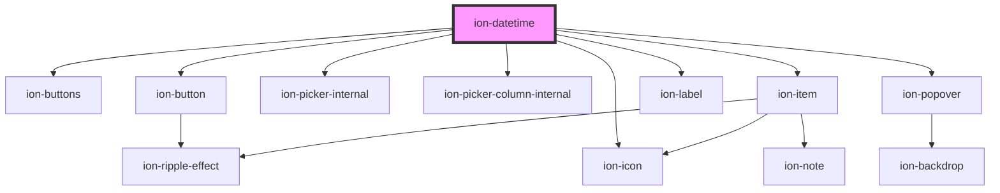

# ion-datetime

Datetimes present a calendar interface and time wheel, making it easy for users to select dates and times. Datetimes are similar to the native `input` elements of `datetime-local`, however, Ionic Framework's Datetime component makes it easy to display the date and time in the preferred format, and manage the datetime values.

### Datetime Data

Historically, handling datetime values within JavaScript, or even within HTML
inputs, has always been a challenge. Specifically, JavaScript's `Date` object is
notoriously difficult to correctly parse apart datetime strings or to format
datetime values. Even worse is how different browsers and JavaScript versions
parse various datetime strings differently, especially per locale.

Fortunately, Ionic Framework's datetime input has been designed so developers can avoid
the common pitfalls, allowing developers to easily manipulate datetime values and give the user a simple datetime picker for a great user experience.

##### ISO 8601 Datetime Format: YYYY-MM-DDTHH:mmZ

Ionic Framework uses the [ISO 8601 datetime format](https://www.w3.org/TR/NOTE-datetime)
for its value. The value is simply a string, rather than using JavaScript's
`Date` object. Using the ISO datetime format makes it easy to serialize
and parse within JSON objects and databases.

An ISO format can be used as a simple year, or just the hour and minute, or get
more detailed down to the millisecond and time zone. Any of the ISO formats below
can be used, and after a user selects a new value, Ionic Framework will continue to use
the same ISO format which datetime value was originally given as.

| Description          | Format                 | Datetime Value Example        |
| -------------------- | ---------------------- | ----------------------------  |
| Year                 | YYYY                   | 1994                          |
| Year and Month       | YYYY-MM                | 1994-12                       |
| Complete Date        | YYYY-MM-DD             | 1994-12-15                    |
| Date and Time        | YYYY-MM-DDTHH:mm       | 1994-12-15T13:47              |
| UTC Timezone         | YYYY-MM-DDTHH:mm:ssZ   | 1994-12-15T13:47:20Z          |
| Timezone Offset      | YYYY-MM-DDTHH:mm:ssTZD | 1994-12-15T13:47:20+05:00     |
| Hour and Minute      | HH:mm                  | 13:47                         |
| Hour, Minute, Second | HH:mm:ss               | 13:47:20                      |

Note that the year is always four-digits, milliseconds (if it's added) is always
three-digits, and all others are always two-digits. So the number representing
January always has a leading zero, such as `01`. Additionally, the hour is
always in the 24-hour format, so `00` is `12am` on a 12-hour clock, `13` means
`1pm`, and `23` means `11pm`.

## Min and Max Datetimes

Dates are infinite in either direction, so for a user's selection there should be at least some form of restricting the dates that can be selected. By default, the maximum date is to the end of the current year, and the minimum date is from the beginning of the year that was 100 years ago.

To customize the minimum and maximum datetime values, the `min` and `max` component properties can be provided which may make more sense for the app's use-case. Following the same IS0 8601 format listed in the table above, each component can restrict which dates can be selected by the user. By passing `2016` to the `min` property and `2020-10-31` to the `max` property, the datetime will restrict the date selection between the beginning of `2016`, and `October 31st of 2020`.

## Selecting Specific Values

While the `min` and `max` properties allow you to restrict date selection to a certain range, the `monthValues`, `dayValues`, `yearValues`, `hourValues`, and `minuteValues` properties allow you choose specific days and times that you to have enabled.

For example, if we wanted users to only select minutes in increments of 15, we could pass `"0,15,30,45"` to the `minuteValues` property.

As another example, if we wanted users to only select from the month of October, we could pass `"10"` to the `monthValues` property.

## Customizing Date and Time Presentation

Some use cases may call for only date selection or only time selection. The `presentation` property allows you to specify which pickers to show and the order to show them in. For example, `presentation="time"` would only show the time picker. `presentation="time-date"` would show the time picker first and the date picker second, but `presentation="date-time"` would show the date picker first and the time picker second.

## Reset and Cancel Buttons

`ion-datetime` provides `cancel` and `reset` methods that you can call when clicking on custom buttons that you have provided in the `buttons` slot. The `reset` method also allows you to provide a date to reset the datetime to.

## Confirming Selected Values

By default, `ionChange` is emitted with the new datetime value whenever a new date is selected. To require user confirmation before emitting `ionChange`, you can either set the `showDefaultButtons` property to `true` or use the `buttons` slot to pass in a custom confirmation button. When passing in custom buttons, the confirm button must call the `confirm` method on `ion-datetime` for `ionChange` to be emitted.

## Localization

Ionic Framework makes use of the [Intl.DatetimeFormat](https://developer.mozilla.org/en-US/docs/Web/JavaScript/Reference/Global_Objects/DatetimeFormat) Web API which allows us to automatically localize the month and day names according to the language and region set on the user's device.

For instances where you need a specific locale, you can use the `locale` property to set it. The following example sets the language to "French" and the region to "France":

```html
<ion-datetime locale="fr-FR"></ion-datetime>
```

### Controlling the Hour Cycle

`ion-datetime` will use the hour cycle that is specified by the `locale` property by default. For example, if `locale` is set to `en-US`, then `ion-datetime` will use a 12 hour cycle.

There are 4 primary hour cycle types:

| Hour cycle type | Description                                                  |
| --------------- | ------------------------------------------------------------ |
| `'h12`          | Hour system using 1–12; corresponds to 'h' in patterns. The 12 hour clock, with midnight starting at 12:00 am. |
| `'h23'`         | Hour system using 0–23; corresponds to 'H' in patterns. The 24 hour clock, with midnight starting at 0:00. |
| `'h11'`         | Hour system using 0–11; corresponds to 'K' in patterns. The 12 hour clock, with midnight starting at 0:00 am. |
| `'h24'`         | Hour system using 1–24; corresponds to 'k' in pattern. The 24 hour clock, with midnight starting at 24:00. |

>  Source: https://developer.mozilla.org/en-US/docs/Web/JavaScript/Reference/Global_Objects/Intl/Locale/hourCycle

There may be scenarios where you need to have more control over which hour cycle is used. This is where the `hourCycle` property can help.

In the following example, we can use the `hourCycle` property to force `ion-datetime` to use the 12 hour cycle even though the locale is `en-GB`, which uses a 24 hour cycle by default:

```html
<ion-datetime hour-cycle="h12" locale="en-GB"></ion-datetime>
```

`ion-datetime` also supports [locale extension tags](https://developer.mozilla.org/en-US/docs/Web/JavaScript/Reference/Global_Objects/Intl/Locale). These tags let you encode information about the locale in the locale string itself. Developers may prefer to use the extension tag approach if they are using the [Intl.Locale API](https://developer.mozilla.org/en-US/docs/Web/JavaScript/Reference/Global_Objects/Intl/Locale) in their apps.

For example, if you wanted to use a 12 hour cycle with the `en-GB` locale, you could alternatively do:

```html
<ion-datetime locale="en-GB-u-hc-h12"></ion-datetime>
```

`ion-datetime` currently supports the `h12` and `h23` hour cycle types. Interested in seeing support for `h11` and `h24` added to `ion-datetime`? [Let us know!](https://github.com/ionic-team/ionic-framework/issues/23750)

### Setting the First Day of the Week

For `ion-datetime`, the default first day of the week is Sunday. As of 2021, there is no browser API that lets Ionic automatically determine the first day of the week based on a device's locale, though there is on-going work regarding this (see: [TC39 GitHub](https://github.com/tc39/ecma402/issues/6)).

To customize the first day of the week, developers can use the `firstDayOfWeek` property. This property takes in a number between `0` and `6` where `0` represents Sunday and `6` represents Saturday.

For example, if you wanted to have the first day of the week be Monday, you could set `firstDayOfWeek` to `1`:

```html
<ion-datetime first-day-of-week="1"></ion-datetime>
```

## Time Zones

Ionic's `ion-datetime` follows the [datetime-local](https://developer.mozilla.org/en-US/docs/Web/HTML/Element/input/datetime-local) behavior of not manipulating or setting the time zone inside of a datetime control. In other words, a time value of "07:00" will not be adjusted according to different time zones.

We recommend using a library such as [date-fns-tz](https://github.com/marnusw/date-fns-tz) to convert a datetime value to the desired time zone.

Below is an example of formatting an ISO-8601 string to display in the time zone set on a user's device:

```typescript
import { format, utcToZonedTime } from 'date-fns-tz';

// Get the time zone set on the user's device
const userTimeZone = Intl.DateTimeFormat().resolvedOptions().timeZone;

// Create a date object from a UTC date string
const date = new Date('2014-10-25T10:46:20Z');

// Use date-fns-tz to convert from UTC to a zoned time
const zonedTime = dateFnsTz.utcToZonedTime(date, userTimeZone);

// Create a formatted string from the zoned time
format(zonedTime, 'yyyy-MM-dd HH:mm:ssXXX', { timeZone: userTimeZone });
```

### Parsing Date Values

The `ionChange` event will emit the date value as an ISO-8601 string in the event payload. It is the developer's responsibility to format it based on their application needs. We recommend using [date-fns](https://date-fns.org) to format the date value.

Below is an example of formatting an ISO-8601 string to display the month, date and year:

```typescript
import { format, parseISO } from 'date-fns';

/**
 * This is provided in the event
 * payload from the `ionChange` event.
 * 
 * The value is an ISO-8601 date string.
 */
const dateFromIonDatetime = '2021-06-04T14:23:00-04:00';
const formattedString = format(parseISO(dateFromIonDatetime), 'MMM d, yyyy');

console.log(formattedString); // Jun 4, 2021
```

See https://date-fns.org/docs/format for a list of all the valid format tokens.

## Disabling Dates

With the `isDateEnabled` property, developers can customize the `ion-datetime` to disable a specific day, range of dates, weekends or any custom rule using an ISO 8601 date string. 

The `isDateEnabled` property accepts a function returning a boolean, indicating if a date is enabled. The function is called for each rendered calendar day, for the previous, current and next month. Custom implementations should be optimized for performance to avoid jank.

```html
<ion-datetime></ion-datetime>

<script>
  const datetime = document.querySelector('ion-datetime');
  datetime.isDateEnabled = function(dateIsoString) {
    // Write your custom logic here
    return true;
  }
</script>
```

### Disabling a specific date

```js
isDateEnabled(dateIsoString) {
  const date = new Date(dateIsoString);
  if (date.getUTCFullYear() === 2022 
    && date.getUTCMonth() === 0 
    && date.getUTCDate() === 1) {
    // Disables January 1, 2022
    return false;
  }
  return true;
}
```

### Disabling weekends

```js
isDateEnabled(dateIsoString) {
  const date = new Date(dateIsoString);
  if (date.getUTCDay() === 0 && date.getUTCDay() === 6) {
    // Disables Saturday and Sunday
    return false;
  }
  return true;
}
```

### Usage with date-fns

Developers can also use the available functions from `date-fns` to disable dates.

```ts
import { isMonday } from 'date-fns';

isDateEnabled(dateIsoString) {
  if (isMonday(new Date(dateIsoString))) {
    // Disables Monday
    return false;
  }
  return true;
}
```

## Advanced Datetime Validation and Manipulation

The datetime picker provides the simplicity of selecting an exact format, and
persists the datetime values as a string using the standardized [ISO 8601
datetime format](https://www.w3.org/TR/NOTE-datetime). However, it's important
to note that `ion-datetime` does not attempt to solve all situations when
validating and manipulating datetime values. If datetime values need to be
parsed from a certain format, or manipulated (such as adding 5 days to a date,
subtracting 30 minutes, etc.), or even formatting data to a specific locale,
then we highly recommend using [date-fns](https://date-fns.org) to work with
dates in JavaScript.

## Compact Datetime Style

Datetime can be used with the [Datetime Button](./datetime-button) component to render a button with the localized selected date and time. The component is rendered in a compact style such that it does not take up much screen space.

It can also be paired with [Modal](./modal) or [Popover](./popover) to show the datetime in an overlay when the date or time buttons are clicked.

See the [Datetime Button](./datetime-button) documentation for usage examples.

## Accessibility

### Keyboard Navigation

`ion-datetime` has full keyboard support for navigating between focusable elements inside of the component. The following table details what each key does:

| Key                | Function                                                     |
| ------------------ | ------------------------------------------------------------ |
| `Tab`              | Moves focus to the next focusable element.                   |
| `Shift` + `Tab`    | Moves focus to the previous focusable element.               |
| `Space` or `Enter` | Clicks the focusable element.                                |

#### Date Grid

| Key                | Function                                                     |
| ------------------ | ------------------------------------------------------------ |
| `ArrowUp` | Moves focus to the same day of the previous week. |
| `ArrowDown` | Moves focus to the same day of the next week. |
| `ArrowRight` | Moves focus to the next day. |
| `ArrowLeft` | Moves focus to the previous day. |
| `Home` | Moves focus to the first day of the current week. |
| `End` | Moves focus to the last day of the current week. |
| `PageUp` | Changes the grid of dates to the previous month. |
| `PageDown` | Changes the grid of dates to the next month. |
| `Shift` + `PageUp` | Changes the grid of dates to the previous year. |
| `Shift` + `PageDown` | Changes the grid of dates to the next year. |

#### Time, Month, and Year Wheels

When using the time wheel picker, you can use the number keys to select hour and minute values when the columns are focused.

| Key                | Function                                                     |
| ------------------ | ------------------------------------------------------------ |
| `ArrowUp` | Scroll to the previous item. |
| `ArrowDown` | Scroll to the next item. |
| `Home` | Scroll to the first item. |
| `End` | Scroll to the last item. |

## Interfaces

### DatetimeChangeEventDetail

```typescript
interface DatetimeChangeEventDetail {
  value?: string | null;
}
```

### DatetimeCustomEvent

While not required, this interface can be used in place of the `CustomEvent` interface for stronger typing with Ionic events emitted from this component.

```typescript
interface DatetimeCustomEvent extends CustomEvent {
  detail: DatetimeChangeEventDetail;
  target: HTMLIonDatetimeElement;
}
```

<!-- Auto Generated Below -->


## Usage

### Angular

```html
<!-- Initial value -->
<ion-datetime value="2012-12-15T13:47:20.789"></ion-datetime>

<!-- Readonly -->
<ion-datetime readonly></ion-datetime>

<!-- Disabled -->
<ion-datetime disabled></ion-datetime>

<!-- Custom locale -->
<ion-datetime locale="en-GB"></ion-datetime>

<!-- Max and min -->
<ion-datetime min="1994-03-14" max="2012-12-09" value="2008-09-02"></ion-datetime>

<!-- 15 minute increments -->
<ion-datetime minuteValues="0,15,30,45"></ion-datetime>

<!-- Specific days/months/years --> 
<ion-datetime monthValues="6,7,8" yearValues="2014,2015" dayValues="01,02,03,04,05,06,08,09,10,11,12,13,14"></ion-datetime>

<!-- Selecting time, no date -->
<ion-datetime presentation="time"></ion-datetime>

<!-- Selecting time first, date second -->
<ion-datetime presentation="time-date"></ion-datetime>

<!-- Full width size -->
<ion-datetime size="cover"></ion-datetime>

<!-- Custom Hour Cycle -->
<ion-datetime hourCycle="h23"></ion-datetime>

<!-- Custom first day of week -->
<ion-datetime [firstDayOfWeek]="1"></ion-datetime>

<!-- Custom title -->
<ion-datetime>
  <div slot="title">My Custom Title</div>
</ion-datetime>

<!-- Clear button -->
<ion-datetime [showClearButton]="true"></ion-datetime>

<!-- Disable custom days -->
<ion-datetime [isDateEnabled]="isDateEnabled"></ion-datetime>

<!-- Datetime in overlay -->
<ion-button id="open-modal">Open Datetime Modal</ion-button>
<ion-modal trigger="open-modal">
  <ng-template>
    <ion-content>
      <ion-datetime></ion-datetime>
    </ion-content>
  </ng-template>
</ion-modal>

<!-- Custom buttons -->
<ion-datetime>
  <ion-buttons slot="buttons">
    <ion-button (click)="confirm()">Good to go!</ion-button>
    <ion-button (click)="reset()">Reset</ion-button>
  </ion-buttons>
</ion-datetime>

<!-- Datetime in popover with cover element -->
<ion-item button="true" id="open-date-input">
  <ion-label>Date</ion-label>
  <ion-text slot="end">{{ dateValue }}</ion-text>
  <ion-popover trigger="open-date-input" show-backdrop="false">
    <ng-template>
      <ion-datetime
        #popoverDatetime
        presentation="date"
        (ionChange)="dateValue = formatDate(popoverDatetime.value)"
      ></ion-datetime>
    </ng-template>
  </ion-popover>
</ion-item>

<!-- Datetime in popover with input -->
<ion-item>
  <ion-input [value]="dateValue2"></ion-input>
  <ion-button fill="clear" id="open-date-input-2">
    <ion-icon icon="calendar"></ion-icon>
  </ion-button>
  <ion-popover trigger="open-date-input-2" show-backdrop="false">
    <ng-template>
      <ion-datetime
        #popoverDatetime2
        presentation="date"
        (ionChange)="dateValue2 = formatDate(popoverDatetime2.value)"
      ></ion-datetime>
    </ng-template>
  </ion-popover>
</ion-item>
```

```typescript
import { Component, ViewChild } from '@angular/core';
import { IonDatetime } from '@ionic/angular';
import { format, parseISO, getDate, getMonth, getYear } from 'date-fns';

@Component({…})
export class MyComponent {
  @ViewChild(IonDatetime, { static: true }) datetime: IonDatetime;

  dateValue = '';
  dateValue2 = '';

  constructor() {}
  
  confirm() {
    this.datetime.nativeEl.confirm();
  }
  
  reset() {
    this.datetime.nativeEl.reset();
  }

  formatDate(value: string) {
    return format(parseISO(value), 'MMM dd yyyy');
  }

  isDateEnabled(dateIsoString: string) {
    const date = new Date(dateIsoString);
    if (getDate(date) === 1 && getMonth(date) === 0 && getYear(date) === 2022) {
      // Disables January 1, 2022.
      return false;
    }
    return true;
  }
}
```


### Javascript

```html
<!-- Initial value -->
<ion-datetime value="2012-12-15T13:47:20.789"></ion-datetime>

<!-- Readonly -->
<ion-datetime readonly></ion-datetime>

<!-- Disabled -->
<ion-datetime disabled></ion-datetime>

<!-- Custom locale -->
<ion-datetime locale="en-GB"></ion-datetime>

<!-- Max and min -->
<ion-datetime min="1994-03-14" max="2012-12-09" value="2008-09-02"></ion-datetime>

<!-- 15 minute increments -->
<ion-datetime minute-values="0,15,30,45"></ion-datetime>

<!-- Specific days/months/years --> 
<ion-datetime month-values="6,7,8" year-values="2014,2015" day-values="01,02,03,04,05,06,08,09,10,11,12,13,14"></ion-datetime>

<!-- Selecting time, no date -->
<ion-datetime presentation="time"></ion-datetime>

<!-- Selecting time first, date second -->
<ion-datetime presentation="time-date"></ion-datetime>

<!-- Full width size -->
<ion-datetime size="cover"></ion-datetime>

<!-- Custom Hour Cycle -->
<ion-datetime hour-cycle="h23"></ion-datetime>

<!-- Custom first day of week -->
<ion-datetime first-day-of-week="1"></ion-datetime>

<!-- Custom title -->
<ion-datetime>
  <div slot="title">My Custom Title</div>
</ion-datetime>

<!-- Clear button -->
<ion-datetime show-clear-button="true"></ion-datetime>

<!-- Custom buttons -->
<ion-datetime id="custom-datetime">
  <ion-buttons slot="buttons">
    <ion-button onclick="confirm()">Good to go!</ion-button>
    <ion-button onclick="reset()">Reset</ion-button>
  </ion-buttons>
</ion-datetime>

<!-- Disable custom dates -->
<ion-datetime id="disabled-date-datetime"></ion-datetime>

<!-- Datetime in overlay -->
<ion-button id="open-modal">Open Datetime Modal</ion-button>
<ion-modal trigger="open-modal">
  <ion-content>
    <ion-datetime></ion-datetime>
  </ion-content>
</ion-modal>

<!-- Datetime in popover with cover element -->
<ion-item button="true" id="open-date-input">
  <ion-label>Date</ion-label>
  <ion-text slot="end" id="date-input"></ion-text>
  <ion-popover trigger="open-date-input" show-backdrop="false">
    <ion-datetime presentation="date" id="popover-datetime"></ion-datetime>
  </ion-popover>
</ion-item>

<!-- Datetime in popover with input -->
<ion-item>
  <ion-input id="date-input-2"></ion-input>
  <ion-button slot="end" fill="clear" id="open-date-input-2">
    <ion-icon icon="calendar"></ion-icon>
  </ion-button>
  <ion-popover trigger="open-date-input-2" show-backdrop="false">
    <ion-datetime presentation="date" id="popover-datetime-2"></ion-datetime>
  </ion-popover>
</ion-item>
```

```javascript
import { format, parseISO, getDate, getMonth, getYear } from 'date-fns';

const datetime = document.querySelector('#custom-datetime');

const confirm = () => {
  datetime.confirm();
};

const reset = () => {
  datetime.reset();
};

const formatDate = (value: string) => {
  return format(parseISO(value), 'MMM dd yyyy');
};

const isDateEnabled = (dateIsoString: string) => {
  const date = new Date(dateIsoString);
  if (getDate(date) === 1 && getMonth(date) === 0 && getYear(date) === 2022) {
    // Disables January 1, 2022.
    return false;
  }
  return true;
};

const disabledDateDatetime = document.querySelector('#disabled-date-datetime');
disabledDateDatetime.isDateEnabled = isDateEnabled;

const popoverDatetime = document.querySelector('#popover-datetime');
const dateInput = document.querySelector('#date-input');
popoverDatetime.addEventListener('ionChange', ev => dateInput.innerText = formatDate(ev.detail.value));

const popoverDatetime2 = document.querySelector('#popover-datetime-2');
const dateInput2 = document.querySelector('#date-input-2');
popoverDatetime2.addEventListener('ionChange', ev => dateInput2.value = formatDate(ev.detail.value));
```


### React

```javascript
import React, { useState, useRef } from 'react';
import {
  IonButton,
  IonButtons,
  IonContent,
  IonDatetime,
  IonInput,
  IonItem,
  IonModal,
  IonPage,
  IonPopover
} from '@ionic/react';
import { calendar } from 'ionicons/icons';
import { format, parseISO, getDate, getMonth, getYear } from 'date-fns';

export const DateTimeExamples: React.FC = () => {
  const [selectedDate, setSelectedDate] = useState('2012-12-15T13:47:20.789');
  const [popoverDate, setPopoverDate] = useState('');
  const [popoverDate2, setPopoverDate2] = useState('');

  const customDatetime = useRef();
  const confirm = () => {
    if (customDatetime === undefined) return;
    
    customDatetime.confirm();
  };
  
  const reset = () => {
    if (customDatetime === undefined) return;
    
    customDatetime.reset();
  };

  const formatDate = (value: string) => {
    return format(parseISO(value), 'MMM dd yyyy');
  };

  return (
    <IonPage>
      {/* Initial value */}
      <IonDatetime value={selectedDate} onIonChange={e => setSelectedDate(e.detail.value!)}></IonDatetime>
      
      {/* Readonly */}
      <IonDatetime readonly></IonDatetime>
      
      {/* Disabled */}
      <IonDatetime disabled></IonDatetime>
      
      {/* Custom locale */}
      <IonDatetime locale="en-GB"></IonDatetime>
      
      {/* Max and min */}
      <IonDatetime min="1994-03-14" max="2012-12-09" value="2008-09-02"></IonDatetime>
      
      {/* 15 minute increments */}
      <IonDatetime minuteValues="0,15,30,45"></IonDatetime>
      
      {/* Specific days/months/years */} 
      <IonDatetime monthValues="6,7,8" yearValues="2014,2015" dayValues="01,02,03,04,05,06,08,09,10,11,12,13,14"></IonDatetime>
      
      {/* Selecting time, no date */}
      <IonDatetime presentation="time"></IonDatetime>
      
      {/* Selecting time first, date second */}
      <IonDatetime presentation="time-date"></IonDatetime>

      {/* Full width size */}
      <IonDatetime size="cover"></IonDatetime>
      
      {/* Custom Hour Cycle */}
      <IonDatetime hourCycle="h23"></IonDatetime>
      
      {/* Custom first day of week */}
      <IonDatetime firstDayOfWeek={1}></IonDatetime>

      {/* Custom title */}
      <IonDatetime>
        <div slot="title">My Custom Title</div>
      </IonDatetime>

      {/* Clear button */}
      <IonDatetime showClearButton={true}></IonDatetime>
      
      {/* Custom buttons */}
      <IonDatetime ref={customDatetime}>
        <IonButtons slot="buttons">
          <IonButton onClick={() => confirm()}>Good to go!</IonButton>
          <IonButton onClick={() => reset()}>Reset</IonButton>
        </IonButtons>
      </IonDatetime>

      {/* Disable custom days */}
      <IonDatetime isDateEnabled={(dateIsoString: string) => {
        const date = new Date(dateIsoString);
        if (getDate(date) === 1 && getMonth(date) === 0 && getYear(date) === 2022) {
          // Disables January 1, 2022.
          return false;
        }
        return true;
      }}></IonDatetime>
      
      {/* Datetime in overlay */}
      <IonButton id="open-modal">Open Datetime Modal</IonButton>
      <IonModal trigger="open-modal">
        <IonContent>
          <IonDatetime></IonDatetime>
        </IonContent>
      </IonModal>

      {/* Datetime in popover with cover element */}
      <IonItem button={true} id="open-date-input">
        <IonLabel>Date</IonLabel>
        <IonText slot="end">{popoverDate}</IonText>
        <IonPopover trigger="open-date-input" showBackdrop={false}>
          <IonDatetime
            presentation="date"
            onIonChange={ev => setPopoverDate(formatDate(ev.detail.value!))}
          />
        </IonPopover>
      </IonItem>

      {/* Datetime in popover with input */}
      <IonItem>
        <IonInput id="date-input-2" value={popoverDate2} />
        <IonButton fill="clear" id="open-date-input-2">
          <IonIcon icon={calendar} />
        </IonButton>
        <IonPopover trigger="open-date-input-2" showBackdrop={false}>
          <IonDatetime
            presentation="date"
            onIonChange={ev => setPopoverDate2(formatDate(ev.detail.value!))}
          />
        </IonPopover>
      </IonItem>
    </IonPage>
  )
}
```


### Stencil

```javascript
import { Component, h } from '@stencil/core';
import { format, parseISO, getDate, getMonth, getYear } from 'date-fns';

@Component({
  tag: 'datetime-example',
  styleUrl: 'datetime-example.css'
})
export class DatetimeExample {
  private customDatetime?: HTMLElement;
  private dateInput?: HTMLElement;
  private dateInput2?: HTMLElement;
  
  private confirm() {
    const { customDatetime } = this;
    if (customDatetime === undefined) return;
    
    customDatetime.confirm();
  }

  private reset() {
    const { customDatetime } = this;
    if (customDatetime === undefined) return;
    
    customDatetime.reset();
  }

  private formatDate(value: string) {
    return format(parseISO(value), 'MMM dd yyyy');
  }
  
  render() {
    return [
      {/* Initial value */}
      <ion-datetime value="2012-12-15T13:47:20.789"></ion-datetime>,
      
      {/* Readonly */}
      <ion-datetime readonly></ion-datetime>,
      
      {/* Disabled */}
      <ion-datetime disabled></ion-datetime>,
      
      {/* Custom locale */}
      <ion-datetime locale="en-GB"></ion-datetime>,
      
      {/* Max and min */}
      <ion-datetime min="1994-03-14" max="2012-12-09" value="2008-09-02"></ion-datetime>,
      
      {/* 15 minute increments */}
      <ion-datetime minuteValues="0,15,30,45"></ion-datetime>,
      
      {/* Specific days/months/years */} 
      <ion-datetime monthValues="6,7,8" yearValues="2014,2015" dayValues="01,02,03,04,05,06,08,09,10,11,12,13,14"></ion-datetime>,
      
      {/* Selecting time, no date */}
      <ion-datetime presentation="time"></ion-datetime>,
      
      {/* Selecting time first, date second */}
      <ion-datetime presentation="time-date"></ion-datetime>,

      {/* Full width size */}
      <ion-datetime size="cover"></ion-datetime>,
      
      {/* Custom Hour Cycle */}
      <ion-datetime hourCycle="h23"></ion-datetime>,
      
      {/* Custom first day of week */}
      <ion-datetime firstDayOfWeek={1}></ion-datetime>,

      {/* Custom title */}
      <ion-datetime>
        <div slot="title">My Custom Title</div>
      </ion-datetime>,

      {/* Clear button */}
      <ion-datetime showClearButton={true}></ion-datetime>  
      
      {/* Custom buttons */}
      <ion-datetime ref={el => this.customDatetime = el}>
        <ion-buttons slot="buttons">
          <ion-button onClick={() => this.confirm()}>Good to go!</ion-button>
          <ion-button onClick={() => this.reset()}>Reset</ion-button>
        </ion-buttons>
      </ion-datetime>

      {/* Disable custom days */}
      <ion-datetime isDateEnabled={(dateIsoString: string) => {
        const date = new Date(dateIsoString);
        if (getDate(date) === 1 && getMonth(date) === 0 && getYear(date) === 2022) {
          // Disables January 1, 2022.
          return false;
        }
        return true;
      }}></ion-datetime>
      
      {/* Datetime in overlay */}
      <ion-button id="open-modal">Open Datetime Modal</ion-button>
      <ion-modal trigger="open-modal">
        <ion-content>
          <ion-datetime></ion-datetime>
        </ion-content>
      </ion-modal>

      {/* Datetime in popover with cover element */}
      <ion-item button="true" id="open-date-input">
        <ion-label>Date</ion-label>
        <ion-text slot="end" ref={el => this.dateInput = el}></ion-text>
        <ion-popover trigger="open-date-input" show-backdrop="false">
          <ion-datetime
            presentation="date"
            onIonChange={ev => this.dateInput.innerText = formatDate(ev.detail.value)}
          />
        </ion-popover>
      </ion-item>

      {/* Datetime in popover with input */}
      <ion-item>
        <ion-input ref={el => this.dateInput2 = el}></ion-input>
        <ion-button slot="end" fill="clear" id="open-date-input-2">
          <ion-icon icon="calendar"></ion-icon>
        </ion-button>
        <ion-popover trigger="open-date-input-2" show-backdrop="false">
          <ion-datetime
            presentation="date"
            onIonChange={ev => this.dateInput2.value = formatDate(ev.detail.value)}
          />
        </ion-popover>
      </ion-item>
    ]
  }
}
```


### Vue

```html
<template>
  <!-- Initial value -->
  <ion-datetime value="2012-12-15T13:47:20.789"></ion-datetime>
  
  <!-- Readonly -->
  <ion-datetime readonly></ion-datetime>
  
  <!-- Disabled -->
  <ion-datetime disabled></ion-datetime>
  
  <!-- Custom locale -->
  <ion-datetime locale="en-GB"></ion-datetime>
  
  <!-- Max and min -->
  <ion-datetime min="1994-03-14" max="2012-12-09" value="2008-09-02"></ion-datetime>
  
  <!-- 15 minute increments -->
  <ion-datetime minute-values="0,15,30,45"></ion-datetime>
  
  <!-- Specific days/months/years --> 
  <ion-datetime month-values="6,7,8" year-values="2014,2015" day-values="01,02,03,04,05,06,08,09,10,11,12,13,14"></ion-datetime>
  
  <!-- Selecting time, no date -->
  <ion-datetime presentation="time"></ion-datetime>
  
  <!-- Selecting time first, date second -->
  <ion-datetime presentation="time-date"></ion-datetime>

  <!-- Full width size -->
  <ion-datetime size="cover"></ion-datetime>
  
  <!-- Custom Hour Cycle -->
  <ion-datetime hour-cycle="h23"></ion-datetime>
  
  <!-- Custom first day of week -->
  <ion-datetime first-day-of-week="1"></ion-datetime>

  <!-- Custom title -->
  <ion-datetime>
    <div slot="title">My Custom Title</div>
  </ion-datetime>

  <!-- Clear button -->
  <ion-datetime :show-clear-button="true"></ion-datetime>
  
  <!-- Custom buttons -->
  <ion-datetime ref="customDatetime">
    <ion-buttons slot="buttons">
      <ion-button @click="confirm()">Good to go!</ion-button>
      <ion-button @click="reset()">Reset</ion-button>
    </ion-buttons>
  </ion-datetime>

  <!-- Disable custom days -->
  <ion-datetime :is-date-enabled="isDateEnabled"></ion-datetime>
  
  <!-- Datetime in overlay -->
  <ion-button id="open-modal">Open Datetime Modal</ion-button>
  <ion-modal trigger="open-modal">
    <ion-content>
      <ion-datetime></ion-datetime>
    </ion-content>
  </ion-modal>

  <!-- Datetime in popover with cover element -->
  <ion-item button="true" id="open-date-input">
    <ion-label>Date</ion-label>
    <ion-text slot="end">{{ date1 }}</ion-text>
    <ion-popover trigger="open-date-input" :show-backdrop="false">
      <ion-datetime
        presentation="date"
        @ionChange="(ev: DatetimeCustomEvent) => date1 = formatDate(ev.detail.value)"
      />
    </ion-popover>
  </ion-item>

  <!-- Datetime in popover with input -->
  <ion-item>
    <ion-input :value="date2" />
    <ion-button fill="clear" id="open-date-input-2">
      <ion-icon icon="calendar" />
    </ion-button>
    <ion-popover trigger="open-date-input-2" :show-backdrop="false">
      <ion-datetime
        presentation="date"
        @ionChange="(ev: DatetimeCustomEvent) => date2 = formatDate(ev.detail.value)"
      />
    </ion-popover>
  </ion-item>
</template>

<script>
  import { defineComponent, ref } from 'vue';
  import {
    IonButton,
    IonButtons,
    IonContent,
    IonDatetime,
    IonInput,
    IonItem,
    IonModal,
    IonPopover
  } from '@ionic/vue';
  import { format, parseISO, getDate, getMonth, getYear } from 'date-fns';

  export default defineComponent({
    components: {
      IonButton,
      IonButtons,
      IonContent,
      IonDatetime,
      IonInput,
      IonItem,
      IonModal,
      IonPopover
    },
    setup() {
      const customDatetime = ref();
      const date1 = '';
      const date2 = '';

      const confirm = () => {
        if (customDatetime.value === undefined) return;
        
        customDatetime.value.$el.confirm();
      };

      const reset = () => {
        if (customDatetime.value === undefined) return;
        
        customDatetime.value.$el.reset();
      };

      const formatDate = (value: string) => {
        return format(parseISO(value), 'MMM dd yyyy');
      };

      const isDateEnabled = (dateIsoString: string) => {
        const date = new Date(dateIsoString);
        if (getDate(date) === 1 && getMonth(date) === 0 && getYear(date) === 2022) {
          // Disables January 1, 2022.
          return false;
        }
        return true;
      }

      return {
        customDatetime,
        confirm,
        reset,
        isDateEnabled
      }
    }
  })
</script>
```


## Properties

| Property               | Attribute                 | Description                                                                                                                                                                                                                                                                                                                                                                                                                                                                                                                             | Type                                                                                  | Default        |
| ---------------------- | ------------------------- | --------------------------------------------------------------------------------------------------------------------------------------------------------------------------------------------------------------------------------------------------------------------------------------------------------------------------------------------------------------------------------------------------------------------------------------------------------------------------------------------------------------------------------------- | ------------------------------------------------------------------------------------- | -------------- |
| `cancelText`           | `cancel-text`             | The text to display on the picker's cancel button.                                                                                                                                                                                                                                                                                                                                                                                                                                                                                      | `string`                                                                              | `'Cancel'`     |
| `clearText`            | `clear-text`              | The text to display on the picker's "Clear" button.                                                                                                                                                                                                                                                                                                                                                                                                                                                                                     | `string`                                                                              | `'Clear'`      |
| `color`                | `color`                   | The color to use from your application's color palette. Default options are: `"primary"`, `"secondary"`, `"tertiary"`, `"success"`, `"warning"`, `"danger"`, `"light"`, `"medium"`, and `"dark"`. For more information on colors, see [theming](/docs/theming/basics).                                                                                                                                                                                                                                                                  | `string \| undefined`                                                                 | `'primary'`    |
| `dayValues`            | `day-values`              | Values used to create the list of selectable days. By default every day is shown for the given month. However, to control exactly which days of the month to display, the `dayValues` input can take a number, an array of numbers, or a string of comma separated numbers. Note that even if the array days have an invalid number for the selected month, like `31` in February, it will correctly not show days which are not valid for the selected month.                                                                          | `number \| number[] \| string \| undefined`                                           | `undefined`    |
| `disabled`             | `disabled`                | If `true`, the user cannot interact with the datetime.                                                                                                                                                                                                                                                                                                                                                                                                                                                                                  | `boolean`                                                                             | `false`        |
| `doneText`             | `done-text`               | The text to display on the picker's "Done" button.                                                                                                                                                                                                                                                                                                                                                                                                                                                                                      | `string`                                                                              | `'Done'`       |
| `firstDayOfWeek`       | `first-day-of-week`       | The first day of the week to use for `ion-datetime`. The default value is `0` and represents Sunday.                                                                                                                                                                                                                                                                                                                                                                                                                                    | `number`                                                                              | `0`            |
| `hourCycle`            | `hour-cycle`              | The hour cycle of the `ion-datetime`. If no value is set, this is specified by the current locale.                                                                                                                                                                                                                                                                                                                                                                                                                                      | `"h12" \| "h23" \| undefined`                                                         | `undefined`    |
| `hourValues`           | `hour-values`             | Values used to create the list of selectable hours. By default the hour values range from `0` to `23` for 24-hour, or `1` to `12` for 12-hour. However, to control exactly which hours to display, the `hourValues` input can take a number, an array of numbers, or a string of comma separated numbers.                                                                                                                                                                                                                               | `number \| number[] \| string \| undefined`                                           | `undefined`    |
| `isDateEnabled`        | --                        | Returns if an individual date (calendar day) is enabled or disabled.  If `true`, the day will be enabled/interactive. If `false`, the day will be disabled/non-interactive.  The function accepts an ISO 8601 date string of a given day. By default, all days are enabled. Developers can use this function to write custom logic to disable certain days.  The function is called for each rendered calendar day, for the previous, current and next month. Custom implementations should be optimized for performance to avoid jank. | `((dateIsoString: string) => boolean) \| undefined`                                   | `undefined`    |
| `locale`               | `locale`                  | The locale to use for `ion-datetime`. This impacts month and day name formatting. The `'default'` value refers to the default locale set by your device.                                                                                                                                                                                                                                                                                                                                                                                | `string`                                                                              | `'default'`    |
| `max`                  | `max`                     | The maximum datetime allowed. Value must be a date string following the [ISO 8601 datetime format standard](https://www.w3.org/TR/NOTE-datetime), `1996-12-19`. The format does not have to be specific to an exact datetime. For example, the maximum could just be the year, such as `1994`. Defaults to the end of this year.                                                                                                                                                                                                        | `string \| undefined`                                                                 | `undefined`    |
| `min`                  | `min`                     | The minimum datetime allowed. Value must be a date string following the [ISO 8601 datetime format standard](https://www.w3.org/TR/NOTE-datetime), such as `1996-12-19`. The format does not have to be specific to an exact datetime. For example, the minimum could just be the year, such as `1994`. Defaults to the beginning of the year, 100 years ago from today.                                                                                                                                                                 | `string \| undefined`                                                                 | `undefined`    |
| `minuteValues`         | `minute-values`           | Values used to create the list of selectable minutes. By default the minutes range from `0` to `59`. However, to control exactly which minutes to display, the `minuteValues` input can take a number, an array of numbers, or a string of comma separated numbers. For example, if the minute selections should only be every 15 minutes, then this input value would be `minuteValues="0,15,30,45"`.                                                                                                                                  | `number \| number[] \| string \| undefined`                                           | `undefined`    |
| `mode`                 | `mode`                    | The mode determines which platform styles to use.                                                                                                                                                                                                                                                                                                                                                                                                                                                                                       | `"ios" \| "md"`                                                                       | `undefined`    |
| `monthValues`          | `month-values`            | Values used to create the list of selectable months. By default the month values range from `1` to `12`. However, to control exactly which months to display, the `monthValues` input can take a number, an array of numbers, or a string of comma separated numbers. For example, if only summer months should be shown, then this input value would be `monthValues="6,7,8"`. Note that month numbers do *not* have a zero-based index, meaning January's value is `1`, and December's is `12`.                                       | `number \| number[] \| string \| undefined`                                           | `undefined`    |
| `name`                 | `name`                    | The name of the control, which is submitted with the form data.                                                                                                                                                                                                                                                                                                                                                                                                                                                                         | `string`                                                                              | `this.inputId` |
| `presentation`         | `presentation`            | Which values you want to select. `'date'` will show a calendar picker to select the month, day, and year. `'time'` will show a time picker to select the hour, minute, and (optionally) AM/PM. `'date-time'` will show the date picker first and time picker second. `'time-date'` will show the time picker first and date picker second.                                                                                                                                                                                              | `"date" \| "date-time" \| "month" \| "month-year" \| "time" \| "time-date" \| "year"` | `'date-time'`  |
| `readonly`             | `readonly`                | If `true`, the datetime appears normal but is not interactive.                                                                                                                                                                                                                                                                                                                                                                                                                                                                          | `boolean`                                                                             | `false`        |
| `showClearButton`      | `show-clear-button`       | If `true`, a "Clear" button will be rendered alongside the default "Cancel" and "OK" buttons at the bottom of the `ion-datetime` component. Developers can also use the `button` slot if they want to customize these buttons. If custom buttons are set in the `button` slot then the default buttons will not be rendered.                                                                                                                                                                                                            | `boolean`                                                                             | `false`        |
| `showDefaultButtons`   | `show-default-buttons`    | If `true`, the default "Cancel" and "OK" buttons will be rendered at the bottom of the `ion-datetime` component. Developers can also use the `button` slot if they want to customize these buttons. If custom buttons are set in the `button` slot then the default buttons will not be rendered.                                                                                                                                                                                                                                       | `boolean`                                                                             | `false`        |
| `showDefaultTimeLabel` | `show-default-time-label` | If `true`, the default "Time" label will be rendered for the time selector of the `ion-datetime` component. Developers can also use the `time-label` slot if they want to customize this label. If a custom label is set in the `time-label` slot then the default label will not be rendered.                                                                                                                                                                                                                                          | `boolean`                                                                             | `true`         |
| `showDefaultTitle`     | `show-default-title`      | If `true`, a header will be shown above the calendar picker. On `ios` mode this will include the slotted title, and on `md` mode this will include the slotted title and the selected date.                                                                                                                                                                                                                                                                                                                                             | `boolean`                                                                             | `false`        |
| `size`                 | `size`                    | If `cover`, the `ion-datetime` will expand to cover the full width of its container. If `fixed`, the `ion-datetime` will have a fixed width.                                                                                                                                                                                                                                                                                                                                                                                            | `"cover" \| "fixed"`                                                                  | `'fixed'`      |
| `value`                | `value`                   | The value of the datetime as a valid ISO 8601 datetime string.                                                                                                                                                                                                                                                                                                                                                                                                                                                                          | `null \| string \| undefined`                                                         | `undefined`    |
| `yearValues`           | `year-values`             | Values used to create the list of selectable years. By default the year values range between the `min` and `max` datetime inputs. However, to control exactly which years to display, the `yearValues` input can take a number, an array of numbers, or string of comma separated numbers. For example, to show upcoming and recent leap years, then this input's value would be `yearValues="2024,2020,2016,2012,2008"`.                                                                                                               | `number \| number[] \| string \| undefined`                                           | `undefined`    |


## Events

| Event       | Description                                         | Type                                     |
| ----------- | --------------------------------------------------- | ---------------------------------------- |
| `ionBlur`   | Emitted when the datetime loses focus.              | `CustomEvent<void>`                      |
| `ionCancel` | Emitted when the datetime selection was cancelled.  | `CustomEvent<void>`                      |
| `ionChange` | Emitted when the value (selected date) has changed. | `CustomEvent<DatetimeChangeEventDetail>` |
| `ionFocus`  | Emitted when the datetime has focus.                | `CustomEvent<void>`                      |


## Methods

### `cancel(closeOverlay?: boolean) => Promise<void>`

Emits the ionCancel event and
optionally closes the popover
or modal that the datetime was
presented in.

#### Returns

Type: `Promise<void>`


### `confirm(closeOverlay?: boolean) => Promise<void>`

Confirms the selected datetime value, updates the
`value` property, and optionally closes the popover
or modal that the datetime was presented in.

#### Returns

Type: `Promise<void>`


### `reset(startDate?: string | undefined) => Promise<void>`

Resets the internal state of the datetime but does not update the value.
Passing a valid ISO-8601 string will reset the state of the component to the provided date.
If no value is provided, the internal state will be reset to today.

#### Returns

Type: `Promise<void>`


## Slots

| Slot           | Description                                      |
| -------------- | ------------------------------------------------ |
| `"buttons"`    | The buttons in the datetime.                     |
| `"time-label"` | The label for the time selector in the datetime. |
| `"title"`      | The title of the datetime.                       |


## CSS Custom Properties

| Name               | Description                                                     |
| ------------------ | --------------------------------------------------------------- |
| `--background`     | The primary background of the datetime component.               |
| `--background-rgb` | The primary background of the datetime component in RGB format. |
| `--title-color`    | The text color of the title.                                    |


## Dependencies

### Depends on

- [ion-buttons](../buttons)
- [ion-button](../button)
- ion-picker-internal
- ion-picker-column-internal
- [ion-item](../item)
- [ion-label](../label)
- ion-icon
- [ion-popover](../popover)

### Graph


----------------------------------------------

*Built with [StencilJS](https://stenciljs.com/)*
