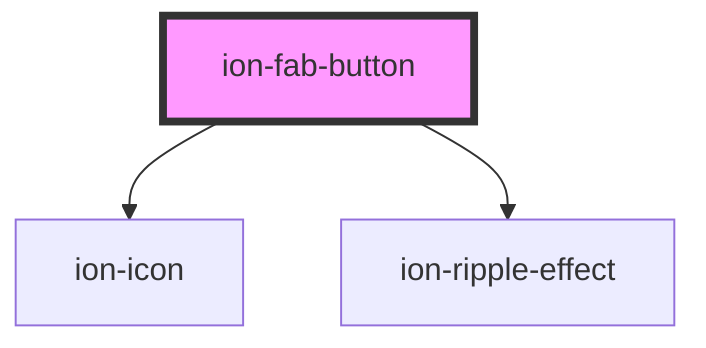

# ion-fab-button

Floating Action Buttons (FABs) represent the primary action in an application. By default, they have a circular shape. When pressed, the button may open more related actions. As the name suggests, FABs generally float over the content in a fixed position. This is not achieved exclusively by using an `<ion-fab-button>FAB</ion-fab-button>`. They need to be wrapped with an `<ion-fab>` component in order to be fixed over the content.

If the FAB button is not wrapped with `<ion-fab>`, it will scroll with the content. FAB buttons have a default size, a mini size and can accept different colors:

<!-- Auto Generated Below -->


## Usage

### Angular / javascript

```html
<ion-content>

  <!-- Fixed Floating Action Button that does not scroll with the content -->
  <ion-fab>
    <ion-fab-button>Button</ion-fab-button>
  </ion-fab>

  <!-- Default Floating Action Button that scrolls with the content.-->
  <ion-fab-button>Default</ion-fab-button>

  <!-- Mini -->
  <ion-fab-button size="small">Mini</ion-fab-button>

  <!-- Colors -->
  <ion-fab-button color="primary">Primary</ion-fab-button>
  <ion-fab-button color="secondary">Secondary</ion-fab-button>
  <ion-fab-button color="danger">Danger</ion-fab-button>
  <ion-fab-button color="light">Light</ion-fab-button>
  <ion-fab-button color="dark">Dark</ion-fab-button>

</ion-content>
```


### React

```tsx
import React from 'react';
import { IonContent, IonFab, IonFabButton } from '@ionic/react';

export const FabButtonExample: React.FunctionComponent = () => (
  <IonContent>
    {/*-- Fixed Floating Action Button that does not scroll with the content --*/}
    <IonFab>
      <IonFabButton>Button</IonFabButton>
    </IonFab>

    {/*-- Default Floating Action Button that scrolls with the content.--*/}
    <IonFabButton>Default</IonFabButton>

    {/*-- Mini --*/}
    <IonFabButton size="small">Mini</IonFabButton>

    {/*-- Colors --*/}
    <IonFabButton color="primary">Primary</IonFabButton>
    <IonFabButton color="secondary">Secondary</IonFabButton>
    <IonFabButton color="danger">Danger</IonFabButton>
    <IonFabButton color="light">Light</IonFabButton>
    <IonFabButton color="dark">Dark</IonFabButton>
  </IonContent>
);
```


### Vue

```html
<template>
  <ion-content>

    <!-- Fixed Floating Action Button that does not scroll with the content -->
    <ion-fab>
      <ion-fab-button>Button</ion-fab-button>
    </ion-fab>

    <!-- Default Floating Action Button that scrolls with the content.-->
    <ion-fab-button>Default</ion-fab-button>

    <!-- Mini -->
    <ion-fab-button size="small">Mini</ion-fab-button>

    <!-- Colors -->
    <ion-fab-button color="primary">Primary</ion-fab-button>
    <ion-fab-button color="secondary">Secondary</ion-fab-button>
    <ion-fab-button color="danger">Danger</ion-fab-button>
    <ion-fab-button color="light">Light</ion-fab-button>
    <ion-fab-button color="dark">Dark</ion-fab-button>

  </ion-content>
</template>
```


## Properties

| Property          | Attribute          | Description                                                                                                                                                                                                                                                                               | Type                              | Default     |
| ----------------- | ------------------ | ----------------------------------------------------------------------------------------------------------------------------------------------------------------------------------------------------------------------------------------------------------------------------------------- | --------------------------------- | ----------- |
| `activated`       | `activated`        | If `true`, the fab button will be show a close icon.                                                                                                                                                                                                                                      | `boolean`                         | `false`     |
| `color`           | `color`            | The color to use from your application's color palette. Default options are: `"primary"`, `"secondary"`, `"tertiary"`, `"success"`, `"warning"`, `"danger"`, `"light"`, `"medium"`, and `"dark"`. For more information on colors, see [theming](/docs/theming/basics).                    | `string \| undefined`             | `undefined` |
| `disabled`        | `disabled`         | If `true`, the user cannot interact with the fab button.                                                                                                                                                                                                                                  | `boolean`                         | `false`     |
| `download`        | `download`         | This attribute instructs browsers to download a URL instead of navigating to it, so the user will be prompted to save it as a local file. If the attribute has a value, it is used as the pre-filled file name in the Save prompt (the user can still change the file name if they want). | `string \| undefined`             | `undefined` |
| `href`            | `href`             | Contains a URL or a URL fragment that the hyperlink points to. If this property is set, an anchor tag will be rendered.                                                                                                                                                                   | `string \| undefined`             | `undefined` |
| `mode`            | `mode`             | The mode determines which platform styles to use.                                                                                                                                                                                                                                         | `"ios" \| "md"`                   | `undefined` |
| `rel`             | `rel`              | Specifies the relationship of the target object to the link object. The value is a space-separated list of [link types](https://developer.mozilla.org/en-US/docs/Web/HTML/Link_types).                                                                                                    | `string \| undefined`             | `undefined` |
| `routerDirection` | `router-direction` | When using a router, it specifies the transition direction when navigating to another page using `href`.                                                                                                                                                                                  | `"back" \| "forward" \| "root"`   | `'forward'` |
| `show`            | `show`             | If `true`, the fab button will show when in a fab-list.                                                                                                                                                                                                                                   | `boolean`                         | `false`     |
| `size`            | `size`             | The size of the button. Set this to `small` in order to have a mini fab.                                                                                                                                                                                                                  | `"small" \| undefined`            | `undefined` |
| `target`          | `target`           | Specifies where to display the linked URL. Only applies when an `href` is provided. Special keywords: `"_blank"`, `"_self"`, `"_parent"`, `"_top"`.                                                                                                                                       | `string \| undefined`             | `undefined` |
| `translucent`     | `translucent`      | If `true`, the fab button will be translucent. Only applies to `ios` mode on devices that support [`backdrop-filter`](https://developer.mozilla.org/en-US/docs/Web/CSS/backdrop-filter#Browser_compatibility).                                                                            | `boolean`                         | `false`     |
| `type`            | `type`             | The type of the button.                                                                                                                                                                                                                                                                   | `"button" \| "reset" \| "submit"` | `'button'`  |


## Events

| Event      | Description                          | Type                |
| ---------- | ------------------------------------ | ------------------- |
| `ionBlur`  | Emitted when the button loses focus. | `CustomEvent<void>` |
| `ionFocus` | Emitted when the button has focus.   | `CustomEvent<void>` |


## CSS Custom Properties

| Name                     | Description                                                                                               |
| ------------------------ | --------------------------------------------------------------------------------------------------------- |
| `--background`           | Background of the button                                                                                  |
| `--background-activated` | Background of the button when pressed                                                                     |
| `--background-focused`   | Background of the button when focused with the tab key                                                    |
| `--background-hover`     | Background of the button on hover                                                                         |
| `--border-color`         | Border color of the button                                                                                |
| `--border-radius`        | Border radius of the button                                                                               |
| `--border-style`         | Border style of the button                                                                                |
| `--border-width`         | Border width of the button                                                                                |
| `--box-shadow`           | Box shadow of the button                                                                                  |
| `--color`                | Text color of the button                                                                                  |
| `--color-activated`      | Text color of the button when pressed                                                                     |
| `--color-focused`        | Text color of the button when focused with the tab key                                                    |
| `--color-hover`          | Text color of the button on hover                                                                         |
| `--padding-bottom`       | Bottom padding of the button                                                                              |
| `--padding-end`          | Right padding if direction is left-to-right, and left padding if direction is right-to-left of the button |
| `--padding-start`        | Left padding if direction is left-to-right, and right padding if direction is right-to-left of the button |
| `--padding-top`          | Top padding of the button                                                                                 |
| `--ripple-color`         | Color of the button ripple effect                                                                         |
| `--transition`           | Transition of the button                                                                                  |


## Dependencies

### Depends on

- ion-icon
- [ion-ripple-effect](../ripple-effect)

### Graph


----------------------------------------------

*Built with [StencilJS](https://stenciljs.com/)*
