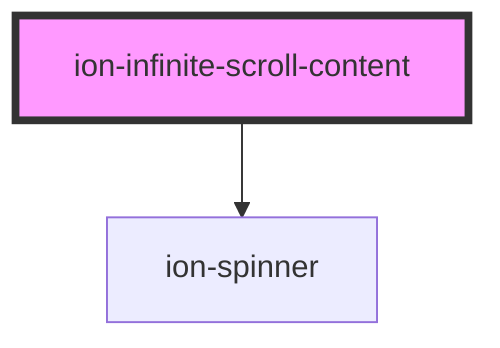

# ion-infinite-scroll-content

The `ion-infinite-scroll-content` component is the default child used by the `ion-infinite-scroll`. It displays an infinite scroll spinner that looks best based on the platform and changes the look depending on the infinite scroll's state. The default spinner can be changed and text can be added by setting the `loadingSpinner` and `loadingText` properties.

## React

The `ion-infinite-scroll-content` component is not supported in React.

<!-- Auto Generated Below -->


## Usage

### Angular

```html
<ion-content>
  <ion-infinite-scroll>
    <ion-infinite-scroll-content
      loadingSpinner="bubbles"
      loadingText="Loading more data…">
    </ion-infinite-scroll-content>
  </ion-infinite-scroll>
</ion-content>
```


### Javascript

```html
<ion-content>
  <ion-infinite-scroll>
    <ion-infinite-scroll-content
      loading-spinner="bubbles"
      loading-text="Loading more data…">
    </ion-infinite-scroll-content>
  </ion-infinite-scroll>
</ion-content>
```


### Vue

```html
<template>
  <ion-content>
    <ion-infinite-scroll>
      <ion-infinite-scroll-content
        loadingSpinner="bubbles"
        loadingText="Loading more data…">
      </ion-infinite-scroll-content>
    </ion-infinite-scroll>
  </ion-content>
</template>
```


## Properties

| Property         | Attribute         | Description                                                                                                                                                                                                                                                                                                                     | Type                                                                                              | Default     |
| ---------------- | ----------------- | ------------------------------------------------------------------------------------------------------------------------------------------------------------------------------------------------------------------------------------------------------------------------------------------------------------------------------- | ------------------------------------------------------------------------------------------------- | ----------- |
| `loadingSpinner` | `loading-spinner` | An animated SVG spinner that shows while loading.                                                                                                                                                                                                                                                                               | `"bubbles" \| "circles" \| "crescent" \| "dots" \| "lines" \| "lines-small" \| null \| undefined` | `undefined` |
| `loadingText`    | `loading-text`    | Optional text to display while loading. `loadingText` can accept either plaintext or HTML as a string. To display characters normally reserved for HTML, they must be escaped. For example `<Ionic>` would become `&lt;Ionic&gt;`  For more information: [Security Documentation](https://ionicframework.com/docs/faq/security) | `string \| undefined`                                                                             | `undefined` |


## Dependencies

### Depends on

- [ion-spinner](../spinner)

### Graph


----------------------------------------------

*Built with [StencilJS](https://stenciljs.com/)*
