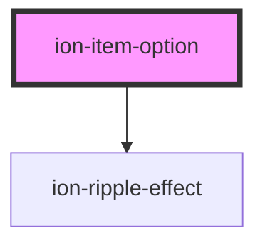

# ion-item-option

The option button for an `ion-item-sliding`. Must be placed inside of an `<ion-item-options>`.
You can combine the `ionSwipe` event and the `expandable` directive to create a full swipe
action for the item.

<!-- Auto Generated Below -->

## Properties

| Property     | Attribute    | Description                                                                                                                                                                                                                                                                               | Type                              | Default     |
| ------------ | ------------ | ----------------------------------------------------------------------------------------------------------------------------------------------------------------------------------------------------------------------------------------------------------------------------------------- | --------------------------------- | ----------- |
| `color`      | `color`      | The color to use from your application's color palette. Default options are: `"primary"`, `"secondary"`, `"tertiary"`, `"success"`, `"warning"`, `"danger"`, `"light"`, `"medium"`, and `"dark"`. For more information on colors, see [theming](/docs/theming/basics).                    | `string \| undefined`             | `undefined` |
| `disabled`   | `disabled`   | If `true`, the user cannot interact with the item option.                                                                                                                                                                                                                                 | `boolean`                         | `false`     |
| `download`   | `download`   | This attribute instructs browsers to download a URL instead of navigating to it, so the user will be prompted to save it as a local file. If the attribute has a value, it is used as the pre-filled file name in the Save prompt (the user can still change the file name if they want). | `string \| undefined`             | `undefined` |
| `expandable` | `expandable` | If `true`, the option will expand to take up the available width and cover any other options.                                                                                                                                                                                             | `boolean`                         | `false`     |
| `href`       | `href`       | Contains a URL or a URL fragment that the hyperlink points to. If this property is set, an anchor tag will be rendered.                                                                                                                                                                   | `string \| undefined`             | `undefined` |
| `mode`       | `mode`       | The mode determines which platform styles to use.                                                                                                                                                                                                                                         | `"ios" \| "md"`                   | `undefined` |
| `rel`        | `rel`        | Specifies the relationship of the target object to the link object. The value is a space-separated list of [link types](https://developer.mozilla.org/en-US/docs/Web/HTML/Link_types).                                                                                                    | `string \| undefined`             | `undefined` |
| `target`     | `target`     | Specifies where to display the linked URL. Only applies when an `href` is provided. Special keywords: `"_blank"`, `"_self"`, `"_parent"`, `"_top"`.                                                                                                                                       | `string \| undefined`             | `undefined` |
| `type`       | `type`       | The type of the button.                                                                                                                                                                                                                                                                   | `"button" \| "reset" \| "submit"` | `'button'`  |

## Slots

| Slot          | Description                                                                       |
| ------------- | --------------------------------------------------------------------------------- |
|               | Content is placed between the named slots if provided without a slot.             |
| `"bottom"`    | Content is placed below the option text.                                          |
| `"end"`       | Content is placed to the right of the option text in LTR, and to the left in RTL. |
| `"icon-only"` | Should be used on an icon in an option that has no text.                          |
| `"start"`     | Content is placed to the left of the option text in LTR, and to the right in RTL. |
| `"top"`       | Content is placed above the option text.                                          |

## CSS Custom Properties

| Name           | Description                   |
| -------------- | ----------------------------- |
| `--background` | Background of the item option |
| `--color`      | Color of the item option      |

## Dependencies

### Depends on

- [ion-ripple-effect](../ripple-effect)

### Graph

----------------------------------------------

*Built with [StencilJS](https://stenciljs.com/)*
