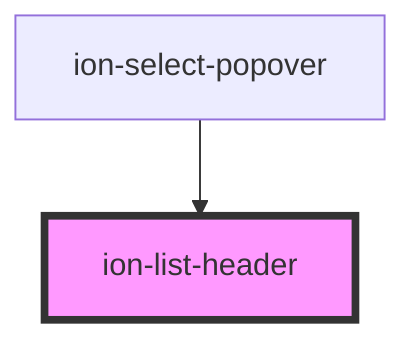

# ion-list-header

ListHeader a header component for a list.
Unlike ItemDivider, ListHeaders are styled to be stand-out from the rest of the list items.


<!-- Auto Generated Below -->


## Usage

### Angular / javascript

```html
<!-- Default List Header -->
<ion-list-header>
  <ion-label>List Header</ion-label>
</ion-list-header>

<!-- List Header with Button -->
<ion-list-header>
  <ion-label>New This Week</ion-label>
  <ion-button>See All</ion-button>
</ion-list-header>

<!-- List Header with Outline Button -->
<ion-list-header>
  <ion-label>New This Week</ion-label>
  <ion-button fill="outline">See All</ion-button>
</ion-list-header>

<!-- List Header Full Lines -->
<ion-list-header lines="full">
  <ion-label>New This Week</ion-label>
  <ion-button>See All</ion-button>
</ion-list-header>

<!-- List Header Inset Lines -->
<ion-list-header lines="inset">
  <ion-label>New This Week</ion-label>
  <ion-button>See All</ion-button>
</ion-list-header>

<!-- List Headers in Lists -->
<ion-list>
  <ion-list-header lines="inset">
    <ion-label>Recent</ion-label>
    <ion-button>Clear</ion-button>
  </ion-list-header>
  <ion-item lines="none">
    <ion-label color="primary">
      <h1>I got you babe</h1>
    </ion-label>
  </ion-item>
</ion-list>

<ion-list>
  <ion-list-header lines="inset">
    <ion-label>Trending</ion-label>
  </ion-list-header>
  <ion-item>
    <ion-label color="primary">
      <h1>harry styles</h1>
    </ion-label>
  </ion-item>
  <ion-item>
    <ion-label color="primary">
      <h1>christmas</h1>
    </ion-label>
  </ion-item>
  <ion-item lines="none">
    <ion-label color="primary">
      <h1>falling</h1>
    </ion-label>
  </ion-item>
</ion-list>
```


### React

```tsx
import React from 'react';
import { IonButton, IonContent, IonItem, IonLabel, IonList, IonListHeader } from '@ionic/react';

export const ListHeaderExample: React.FC = () => (
  <IonContent>
    {/*-- Default List Header --*/}
    <IonListHeader>
      <IonLabel>List Header</IonLabel>
    </IonListHeader>

    {/*-- List Header with Button --*/}
    <IonListHeader>
      <IonLabel>New This Week</IonLabel>
      <IonButton>See All</IonButton>
    </IonListHeader>

    {/*-- List Header with Outline Button --*/}
    <IonListHeader>
      <IonLabel>New This Week</IonLabel>
      <IonButton fill="outline">See All</IonButton>
    </IonListHeader>

    {/*-- List Header Full Lines --*/}
    <IonListHeader lines="full">
      <IonLabel>New This Week</IonLabel>
      <IonButton>See All</IonButton>
    </IonListHeader>

    {/*-- List Header Inset Lines --*/}
    <IonListHeader lines="inset">
      <IonLabel>New This Week</IonLabel>
      <IonButton>See All</IonButton>
    </IonListHeader>

    {/*-- List Headers in Lists --*/}
    <IonList>
      <IonListHeader lines="inset">
        <IonLabel>Recent</IonLabel>
        <IonButton>Clear</IonButton>
      </IonListHeader>
      <IonItem lines="none">
        <IonLabel color="primary">
          <h1>I got you babe</h1>
        </IonLabel>
      </IonItem>
    </IonList>

    <IonList>
      <IonListHeader lines="inset">
        <IonLabel>Trending</IonLabel>
      </IonListHeader>
      <IonItem>
        <IonLabel color="primary">
          <h1>harry styles</h1>
        </IonLabel>
      </IonItem>
      <IonItem>
        <IonLabel color="primary">
          <h1>christmas</h1>
        </IonLabel>
      </IonItem>
      <IonItem lines="none">
        <IonLabel color="primary">
          <h1>falling</h1>
        </IonLabel>
      </IonItem>
    </IonList>
  </IonContent>
);
```


### Stencil

```tsx
import { Component, h } from '@stencil/core';

@Component({
  tag: 'list-header-example',
  styleUrl: 'list-header-example.css'
})
export class ListHeaderExample {
  render() {
    return [
      // Default List Header
      <ion-list-header>
        <ion-label>List Header</ion-label>
      </ion-list-header>,

      // List Header with Button
      <ion-list-header>
        <ion-label>New This Week</ion-label>
        <ion-button>See All</ion-button>
      </ion-list-header>,

      // List Header with Outline Button
      <ion-list-header>
        <ion-label>New This Week</ion-label>
        <ion-button fill="outline">See All</ion-button>
      </ion-list-header>,

      // List Header Full Lines
      <ion-list-header lines="full">
        <ion-label>New This Week</ion-label>
        <ion-button>See All</ion-button>
      </ion-list-header>,

      // List Header Inset Lines
      <ion-list-header lines="inset">
        <ion-label>New This Week</ion-label>
        <ion-button>See All</ion-button>
      </ion-list-header>,

      // List Headers in Lists
      <ion-list>
        <ion-list-header lines="inset">
          <ion-label>Recent</ion-label>
          <ion-button>Clear</ion-button>
        </ion-list-header>
        <ion-item lines="none">
          <ion-label color="primary">
            <h1>I got you babe</h1>
          </ion-label>
        </ion-item>
      </ion-list>,

      <ion-list>
        <ion-list-header lines="inset">
          <ion-label>Trending</ion-label>
        </ion-list-header>
        <ion-item>
          <ion-label color="primary">
            <h1>harry styles</h1>
          </ion-label>
        </ion-item>
        <ion-item>
          <ion-label color="primary">
            <h1>christmas</h1>
          </ion-label>
        </ion-item>
        <ion-item lines="none">
          <ion-label color="primary">
            <h1>falling</h1>
          </ion-label>
        </ion-item>
      </ion-list>
    ];
  }
}
```


### Vue

```html
<template>
  <!-- Default List Header -->
  <ion-list-header>
    <ion-label>List Header</ion-label>
  </ion-list-header>

  <!-- List Header with Button -->
  <ion-list-header>
    <ion-label>New This Week</ion-label>
    <ion-button>See All</ion-button>
  </ion-list-header>

  <!-- List Header with Outline Button -->
  <ion-list-header>
    <ion-label>New This Week</ion-label>
    <ion-button fill="outline">See All</ion-button>
  </ion-list-header>

  <!-- List Header Full Lines -->
  <ion-list-header lines="full">
    <ion-label>New This Week</ion-label>
    <ion-button>See All</ion-button>
  </ion-list-header>

  <!-- List Header Inset Lines -->
  <ion-list-header lines="inset">
    <ion-label>New This Week</ion-label>
    <ion-button>See All</ion-button>
  </ion-list-header>

  <!-- List Headers in Lists -->
  <ion-list>
    <ion-list-header lines="inset">
      <ion-label>Recent</ion-label>
      <ion-button>Clear</ion-button>
    </ion-list-header>
    <ion-item lines="none">
      <ion-label color="primary">
        <h1>I got you babe</h1>
      </ion-label>
    </ion-item>
  </ion-list>

  <ion-list>
    <ion-list-header lines="inset">
      <ion-label>Trending</ion-label>
    </ion-list-header>
    <ion-item>
      <ion-label color="primary">
        <h1>harry styles</h1>
      </ion-label>
    </ion-item>
    <ion-item>
      <ion-label color="primary">
        <h1>christmas</h1>
      </ion-label>
    </ion-item>
    <ion-item lines="none">
      <ion-label color="primary">
        <h1>falling</h1>
      </ion-label>
    </ion-item>
  </ion-list>
</template>

<script>
import { IonItem, IonLabel, IonList, IonListHeader } from '@ionic/vue';
import { defineComponent } from 'vue';

export default defineComponent({
  components: { IonItem, IonLabel, IonList, IonListHeader }
});
</script>
```


## Properties

| Property | Attribute | Description                                                                                                                                                                                                                                                            | Type                                       | Default     |
| -------- | --------- | ---------------------------------------------------------------------------------------------------------------------------------------------------------------------------------------------------------------------------------------------------------------------- | ------------------------------------------ | ----------- |
| `color`  | `color`   | The color to use from your application's color palette. Default options are: `"primary"`, `"secondary"`, `"tertiary"`, `"success"`, `"warning"`, `"danger"`, `"light"`, `"medium"`, and `"dark"`. For more information on colors, see [theming](/docs/theming/basics). | `string \| undefined`                      | `undefined` |
| `lines`  | `lines`   | How the bottom border should be displayed on the list header.                                                                                                                                                                                                          | `"full" \| "inset" \| "none" \| undefined` | `undefined` |
| `mode`   | `mode`    | The mode determines which platform styles to use.                                                                                                                                                                                                                      | `"ios" \| "md"`                            | `undefined` |


## CSS Custom Properties

| Name                   | Description                           |
| ---------------------- | ------------------------------------- |
| `--background`         | Background of the list header         |
| `--border-color`       | Color of the list header border       |
| `--border-style`       | Style of the list header border       |
| `--border-width`       | Width of the list header border       |
| `--color`              | Color of the list header text         |
| `--inner-border-width` | Width of the inner list header border |


## Dependencies

### Used by

 - ion-select-popover

### Graph


----------------------------------------------

*Built with [StencilJS](https://stenciljs.com/)*
