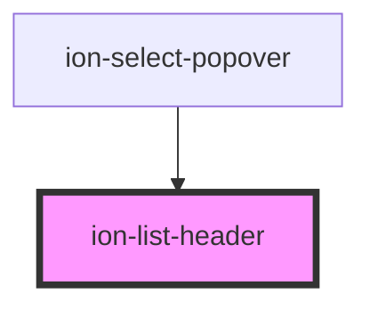

# ion-list-header

ListHeader a header component for a list.
Unlike ItemDivider, ListHeaders are styled to be stand-out from the rest of the list items.


<!-- Auto Generated Below -->


## Usage

### Javascript

```html
<ion-list>
  <ion-list-header>
    <ion-label>Items</ion-label>
  </ion-list-header>
  <ion-item>Item 1</ion-item>
  <ion-item>Item 2</ion-item>
  <ion-item>Item 3</ion-item>
  <ion-item>Item 4</ion-item>
  <ion-item>Item 5</ion-item>
</ion-list>
```


### React

```tsx
import React from 'react';
import { IonList, IonItem, IonLabel, IonContent, IonListHeader } from '@ionic/react';

export const ListHeaderExample: React.FunctionComponent = () => (
  <IonContent>
    <IonList>
      <IonListHeader>
        <IonLabel>Items</IonLabel>
      </IonListHeader>
      <IonItem>Item 1</IonItem>
      <IonItem>Item 2</IonItem>
      <IonItem>Item 3</IonItem>
      <IonItem>Item 4</IonItem>
      <IonItem>Item 5</IonItem>
    </IonList>
  </IonContent>
);
```


## Properties

| Property | Attribute | Description                                                                                                                                                                                                                                                            | Type                  | Default     |
| -------- | --------- | ---------------------------------------------------------------------------------------------------------------------------------------------------------------------------------------------------------------------------------------------------------------------- | --------------------- | ----------- |
| `color`  | `color`   | The color to use from your application's color palette. Default options are: `"primary"`, `"secondary"`, `"tertiary"`, `"success"`, `"warning"`, `"danger"`, `"light"`, `"medium"`, and `"dark"`. For more information on colors, see [theming](/docs/theming/basics). | `string \| undefined` | `undefined` |
| `mode`   | `mode`    | The mode determines which platform styles to use.                                                                                                                                                                                                                      | `"ios" \| "md"`       | `undefined` |


## CSS Custom Properties

| Name           | Description                   |
| -------------- | ----------------------------- |
| `--background` | Background of the list header |
| `--color`      | Color of the list header text |


## Dependencies

### Used by

 - ion-select-popover

### Graph


----------------------------------------------

*Built with [StencilJS](https://stenciljs.com/)*
