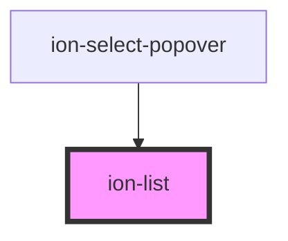

# ion-list

Lists are made up of multiple rows of items which can contain text, buttons, toggles,
icons, thumbnails, and much more. Lists generally contain items with similar data content, such as images and text.

Lists support several interactions including swiping items to reveal options, dragging to reorder items within the list, and deleting items.


<!-- Auto Generated Below -->


## Usage

### Angular

```html
<!-- List of Text Items -->
<ion-list>
  <ion-item>
    <ion-label>Pokémon Yellow</ion-label>
  </ion-item>
  <ion-item>
    <ion-label>Mega Man X</ion-label>
  </ion-item>
  <ion-item>
    <ion-label>The Legend of Zelda</ion-label>
  </ion-item>
  <ion-item>
    <ion-label>Pac-Man</ion-label>
  </ion-item>
  <ion-item>
    <ion-label>Super Mario World</ion-label>
  </ion-item>
</ion-list>

<!-- List of Input Items -->
<ion-list>
  <ion-item>
    <ion-label>Input</ion-label>
    <ion-input></ion-input>
  </ion-item>
  <ion-item>
    <ion-label>Toggle</ion-label>
    <ion-toggle slot="end"></ion-toggle>
  </ion-item>
  <ion-item>
    <ion-label>Radio</ion-label>
    <ion-radio slot="end"></ion-radio>
  </ion-item>
  <ion-item>
    <ion-label>Checkbox</ion-label>
    <ion-checkbox slot="start"></ion-checkbox>
  </ion-item>
</ion-list>

<!-- List of Sliding Items -->
<ion-list>
  <ion-item-sliding>
    <ion-item>
      <ion-label>Item</ion-label>
    </ion-item>
    <ion-item-options side="end">
      <ion-item-option (click)="unread(item)">Unread</ion-item-option>
    </ion-item-options>
  </ion-item-sliding>

  <ion-item-sliding>
    <ion-item>
      <ion-label>Item</ion-label>
    </ion-item>
    <ion-item-options side="end">
      <ion-item-option (click)="unread(item)">Unread</ion-item-option>
    </ion-item-options>
  </ion-item-sliding>
</ion-list>
```


### Javascript

```html
<!-- List of Text Items -->
<ion-list>
  <ion-item>
    <ion-label>Pokémon Yellow</ion-label>
  </ion-item>
  <ion-item>
    <ion-label>Mega Man X</ion-label>
  </ion-item>
  <ion-item>
    <ion-label>The Legend of Zelda</ion-label>
  </ion-item>
  <ion-item>
    <ion-label>Pac-Man</ion-label>
  </ion-item>
  <ion-item>
    <ion-label>Super Mario World</ion-label>
  </ion-item>
</ion-list>

<!-- List of Input Items -->
<ion-list>
  <ion-item>
    <ion-label>Input</ion-label>
    <ion-input></ion-input>
  </ion-item>
  <ion-item>
    <ion-label>Toggle</ion-label>
    <ion-toggle slot="end"></ion-toggle>
  </ion-item>
  <ion-item>
    <ion-label>Radio</ion-label>
    <ion-radio slot="end"></ion-radio>
  </ion-item>
  <ion-item>
    <ion-label>Checkbox</ion-label>
    <ion-checkbox slot="start"></ion-checkbox>
  </ion-item>
</ion-list>

<!-- List of Sliding Items -->
<ion-list>
  <ion-item-sliding>
    <ion-item>
      <ion-label>Item</ion-label>
    </ion-item>
    <ion-item-options side="end">
      <ion-item-option onClick="unread(item)">Unread</ion-item-option>
    </ion-item-options>
  </ion-item-sliding>

  <ion-item-sliding>
    <ion-item>
      <ion-label>Item</ion-label>
    </ion-item>
    <ion-item-options side="end">
      <ion-item-option onClick="unread(item)">Unread</ion-item-option>
    </ion-item-options>
  </ion-item-sliding>
</ion-list>
```


### React

```tsx
import React from 'react';
import { IonList, IonItem, IonLabel, IonInput, IonToggle, IonRadio, IonCheckbox, IonItemSliding, IonItemOption, IonItemOptions, IonContent } from '@ionic/react';

export const ListExample: React.FunctionComponent = () => (
  <IonContent>
    {/*-- List of Text Items --*/}
    <IonList>
      <IonItem>
        <IonLabel>Pokémon Yellow</IonLabel>
      </IonItem>
      <IonItem>
        <IonLabel>Mega Man X</IonLabel>
      </IonItem>
      <IonItem>
        <IonLabel>The Legend of Zelda</IonLabel>
      </IonItem>
      <IonItem>
        <IonLabel>Pac-Man</IonLabel>
      </IonItem>
      <IonItem>
        <IonLabel>Super Mario World</IonLabel>
      </IonItem>
    </IonList>

    {/*-- List of Input Items --*/}
    <IonList>
      <IonItem>
        <IonLabel>Input</IonLabel>
        <IonInput></IonInput>
      </IonItem>
      <IonItem>
        <IonLabel>Toggle</IonLabel>
        <IonToggle slot="end"></IonToggle>
      </IonItem>
      <IonItem>
        <IonLabel>Radio</IonLabel>
        <IonRadio slot="end"></IonRadio>
      </IonItem>
      <IonItem>
        <IonLabel>Checkbox</IonLabel>
        <IonCheckbox slot="start" />
      </IonItem>
    </IonList>

    {/*-- List of Sliding Items --*/}
    <IonList>
      <IonItemSliding>
        <IonItem>
          <IonLabel>Item</IonLabel>
        </IonItem>
        <IonItemOptions side="end">
          <IonItemOption onClick={() => {}}>Unread</IonItemOption>
        </IonItemOptions>
      </IonItemSliding>

      <IonItemSliding>
        <IonItem>
          <IonLabel>Item</IonLabel>
        </IonItem>
        <IonItemOptions side="end">
          <IonItemOption onClick={() => {}}>Unread</IonItemOption>
        </IonItemOptions>
      </IonItemSliding>
    </IonList>
  </IonContent>
);
```


### Vue

```html
<template>
  <!-- List of Text Items -->
  <ion-list>
    <ion-item>
      <ion-label>Pokémon Yellow</ion-label>
    </ion-item>
    <ion-item>
      <ion-label>Mega Man X</ion-label>
    </ion-item>
    <ion-item>
      <ion-label>The Legend of Zelda</ion-label>
    </ion-item>
    <ion-item>
      <ion-label>Pac-Man</ion-label>
    </ion-item>
    <ion-item>
      <ion-label>Super Mario World</ion-label>
    </ion-item>
  </ion-list>

  <!-- List of Input Items -->
  <ion-list>
    <ion-item>
      <ion-label>Input</ion-label>
      <ion-input></ion-input>
    </ion-item>
    <ion-item>
      <ion-label>Toggle</ion-label>
      <ion-toggle slot="end"></ion-toggle>
    </ion-item>
    <ion-item>
      <ion-label>Radio</ion-label>
      <ion-radio slot="end"></ion-radio>
    </ion-item>
    <ion-item>
      <ion-label>Checkbox</ion-label>
      <ion-checkbox slot="start"></ion-checkbox>
    </ion-item>
  </ion-list>

  <!-- List of Sliding Items -->
  <ion-list>
    <ion-item-sliding>
      <ion-item>
        <ion-label>Item</ion-label>
      </ion-item>
      <ion-item-options side="end">
        <ion-item-option @click="unread(item)">Unread</ion-item-option>
      </ion-item-options>
    </ion-item-sliding>

    <ion-item-sliding>
      <ion-item>
        <ion-label>Item</ion-label>
      </ion-item>
      <ion-item-options side="end">
        <ion-item-option @click="unread(item)">Unread</ion-item-option>
      </ion-item-options>
    </ion-item-sliding>
  </ion-list>
</template>
```


## Properties

| Property | Attribute | Description                                                         | Type                                       | Default     |
| -------- | --------- | ------------------------------------------------------------------- | ------------------------------------------ | ----------- |
| `inset`  | `inset`   | If `true`, the list will have margin around it and rounded corners. | `boolean`                                  | `false`     |
| `lines`  | `lines`   | How the bottom border should be displayed on all items.             | `"full" \| "inset" \| "none" \| undefined` | `undefined` |
| `mode`   | `mode`    | The mode determines which platform styles to use.                   | `"ios" \| "md"`                            | `undefined` |


## Methods

### `closeSlidingItems() => Promise<boolean>`

If `ion-item-sliding` are used inside the list, this method closes
any open sliding item.

Returns `true` if an actual `ion-item-sliding` is closed.

#### Returns

Type: `Promise<boolean>`


## Dependencies

### Used by

 - ion-select-popover

### Graph


----------------------------------------------

*Built with [StencilJS](https://stenciljs.com/)*
