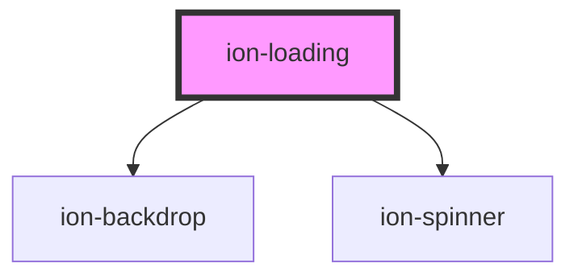

# ion-loading

An overlay that can be used to indicate activity while blocking user interaction. The loading indicator appears on top of the app's content, and can be dismissed by the app to resume user interaction with the app. It includes an optional backdrop, which can be disabled by setting `showBackdrop: false` upon creation.

## Dismissing

The loading indicator can be dismissed automatically after a specific amount of time by passing the number of milliseconds to display it in the `duration` of the loading options. To dismiss the loading indicator after creation, call the `dismiss()` method on the loading instance. The `onDidDismiss` function can be called to perform an action after the loading indicator is dismissed.

## Customization

Loading uses scoped encapsulation, which means it will automatically scope its CSS by appending each of the styles with an additional class at runtime. Overriding scoped selectors in CSS requires a [higher specificity](https://developer.mozilla.org/en-US/docs/Web/CSS/Specificity) selector.

We recommend passing a custom class to `cssClass` in the `create` method and using that to add custom styles to the host and inner elements. This property can also accept multiple classes separated by spaces. View the [Usage](#usage) section for an example of how to pass a class using `cssClass`.

```css
/* DOES NOT WORK - not specific enough */
ion-loading {
  color: green;
}

/* Works - pass "my-custom-class" in cssClass to increase specificity */
.my-custom-class {
  color: green;
}
```

Any of the defined [CSS Custom Properties](#css-custom-properties) can be used to style the Loading without needing to target individual elements:

```css
.my-custom-class {
  --background: #222;
  --spinner-color: #fff;

  color: #fff;
}
```

> If you are building an Ionic Angular app, the styles need to be added to a global stylesheet file. Read [Style Placement](#style-placement) in the Angular section below for more information.

## Interfaces

### LoadingOptions

```typescript
interface LoadingOptions {
  spinner?: SpinnerTypes | null;
  message?: string | IonicSafeString;
  cssClass?: string | string[];
  showBackdrop?: boolean;
  duration?: number;
  translucent?: boolean;
  animated?: boolean;
  backdropDismiss?: boolean;
  mode?: Mode;
  keyboardClose?: boolean;
  id?: string;
  htmlAttributes?: { [key: string]: any };

  enterAnimation?: AnimationBuilder;
  leaveAnimation?: AnimationBuilder;
}
```


<!-- Auto Generated Below -->


## Usage

### Angular

```typescript
import { Component } from '@angular/core';
import { LoadingController } from '@ionic/angular';

@Component({
  selector: 'loading-example',
  templateUrl: 'loading-example.html',
  styleUrls: ['./loading-example.css']
})
export class LoadingExample {
  constructor(public loadingController: LoadingController) {}

  async presentLoading() {
    const loading = await this.loadingController.create({
      cssClass: 'my-custom-class',
      message: 'Please wait...',
      duration: 2000
    });
    await loading.present();

    const { role, data } = await loading.onDidDismiss();
    console.log('Loading dismissed!');
  }

  async presentLoadingWithOptions() {
    const loading = await this.loadingController.create({
      spinner: null,
      duration: 5000,
      message: 'Click the backdrop to dismiss early...',
      translucent: true,
      cssClass: 'custom-class custom-loading',
      backdropDismiss: true
    });
    await loading.present();

    const { role, data } = await loading.onDidDismiss();
    console.log('Loading dismissed with role:', role);
  }
}
```


### Style Placement

In Angular, the CSS of a specific page is scoped only to elements of that page. Even though the Loading can be presented from within a page, the `ion-loading` element is appended outside of the current page. This means that any custom styles need to go in a global stylesheet file. In an Ionic Angular starter this can be the `src/global.scss` file or you can register a new global style file by [adding to the `styles` build option in `angular.json`](https://angular.io/guide/workspace-config#style-script-config).


### Javascript

```javascript
async function presentLoading() {
  const loading = document.createElement('ion-loading');

  loading.cssClass = 'my-custom-class';
  loading.message = 'Please wait...';
  loading.duration = 2000;

  document.body.appendChild(loading);
  await loading.present();

  const { role, data } = await loading.onDidDismiss();
  console.log('Loading dismissed!');
}

async function presentLoadingWithOptions() {
  const loading = document.createElement('ion-loading');

  loading.spinner = null;
  loading.duration = 5000;
  loading.message = 'Click the backdrop to dismiss early...';
  loading.translucent = true;
  loading.cssClass = 'custom-class custom-loading';
  loading.backdropDismiss = true;

  document.body.appendChild(loading);
  await loading.present();

  const { role, data } = await loading.onDidDismiss();
  console.log('Loading dismissed with role:', role);
}
```


### React

```tsx
/* Using with useIonLoading Hook */

import React from 'react';
import { IonButton, IonContent, IonPage, useIonLoading } from '@ionic/react';

interface LoadingProps {}

const LoadingExample: React.FC<LoadingProps> = () => {
  const [present, dismiss] = useIonLoading();
  /**
   * The recommended way of dismissing is to use the `dismiss` property
   * on `IonLoading`, but the `dismiss` method returned from `useIonLoading`
   * can be used for more complex scenarios.
   */
  return (
    <IonPage>
      <IonContent>
        <IonButton
          expand="block"
          onClick={() => {
            present({
              message: 'Loading...',
              duration: 3000
            })
          }}
        >
          Show Loading
        </IonButton>
        <IonButton
          expand="block"
          onClick={() => present('Loading', 2000, 'dots')}
        >
          Show Loading using params
        </IonButton>
      </IonContent>
    </IonPage>
  );
};
```

```tsx
/* Using with IonLoading Component */

import React, { useState } from 'react';
import { IonLoading, IonButton, IonContent } from '@ionic/react';

export const LoadingExample: React.FC = () => {
  const [showLoading, setShowLoading] = useState(true);

  setTimeout(() => {
    setShowLoading(false);
  }, 2000);

  return (
    <IonContent>
      <IonButton onClick={() => setShowLoading(true)}>Show Loading</IonButton>
      <IonLoading
        cssClass='my-custom-class'
        isOpen={showLoading}
        onDidDismiss={() => setShowLoading(false)}
        message={'Please wait...'}
        duration={5000}
      />
    </IonContent>
  );
};
```


### Stencil

```tsx
import { Component, h } from '@stencil/core';

import { loadingController } from '@ionic/core';

@Component({
  tag: 'loading-example',
  styleUrl: 'loading-example.css'
})
export class LoadingExample {
  async presentLoading() {
    const loading = await loadingController.create({
      cssClass: 'my-custom-class',
      message: 'Please wait...',
      duration: 2000
    });
    await loading.present();

    const { role, data } = await loading.onDidDismiss();
    console.log('Loading dismissed!', role, data);
  }

  async presentLoadingWithOptions() {
    const loading = await loadingController.create({
      spinner: null,
      duration: 5000,
      message: 'Click the backdrop to dismiss early...',
      translucent: true,
      cssClass: 'custom-class custom-loading',
      backdropDismiss: true
    });
    await loading.present();

    const { role, data } = await loading.onDidDismiss();
    console.log('Loading dismissed with role:', role, data);
  }

  render() {
    return [
      <ion-content>
        <ion-button onClick={() => this.presentLoading()}>Present Loading</ion-button>
        <ion-button onClick={() => this.presentLoadingWithOptions()}>Present Loading: Options</ion-button>
      </ion-content>
    ];
  }
}
```


### Vue

```html
<template>
  <ion-button @click="presentLoading">Show Loading</ion-button>
  <br />
  <ion-button @click="presentLoadingWithOptions">Show Loading</ion-button>
</template>

<script>
import { IonButton, loadingController } from '@ionic/vue';
import { defineComponent } from 'vue';

export default defineComponent({
  props: {
    timeout: { type: Number, default: 1000 },
  },
  methods: {
    async presentLoading() {
      const loading = await loadingController
        .create({
          cssClass: 'my-custom-class',
          message: 'Please wait...',
          duration: this.timeout,
        });
        
      await loading.present();
      
      setTimeout(function() {
        loading.dismiss()
      }, this.timeout);
    },
    async presentLoadingWithOptions() {
      const loading = await loadingController
        .create({
          spinner: null,
          duration: this.timeout,
          message: 'Click the backdrop to dismiss early...',
          translucent: true,
          cssClass: 'custom-class custom-loading',
          backdropDismiss: true
        });
        
      await loading.present();
        
      setTimeout(function() {
        loading.dismiss()
      }, this.timeout);
    },
  },
  components: { IonButton }
});
</script>
```

Developers can also use this component directly in their template:

```html
<template>
  <ion-button @click="setOpen(true)">Show Loading</ion-button>
  <ion-loading
    :is-open="isOpenRef"
    cssClass="my-custom-class"
    message="Please wait..."
    :duration="timeout"
    @didDismiss="setOpen(false)"
  >
  </ion-loading>
</template>

<script>
import { IonLoading, IonButton } from '@ionic/vue';
import { defineComponent, ref } from 'vue';

export default defineComponent({
  props: {
    timeout: { type: Number, default: 1000 },
  },
  components: { IonLoading, IonButton },
  setup() {
    const isOpenRef = ref(false);
    const setOpen = (state: boolean) => isOpenRef.value = state;
    
    return { isOpenRef, setOpen }
  }
});
</script>
```


## Properties

| Property          | Attribute          | Description                                                                                                                                                                                                                      | Type                                                                                                                                                    | Default     |
| ----------------- | ------------------ | -------------------------------------------------------------------------------------------------------------------------------------------------------------------------------------------------------------------------------- | ------------------------------------------------------------------------------------------------------------------------------------------------------- | ----------- |
| `animated`        | `animated`         | If `true`, the loading indicator will animate.                                                                                                                                                                                   | `boolean`                                                                                                                                               | `true`      |
| `backdropDismiss` | `backdrop-dismiss` | If `true`, the loading indicator will be dismissed when the backdrop is clicked.                                                                                                                                                 | `boolean`                                                                                                                                               | `false`     |
| `cssClass`        | `css-class`        | Additional classes to apply for custom CSS. If multiple classes are provided they should be separated by spaces.                                                                                                                 | `string \| string[] \| undefined`                                                                                                                       | `undefined` |
| `duration`        | `duration`         | Number of milliseconds to wait before dismissing the loading indicator.                                                                                                                                                          | `number`                                                                                                                                                | `0`         |
| `enterAnimation`  | --                 | Animation to use when the loading indicator is presented.                                                                                                                                                                        | `((baseEl: any, opts?: any) => Animation) \| undefined`                                                                                                 | `undefined` |
| `htmlAttributes`  | --                 | Additional attributes to pass to the loader.                                                                                                                                                                                     | `undefined \| { [key: string]: any; }`                                                                                                                  | `undefined` |
| `keyboardClose`   | `keyboard-close`   | If `true`, the keyboard will be automatically dismissed when the overlay is presented.                                                                                                                                           | `boolean`                                                                                                                                               | `true`      |
| `leaveAnimation`  | --                 | Animation to use when the loading indicator is dismissed.                                                                                                                                                                        | `((baseEl: any, opts?: any) => Animation) \| undefined`                                                                                                 | `undefined` |
| `message`         | `message`          | Optional text content to display in the loading indicator.                                                                                                                                                                       | `IonicSafeString \| string \| undefined`                                                                                                                | `undefined` |
| `mode`            | `mode`             | The mode determines which platform styles to use.                                                                                                                                                                                | `"ios" \| "md"`                                                                                                                                         | `undefined` |
| `showBackdrop`    | `show-backdrop`    | If `true`, a backdrop will be displayed behind the loading indicator.                                                                                                                                                            | `boolean`                                                                                                                                               | `true`      |
| `spinner`         | `spinner`          | The name of the spinner to display.                                                                                                                                                                                              | `"bubbles" \| "circles" \| "circular" \| "crescent" \| "dots" \| "lines" \| "lines-sharp" \| "lines-sharp-small" \| "lines-small" \| null \| undefined` | `undefined` |
| `translucent`     | `translucent`      | If `true`, the loading indicator will be translucent. Only applies when the mode is `"ios"` and the device supports [`backdrop-filter`](https://developer.mozilla.org/en-US/docs/Web/CSS/backdrop-filter#Browser_compatibility). | `boolean`                                                                                                                                               | `false`     |


## Events

| Event                   | Description                               | Type                                   |
| ----------------------- | ----------------------------------------- | -------------------------------------- |
| `ionLoadingDidDismiss`  | Emitted after the loading has dismissed.  | `CustomEvent<OverlayEventDetail<any>>` |
| `ionLoadingDidPresent`  | Emitted after the loading has presented.  | `CustomEvent<void>`                    |
| `ionLoadingWillDismiss` | Emitted before the loading has dismissed. | `CustomEvent<OverlayEventDetail<any>>` |
| `ionLoadingWillPresent` | Emitted before the loading has presented. | `CustomEvent<void>`                    |


## Methods

### `dismiss(data?: any, role?: string | undefined) => Promise<boolean>`

Dismiss the loading overlay after it has been presented.

#### Returns

Type: `Promise<boolean>`


### `onDidDismiss<T = any>() => Promise<OverlayEventDetail<T>>`

Returns a promise that resolves when the loading did dismiss.

#### Returns

Type: `Promise<OverlayEventDetail<T>>`


### `onWillDismiss<T = any>() => Promise<OverlayEventDetail<T>>`

Returns a promise that resolves when the loading will dismiss.

#### Returns

Type: `Promise<OverlayEventDetail<T>>`


### `present() => Promise<void>`

Present the loading overlay after it has been created.

#### Returns

Type: `Promise<void>`


## CSS Custom Properties

| Name                 | Description                          |
| -------------------- | ------------------------------------ |
| `--backdrop-opacity` | Opacity of the backdrop              |
| `--background`       | Background of the loading dialog     |
| `--height`           | Height of the loading dialog         |
| `--max-height`       | Maximum height of the loading dialog |
| `--max-width`        | Maximum width of the loading dialog  |
| `--min-height`       | Minimum height of the loading dialog |
| `--min-width`        | Minimum width of the loading dialog  |
| `--spinner-color`    | Color of the loading spinner         |
| `--width`            | Width of the loading dialog          |


## Dependencies

### Depends on

- [ion-backdrop](../backdrop)
- [ion-spinner](../spinner)

### Graph


----------------------------------------------

*Built with [StencilJS](https://stenciljs.com/)*
