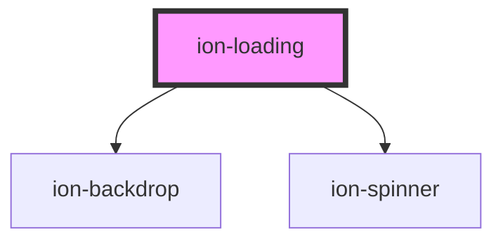

# ion-loading

An overlay that can be used to indicate activity while blocking user interaction. The loading indicator appears on top of the app's content, and can be dismissed by the app to resume user interaction with the app. It includes an optional backdrop, which can be disabled by setting `showBackdrop: false` upon creation.


### Creating

Loading indicators can be created using a [Loading Controller](../loading-controller). They can be customized by passing loading options in the loading controller's `create()` method. The spinner name should be passed in the `spinner` property. If a value is not passed to `spinner` the loading indicator will use the spinner specified by the platform.


### Dismissing

The loading indicator can be dismissed automatically after a specific amount of time by passing the number of milliseconds to display it in the `duration` of the loading options. To dismiss the loading indicator after creation, call the `dismiss()` method on the loading instance. The `onDidDismiss` function can be called to perform an action after the loading indicator is dismissed.


<!-- Auto Generated Below -->


## Usage

### Angular

```typescript
import { Component } from '@angular/core';
import { LoadingController } from '@ionic/angular';

@Component({
  selector: 'loading-example',
  templateUrl: 'loading-example.html',
  styleUrls: ['./loading-example.css']
})
export class LoadingExample {
  constructor(public loadingController: LoadingController) {}

  async presentLoading() {
    const loading = await this.loadingController.create({
      message: 'Hellooo',
      duration: 2000
    });
    await loading.present();
    
    const { role, data } = await loading.onDidDismiss();
    
    console.log('Loading dismissed!');
  }

  async presentLoadingWithOptions() {
    const loading = await this.loadingController.create({
      spinner: null,
      duration: 5000,
      message: 'Please wait...',
      translucent: true,
      cssClass: 'custom-class custom-loading'
    });
    return await loading.present();
  }
}
```


### Javascript

```javascript
async function presentLoading() {
  const loadingController = document.querySelector('ion-loading-controller');
  await loadingController.componentOnReady();

  const loading = await loadingController.create({
    message: 'Hellooo',
    duration: 2000
  });
  
  await loading.present();
    
  const { role, data } = await loading.onDidDismiss();
  
  console.log('Loading dismissed!');
}

async function presentLoadingWithOptions() {
  const loadingController = document.querySelector('ion-loading-controller');
  await loadingController.componentOnReady();

  const loading = await loadingController.create({
    spinner: null,
    duration: 5000,
    message: 'Please wait...',
    translucent: true,
    cssClass: 'custom-class custom-loading'
  });
  return await loading.present();
}
```


### React

```tsx
import React, { useState } from 'react';
import { IonLoading, IonButton, IonContent } from '@ionic/react';

export const LoadingExample: React.FunctionComponent = () => {
  const [showLoading, setShowLoading] = useState(true);

  setTimeout(() => {
    setShowLoading(false);
  }, 2000);

  return (
    <IonContent>
      <IonButton onClick={() => setShowLoading(true)}>Show Loading</IonButton>
      <IonLoading
        isOpen={showLoading}
        onDidDismiss={() => setShowLoading(false)}
        message={'Loading...'}
        duration={5000}
      />
    </IonContent>
  );
};
```


### Vue

```html
<template>
  <IonVuePage :title="'Loading'">
    <ion-button @click="presentLoading">Show Loading</ion-button>
    <br />
    <ion-button @click="presentLoadingWithOptions">Show Loading</ion-button>
  </IonVuePage>
</template>

<script>
export default {
  props: {
    timeout: { type: Number, default: 1000 },
  },
  methods: {
    presentLoading() {
      return this.$ionic.loadingController
        .create({
          message: 'Loading',
          duration: this.timeout,
        })
        .then(l => {
          setTimeout(function() {
            l.dismiss()
          }, this.timeout)
          return l.present()
        })
    },
    presentLoadingWithOptions() {
      return this.$ionic.loadingController
        .create({
          spinner: null,
          duration: this.timeout,
          message: 'Please wait...',
          translucent: true,
          cssClass: 'custom-class custom-loading',
        })
        .then(l => {
          setTimeout(function() {
            l.dismiss()
          }, this.timeout)
          return l.present()
        })
    },
  },
}
</script>
```


## Properties

| Property          | Attribute          | Description                                                                                                      | Type                                                                                              | Default     |
| ----------------- | ------------------ | ---------------------------------------------------------------------------------------------------------------- | ------------------------------------------------------------------------------------------------- | ----------- |
| `animated`        | `animated`         | If `true`, the loading indicator will animate.                                                                   | `boolean`                                                                                         | `true`      |
| `backdropDismiss` | `backdrop-dismiss` | If `true`, the loading indicator will be dismissed when the backdrop is clicked.                                 | `boolean`                                                                                         | `false`     |
| `cssClass`        | `css-class`        | Additional classes to apply for custom CSS. If multiple classes are provided they should be separated by spaces. | `string \| string[] \| undefined`                                                                 | `undefined` |
| `duration`        | `duration`         | Number of milliseconds to wait before dismissing the loading indicator.                                          | `number`                                                                                          | `0`         |
| `enterAnimation`  | --                 | Animation to use when the loading indicator is presented.                                                        | `((Animation: Animation, baseEl: any, opts?: any) => Promise<Animation>) \| undefined`            | `undefined` |
| `keyboardClose`   | `keyboard-close`   | If `true`, the keyboard will be automatically dismissed when the overlay is presented.                           | `boolean`                                                                                         | `true`      |
| `leaveAnimation`  | --                 | Animation to use when the loading indicator is dismissed.                                                        | `((Animation: Animation, baseEl: any, opts?: any) => Promise<Animation>) \| undefined`            | `undefined` |
| `message`         | `message`          | Optional text content to display in the loading indicator.                                                       | `string \| undefined`                                                                             | `undefined` |
| `mode`            | `mode`             | The mode determines which platform styles to use.                                                                | `"ios" \| "md"`                                                                                   | `undefined` |
| `showBackdrop`    | `show-backdrop`    | If `true`, a backdrop will be displayed behind the loading indicator.                                            | `boolean`                                                                                         | `true`      |
| `spinner`         | `spinner`          | The name of the spinner to display.                                                                              | `"bubbles" \| "circles" \| "crescent" \| "dots" \| "lines" \| "lines-small" \| null \| undefined` | `undefined` |
| `translucent`     | `translucent`      | If `true`, the loading indicator will be translucent.                                                            | `boolean`                                                                                         | `false`     |


## Events

| Event                   | Description                               | Type                                   |
| ----------------------- | ----------------------------------------- | -------------------------------------- |
| `ionLoadingDidDismiss`  | Emitted after the loading has dismissed.  | `CustomEvent<OverlayEventDetail<any>>` |
| `ionLoadingDidPresent`  | Emitted after the loading has presented.  | `CustomEvent<void>`                    |
| `ionLoadingWillDismiss` | Emitted before the loading has dismissed. | `CustomEvent<OverlayEventDetail<any>>` |
| `ionLoadingWillPresent` | Emitted before the loading has presented. | `CustomEvent<void>`                    |


## Methods

### `dismiss(data?: any, role?: string | undefined) => Promise<boolean>`

Dismiss the loading overlay after it has been presented.

#### Returns

Type: `Promise<boolean>`


### `onDidDismiss() => Promise<OverlayEventDetail<any>>`

Returns a promise that resolves when the loading did dismiss.

#### Returns

Type: `Promise<OverlayEventDetail<any>>`


### `onWillDismiss() => Promise<OverlayEventDetail<any>>`

Returns a promise that resolves when the loading will dismiss.

#### Returns

Type: `Promise<OverlayEventDetail<any>>`


### `present() => Promise<void>`

Present the loading overlay after it has been created.

#### Returns

Type: `Promise<void>`


## CSS Custom Properties

| Name              | Description                          |
| ----------------- | ------------------------------------ |
| `--background`    | Background of the loading dialog     |
| `--height`        | Height of the loading dialog         |
| `--max-height`    | Maximum height of the loading dialog |
| `--max-width`     | Maximum width of the loading dialog  |
| `--min-height`    | Minimum height of the loading dialog |
| `--min-width`     | Minimum width of the loading dialog  |
| `--spinner-color` | Color of the loading spinner         |
| `--width`         | Width of the loading dialog          |


## Dependencies

### Depends on

- [ion-backdrop](../backdrop)
- [ion-spinner](../spinner)

### Graph


----------------------------------------------

*Built with [StencilJS](https://stenciljs.com/)*
