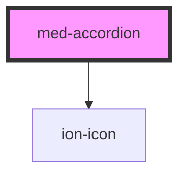

# med-accordion

<!-- Auto Generated Below -->

## Properties

| Property    | Attribute   | Description | Type                  | Default     |
| ----------- | ----------- | ----------- | --------------------- | ----------- |
| `collapsed` | `collapsed` |             | `boolean`             | `true`      |
| `color`     | `color`     |             | `string \| undefined` | `undefined` |
| `size`      | `size`      |             | `"full" \| undefined` | `undefined` |

## Methods

### `toggle() => Promise<void>`

#### Returns

Type: `Promise<void>`

## Dependencies

### Depends on

- ion-icon

### Graph

----------------------------------------------

*Built with [StencilJS](https://stenciljs.com/)*
