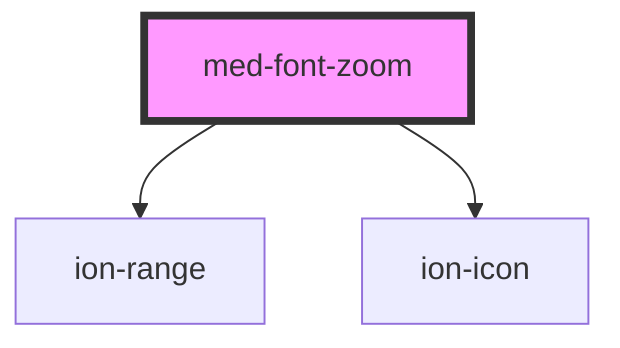

# med-font-zoom

<!-- Auto Generated Below -->

## Properties

| Property               | Attribute | Description | Type                                     | Default     |
| ---------------------- | --------- | ----------- | ---------------------------------------- | ----------- |
| `emitter` _(required)_ | --        |             | `{ emit: (value: RangeValue) => void; }` | `undefined` |

## Dependencies

### Depends on

- [ion-range](../../../range)
- ion-icon

### Graph

----------------------------------------------

*Built with [StencilJS](https://stenciljs.com/)*
