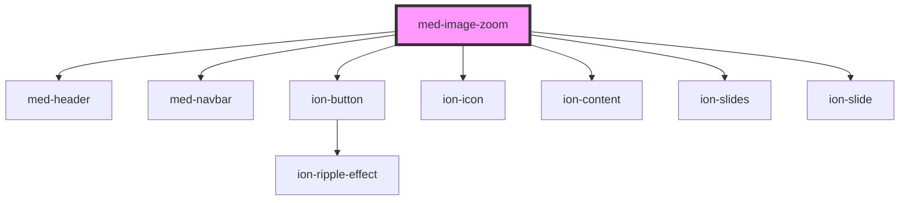

# med-image-zoom

<!-- Auto Generated Below -->

## Properties

| Property  | Attribute | Description | Type  | Default |
| --------- | --------- | ----------- | ----- | ------- |
| `imagens` | `imagens` |             | `any` | `[]`    |

## Dependencies

### Depends on

- [med-header](../med-header)
- [med-navbar](../med-navbar)
- [ion-button](../../../button)
- ion-icon
- [ion-content](../../../content)
- [ion-slides](../../../slides)
- [ion-slide](../../../slide)

### Graph

----------------------------------------------

*Built with [StencilJS](https://stenciljs.com/)*
